# 01. SPI-QSPI Protocol Special Topic (1) - Introduction to Basic Protocol Features
> Preface
- The SPI/QSPI protocol interface serves as a data communication interface for display devices, storage devices, and certain sensor devices.
- This technical guide provides a comprehensive overview of the SPI/QSPI protocol for the GR55xx series chips, detailing the design features of the chip modules, the usage of software interfaces, and methods to construct high-efficiency application interfaces. This will help users quickly grasp and utilize the high throughput performance of SPI/QSPI.
- This series of articles generally applies to GR551x, GR5525, and GR5526. Specific applicability to certain chips will be indicated where relevant.

## 1. SPI Protocol
SPI is a high-speed, full-duplex, synchronous serial interface technology. It uses only four pins on the chip for control and data transmission and is widely used in EEPROM, Flash, RTC (Real-Time Clock), ADC (Analog-to-Digital Converter), DSP (Digital Signal Processor), and digital signal decoders.

### 1.1 Pin Signals
The SPI protocol defines four functional signal pins:
- SCK (Serial Clock): SCK is the serial clock line, used by the host to transmit clock signals to the slave.
- MOSI (Master Out Slave In): Also known as the Tx-channel on the SPI host, it is used by the host to send data to the slave.
- CS/SS (Chip Select/Slave Select): This pin is used by the host to select which slave to communicate with. A low level indicates that the slave is selected (active low).
- MISO (Master In Slave Out): Also known as the Rx-channel on the SPI host, it is used by the host to receive data transmitted by the slave.

### 1.2 Roles
In the SPI protocol, there are two roles: Master and Slave. Communication is conducted in a master-slave control manner, with the transmission initiated by the Master and responded to by the Slave. The typical master-slave communication topology is shown below:

- The SPI protocol stipulates that the clock signal for the Slave device is provided by the Master through the SCK pin. The Slave itself cannot generate or control the clock signal; without it, the Slave cannot function properly.
- The SPI bus transmits the clock signal simultaneously with data transmission, making the SPI protocol a synchronous transmission protocol. The Master generates corresponding clock pulses based on the data to be exchanged, forming a clock signal. This signal, controlled by clock polarity (CPOL) and clock phase (CPHA), determines when the two SPI devices exchange and sample data, ensuring synchronous data transmission between the two devices.
- The SPI bus protocol supports full-duplex serial communication, with data transmission in a most significant bit (MSB) first order.
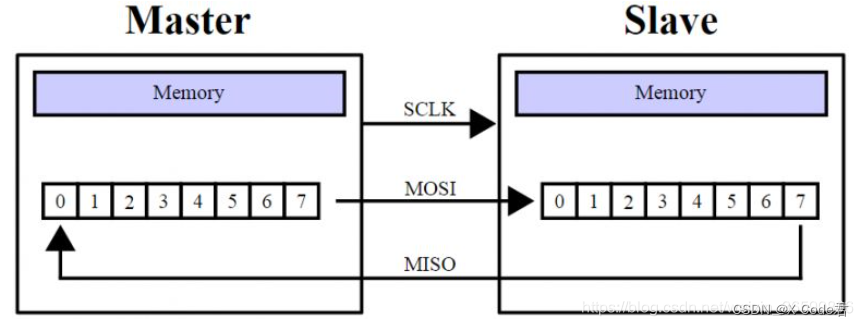

### 1.3 Clock Frequency
The SPI protocol operates based on a clock signal, and its efficiency remains constant when the clock frequency is fixed. Typically, the SPI clock is derived from the system's main clock or a divided peripheral clock. The maximum operating frequency achievable by the Controller and Peripheral may differ.
The table below lists the SPI/QSPI clock frequencies for the GR55xx series chips:
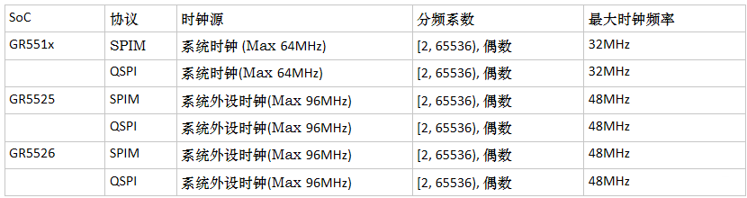

### 1.4 Clock Modes
The SPI protocol defines four clock modes, determined by the combination of Clock Polarity (CPOL) and Clock Phase (CPHA).
- The CPOL parameter specifies the idle state level of the SCK clock signal.
- The CPHA parameter specifies whether data is sampled on the rising edge or the falling edge of the SCK clock (sampled on the first or second clock transition).
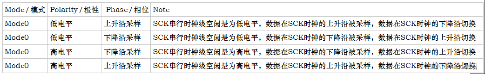
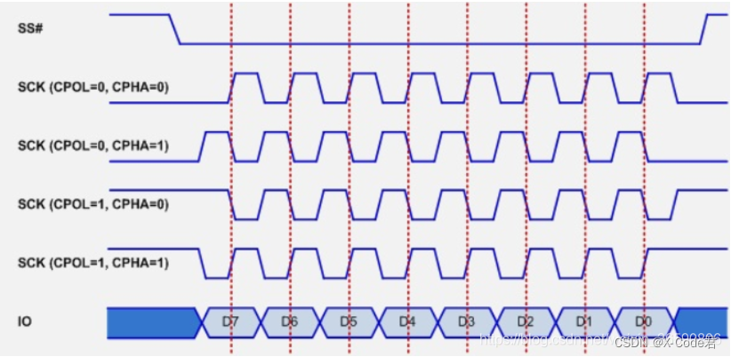
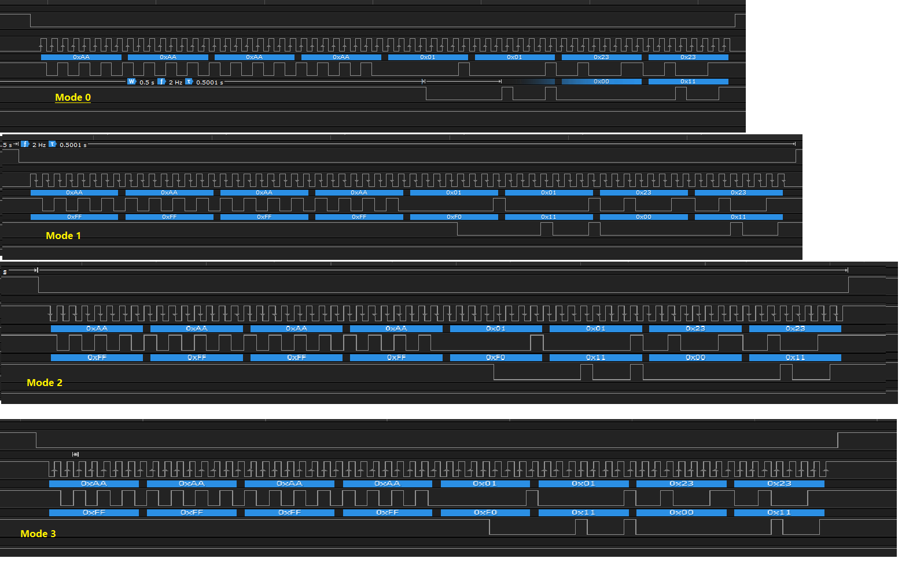

### 1.5 Timing Phase
The complete timing sequence of the SPI protocol comprises instructions, addresses, and data. In a functional timing sequence, only some of these components may be included (the address cannot exist independently).
- Typical timing for read operation
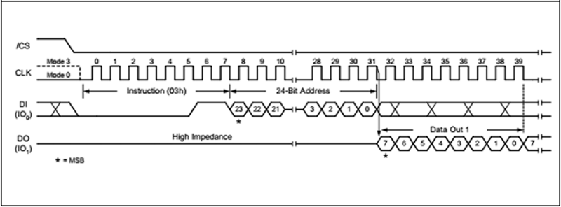
- Typical timing for write operation

### 1.6 SPI Protocol Derived Timing
Building on the SPI protocol, data I/O lines or other function lines can be extended, leading to various SPI timing variations.
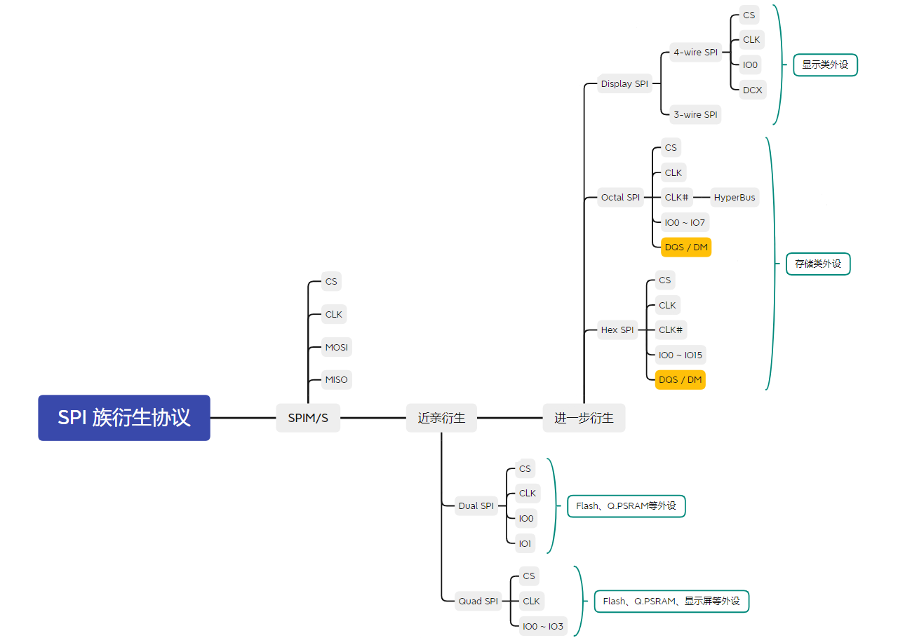

## QSPI Protocol

### 2.1 Overview
QSPI (QuadSPI) and DSPI (Dual SPI) are extensions of the SPI protocol. However, the chip select (CSn), clock functions, clock modes, and clock frequencies are similar to those of SPI. They remain synchronous, serial protocols, with only their operating modes changed. In DSPI/QSPI modes, the data lines are no longer in full-duplex mode.

### 2.2 Pin Signals
In the QSPI protocol, data lines extend from SPI's MOSI and MISO to IO0, IO1, IO2, and IO3.
A typical circuit wiring diagram:

Common Flash devices support SPI, Dual SPI, and Quad SPI modes. In different modes, the IOs exhibit different capabilities.
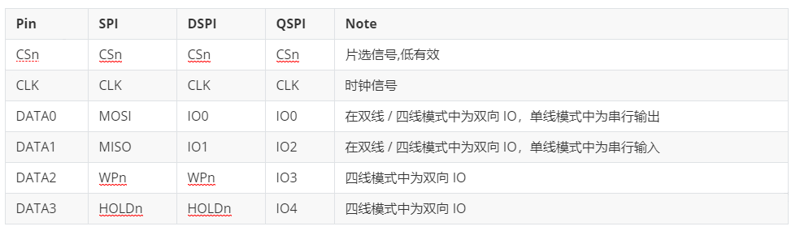

### 2.3 Timing Phase

The standard QSPI timing consists of the following 5 phases:
- Instruction: Defines and identifies control behaviors
- Address: The address of the target operation
- Mode bits: Generally present only in NOR Flash devices, used to indicate whether SIOO mode is supported
- Dummy Cycles: Equivalent to Wait Cycles, providing wait time for data output from the slave device
- Data: Data

### 2.4 Instruction Addressing Mode
In QSPI timing sequences, there are several ways to send instructions and addresses:
(Note: The following timing diagrams are referenced from the datasheets of QSPI interface Flash (PUYA) and PSRAM devices available on the market.)
- Single-line instruction, single-line address mode
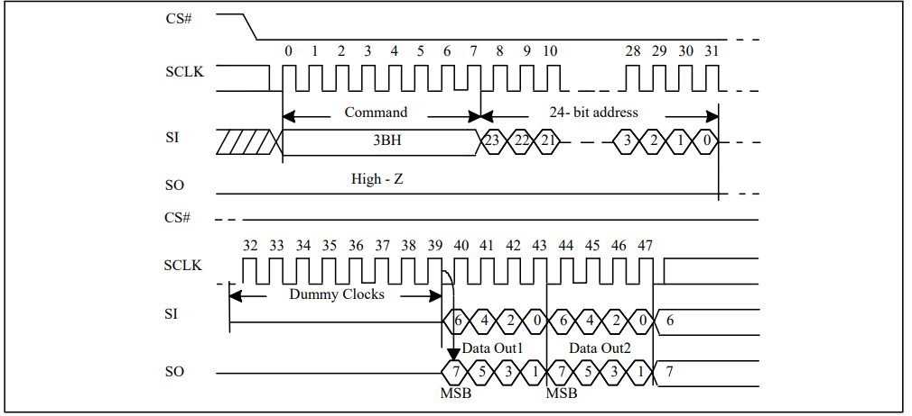
- Single-line instruction, multi-line address mode
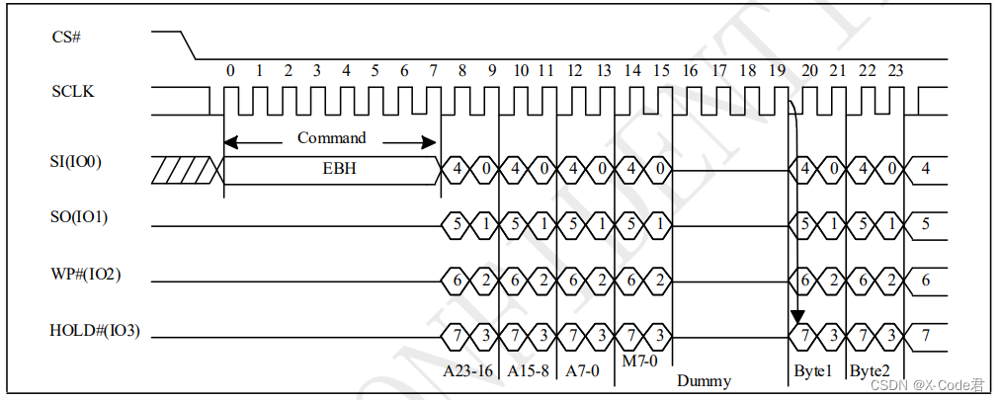
- Multi-line instruction, multi-line address mode
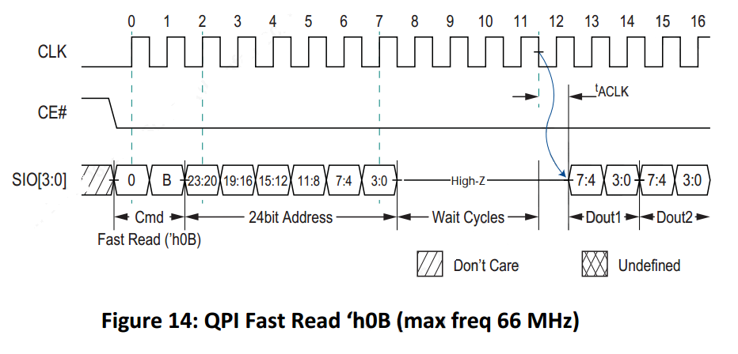
When the address is transmitted in multi-line mode, subsequent phases should also use multi-line mode.

### 2.5 QPI Modes
In QSPI mode, when all valid phases are transmitted using Quad mode, it is referred to as QPI mode. QPI mode is commonly seen in QSPI PSRAM devices.
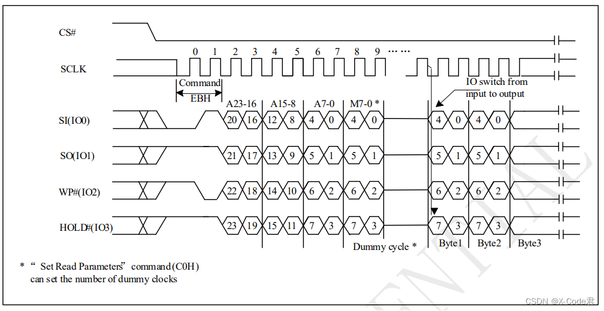

### 2.6 SIOO Modes
SIOO Mode stands for Send Instruction Only Once mode.
It is commonly used in the read commands of NOR Flash and requires the support of Mode Bits phase. Once this mode is declared, the command phase only needs to be included in the timing during the first access. For subsequent accesses, it does not need to be sent again until the Mode Bits state changes.

### 2.7 Efficiency Calculation
Phases other than the DATA Phase are considered Overhead.
Access efficiency: DATA Clock / Total Clock.