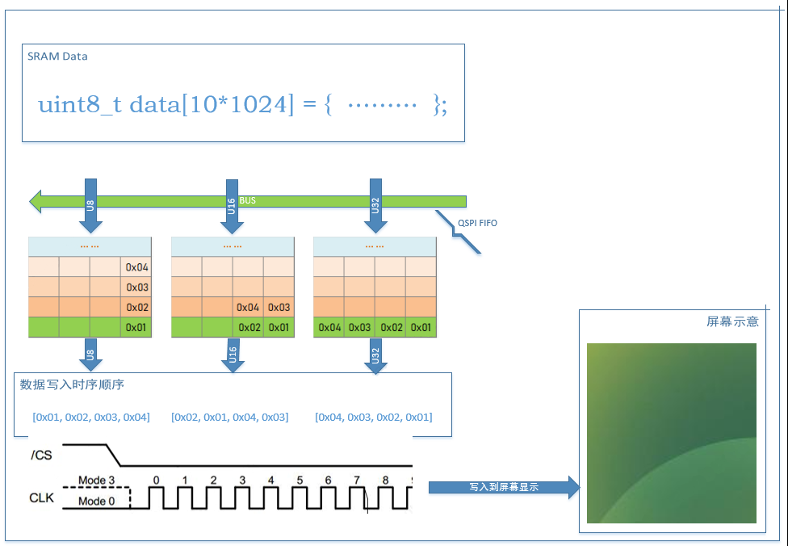
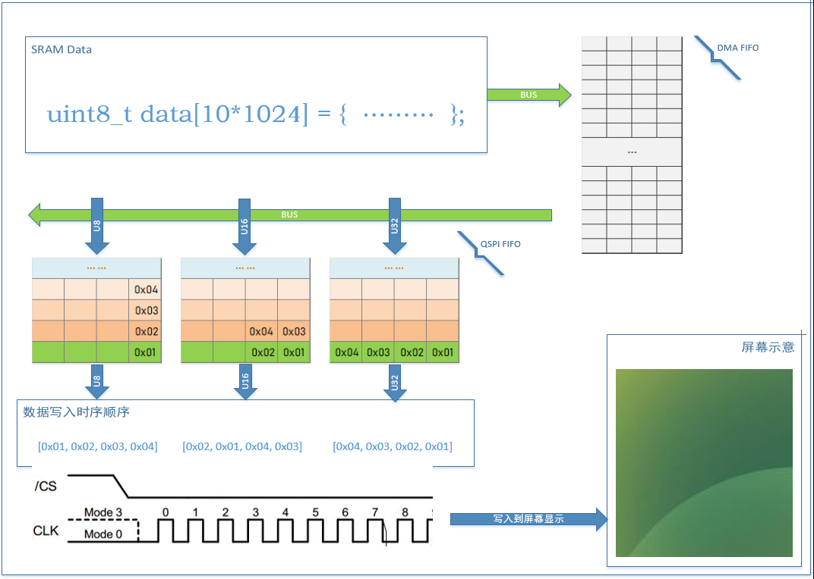

# 02. SPI-QSPI Protocol Special Topic (2) - Fundamentals of Building GR55xx (Q)SPI High-Speed Transmission Interface
> Preface
- The SPI/QSPI protocol interface serves as a data communication interface for display, storage, and certain sensor devices.
- This technical guide provides a detailed explanation of the SPI/QSPI protocol for the GR55xx series chips, the design features of the chip modules, the usage of software interfaces, and how to build high-efficiency application interfaces. It helps users quickly understand and utilize the high throughput performance of SPI/QSPI.
- The series of articles generally applies to GR551x, GR5525, and GR5526. Specific applicability will be noted where relevant.

## 1. Basic Application Background Supplement

### 1.1 System Master and Slave
- Master: In simple terms, the role that can initiate access to various devices on the system bus. A typical Master in an SoC (System on Chip) is the CPU, which can initiate access operations to any peripheral. Another example of an atypical Master is the DMA.
- Slave: In simple terms, in a bus system, it cannot initiate access to other devices and can only passively accept access from Master devices.
- DMA: Direct Memory Access, where the CPU handles numerous complex transactions, including simple yet time-consuming data transfer tasks that can be offloaded to the DMA. Data storage access and display data transmission are typical scenarios involving large data block transfers, making them ideal for DMA to assist the CPU.

### 1.2 Synchronous and Asynchronous Access
- Synchronous Access: Generally, the Master initiates an access operation to the target Slave device. This operation can involve various scenarios such as read/write operations, command execution, communication, etc. After initiating the operation, the Master waits for the operation to complete. The Master proceeds with other transactions only when the operation status indicates completion.

- Asynchronous Access: Generally, the Master initiates an access operation to the target Slave device but does not wait for the operation to complete. Instead, it immediately proceeds to execute other transactions. The Master is notified of the completion of the previous access operation through hardware or software mechanisms (or the Master periodically queries during the intervals of other transactions) to ensure the transaction is complete.

| Operation | Advantages | Disadvantages |
| --- | --- | --- |
| Synchronous | Simple program logic, tasks executed serially | Master spends too much time waiting, leading to low utilization and insufficient performance exploitation of the chip |
| Asynchronous | Allows all Masters to run simultaneously as much as possible, fully exploiting chip performance | Program logic is generally more complex than synchronous operations |

In high-bandwidth product development, it is recommended to design the interface architecture in such a way that both the CPU and DMA can operate simultaneously. The CPU handles instruction-based transactions, while the DMA handles large data transfer transactions. For instance, in products such as watches, an A-B Buffer architecture is used. While the CPU executes rendering transactions, the DMA transfers data to the screen for display.

## 2. Data Transmission Behavior

The following example explains how to send 10 Kbytes of data from SRAM through the QSPI interface. The same principle applies to SPIM (SPI Master), and further details on SPIM behavior will not be provided.

### 2.1 Writing Data from CPU to Screen via QSPI

- Transmission starts, initiating the SPI transfer. The CPU moves the SRAM data to the QSPI FIFO sequentially.
- The SPI controller begins operation, sending the data in the FIFO to the data line according to the configured operating frequency.
- Assuming the FIFO depth is N, when the bus width used by the CPU for transmission is Byte, the FIFO can buffer up to N Bytes of data; similarly, for transmission widths of Halfword and Word, the FIFO can buffer up to 2N Bytes and 4N Bytes, respectively.
- If the CPU's data pushing speed is slower than the QSPI's sending speed, it may cause some unpredictable behavior.
- Throughout the process, the CPU is continuously involved in data transmission.

### 2.2 Writing Data via DMA Directly to Screen through QSPI

- Transmission starts as the CPU configures the DMA and QSPI, initiating data transfer.
- The DMA reads data from SRAM into its FIFO and then forwards it to the QSPI FIFO.
- The SPI controller synchronously begins operation, transmitting data from the FIFO to the protocol data line according to the configured frequency.
- Assuming the FIFO depth is N, when the CPU uses a bus width of Byte for transmission, the FIFO can buffer up to N Bytes of data. Similarly, for Halfword and Word transmission widths, the FIFO can buffer up to 2N Bytes and 4N Bytes of data, respectively.
- Throughout the entire transmission process, the CPU only needs to configure and activate the DMA and QSPI modules, then it can proceed with other tasks.
- Upon completion of data transmission, the DMA/QSPI notifies the CPU via a hardware interrupt, allowing the CPU to handle subsequent tasks.

### 2.3 Reservoir Problem in Transmission (Producer & Consumer Problem)
- The SPI FIFO acts as a buffer during the transmission process. If the Master writes data faster than the QSPI can send it out, the FIFO might overflow, marked as TXO (Transmit Overflow).
- Conversely, if the Master writes data slower than the SPI can send it out, the FIFO might become empty, leaving no data to send, marked as TXE (Transmit Empty).
These phenomena are akin to the producer-consumer behavior familiar in computing and can occur in any chip under various application scenarios. The GR55xx series chips offer different solutions for these behaviors. For receiving data, the process is similar but operates in reverse.