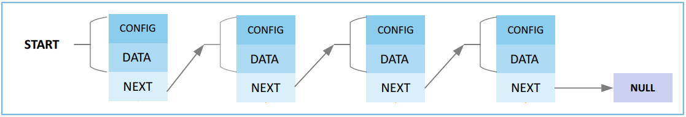
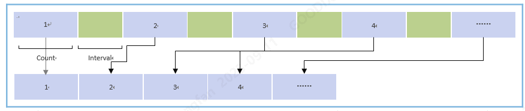
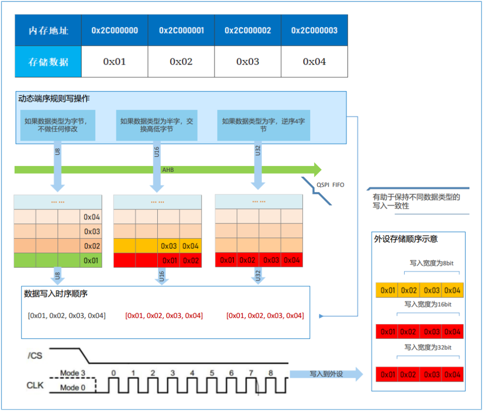
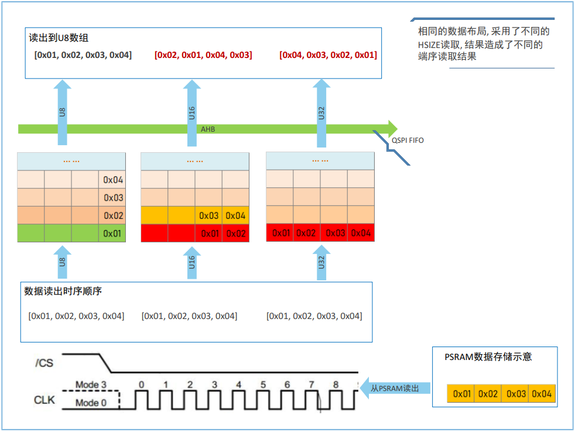

# 03. SPI-QSPI Protocol Special Topic (3) - GR552x Chip's DMA and QSPI Module Features
- Preface
  - The SPI/QSPI protocol interface facilitates data communication in display, storage, and certain sensor devices.
  - This technical article details the SPI/QSPI protocol in the GR55xx series chips, the design features of the chip modules, the usage of software interfaces, and how to build efficient application interfaces, helping users quickly understand and leverage the high throughput performance of SPI/QSPI.
  - This article is relevant to GR5525 and GR5526.

## 1. Typical DMA Features
> For details of Direct Memory Access (DMA), refer to DMA-related contents in GR5526 Datasheet.

### 1.1 Typical DMA Applications

#### 1.1.1 DMA Base Data Transmission
DMA enables data transmission from memory to memory, memory to peripheral, peripheral to memory, and peripheral to peripheral. In a DMA base data transmission, up to 4095 beats of data can be transmitted at a time. “Beat” refers to the bit width of the data transmitted through DMA.
- If the data bit width is in bytes, up to 4095 bytes of data can be transmitted in a single DMA transmission.
- If the data bit width is in half-words, up to 4095 x 2 bytes of data can be transmitted in a single DMA transmission.
- If the data bit width is in words, up to 4095 x 4 bytes of data can be transmitted in a single DMA transmission.
- If more than 4095 beats of data are transmitted in a single DMA base data transmission, an error message will pop up, indicating that the DMA transmission is interrupted.
- Address alignment shall be ensured in DMA transmission.

#### 1.1.2 DMA Chain Data Transmission
To improve the DMA transmission capability in the following scenarios, GR5526 SoCs extend the DMA chain data transmission capability, which means multiple data blocks can be connected using a pointer linked list, so that all these data can be transmitted in a single DMA transmission cycle.
- Transmit more than 4095 beats of data in a single transmission.
- Transmit data from a discontinuous address space in a single transmission cycle.
- Use different transmission configurations to transmit data in a single transmission cycle.
To be specific: Manage all to-be-transmitted data blocks using a pointer linked list. After a data block is sent, the next block is automatically loaded according to the Next pointer until the Next pointer becomes empty.
As shown below, each link node mainly contains DMA transmission configuration information of the current node, node data block, and information of the pointer pointing to the next link node, until the last transmission link node becomes null. These link nodes will be implemented in a single DMA transmission. Data at each node shall not be more than 4095 beats.
DMA chain data transmission can be widely used in such scenarios as big data block transmission, discontinuous data transmission, and display refresh.
> Figure 1 - DMA chain data transmission

#### 1.1.3 DMA Scatter Transmission
In a DMA scatter transmission, data in a continuous address space is scattered to a discontinuous address space based on certain rules.
> Figure 2 - DMA scatter transmission schematic

1. The continuous data is divided equally into several data blocks, and the length of the last data block can be different.
2. The data volume contained in each data block is marked as “Count” (in beats).
3. The address interval between data blocks is marked as “Interval” (in beats).
Example: To transmit 1000 bytes of data (Count: 4; Interval: 2) through DMA scatter transmission:
- If the transmission width is 8 bits, then the data is 1000 beats in total, each data block is 4 bytes, and the address interval is 2 bytes.
- If the transmission width is 16 bits, then the data is 500 beats in total, each data block is 8 bytes, and the address interval is 4 bytes.
- If the transmission width is 32 bits, then the data is 200 beats in total, each data block is 16 bytes, and the address interval is 8 bytes.

#### 1.1.4 DMA Gather Transmission
In a DMA gather transmission, data in a discontinuous address space is gathered in a continuous address space. DMA gather transmission can be regarded as a reverse process of DMA scatter transmission.
> Figure 3 - DMA gather transmission schematic
 
1. Several data blocks of equal length are evenly arranged at the same address interval, and the length of the last data block can be different.
2. The data volume contained in each data block is marked as “count” (in beats).
3. The address interval between data blocks is marked as “interval” (in beats).
Example: To transmit 1000 bytes of data (count: 4; interval: 2) through DMA gather transmission:
- If the transmission width is 8 bits, then the data is 1000 beats in total, each data block is 4 bytes, and the address interval is 2 bytes.
- If the transmission width is 16 bits, then the data is 500 beats in total, each data block is 8 bytes, and the address interval is 4 bytes.
- If the transmission width is 32 bits, then the data is 200 beats in total, each data block is 16 bytes, and the address interval is 8 bytes.

#### 1.1.5 DMA Scatter and Gather Transmission
The DMA scatter and gather transmission can be enabled simultaneously, to transmit the data in a discontinuous address space to another discontinuous address space.

### 1.2 Features of DMA Transmission Channel
GR5526/GR5525 provides two DMA instances for users: DMA0 and DMA1. There are six DMA channels in total. The FIFO depth is 32 (channel 0) or 4 (channels 1–5).
Channel 0 features large FIFO depth, so it can cache more data in DMA transmission, improving DMA transmission throughput. Therefore, in wearable applications, it is recommended to allocate channel 0 of DMA0/DMA1 to peripherals with high throughput in such scenarios as Flash access, PSRAM access, bulk memory block transfer, and display.

## 2. Typical QSPI Features
For a general introduction to QSPI, please refer to the "QSPI" section in the [GR5526 Datasheet](https://docs.goodix.com/zh/online/detail/datasheet_bl_b/Rev.1.0/1676fe80d42b2250d0eba1e517bd97ca).

### 2.1 QSPI Working Modes
According to the number of data lines involved and the timing behavior during operation, the GR5526 chip's QSPI is divided into three operating modes:
- 1-Line SPI mode: Uses SCLK, CS#, MOSI, and MISO signals during operation.
- 2-Line DualSPI mode: Uses SCLK, CS#, IO0, and IO1 signals during operation.
- 4-Line QuadSPI mode: Uses SCLK, CS#, IO0, IO1, IO2, and IO3 signals during operation.
According to the different peripheral access methods, the GR5526 chip's QSPI is divided into two operating modes:
- Register Mode: After the initialization of the QSPI module and peripherals, QSPI reads from and writes to peripherals by operating QSPI control registers. These operations are encapsulated as functions in the SDK by functionalities, and specific access behaviors are implemented by calling corresponding function groups.
- Memory Mapped Mode: Also known as XIP mode, after the initialization of the QSPI module and peripherals, the peripheral's memory space is further mapped to the system bus address space, and peripherals are accessed through bus addressing.
Generally, any peripheral that supports the QSPI timing protocol can be accessed in register mode, such as NOR Flash devices, NAND Flash devices, PSRAM devices, display devices, and other peripherals that support the QSPI timing.
QSPI NOR Flash and QSPI PSRAM storage devices can also be accessed in memory mapped mode. Due to different access characteristics, QSPI NOR Flash only supports read operations in memory mapped mode, while QSPI PSRAM devices support both read and write operations in this mode.
 Generally, storage devices that support memory mapped access mode can only operate in DualSPI/QuadSPI mode, and to achieve better access efficiency, it is recommended to operate in QuadSPI mode whenever possible.
The table below summarizes the access modes supported by common wearable peripherals, with the following recommendations:
- The actual support of peripherals needs to be confirmed according to the datasheet of the specific peripheral.
- As long as the peripheral's access method supports memory mapped mode, it is recommended to prioritize this mode to make the program code for reading storage devices more concise and access more efficient.
> Table 1 - GR5526/GR5525 QSPI Working Modes Supported by Wearable Peripherals

| Working Mode     |         | **NOR Flash** |           | **NAND Flash** |           | **QSPI PSRAM** |           | **Display/LCD** |           |
| ---------------- | ------- | ------------- | --------- | -------------- | --------- | -------------- | --------- | --------------- | --------- |
|                  |         | **Read**      | **Write** | **Read**       | **Write** | **Read**       | **Write** | **Read**        | **Write** |
| Register Mode    | SPI     | Yes           | Yes       | Yes            | Yes       | Yes            | Yes       | Yes             | Yes       |
|                  | Dual SPI | Yes           | Yes       | Yes            | Yes       | Yes            | Yes       | Yes             | Yes       |
|                  | Quad SPI | Yes           | Yes       | Yes            | Yes       | Yes            | Yes       | Yes             | Yes       |
| Memory Mapped Mode | SPI     | N/A           | N/A       | N/A            | N/A       | N/A            | N/A       | N/A             | N/A       |
|                  | Dual SPI | Yes           | N/A       | N/A            | N/A       | Yes            | Yes       | N/A             | N/A       |
|                  | Quad SPI | Yes           | N/A       | N/A            | N/A       | Yes            | Yes       | N/A             | N/A       |

### 2.2 QSPI Data Endian

#### 2.2.1 Data Endian in Write Operations
When the same memory data is written to a peripheral through QSPI with different bus access widths using CPU or DMA, different types of byte endian will be obtained, as shown below.
> Figure 4 - Default write process of QSPI controller

The endian conversion process is as follows:
1. Send the array {0x01, 0x02, 0x03, 0x04} through QSPI.
2. When the data enters the QSPI FIFO queue:
   - If the data is to be written by bytes, 4 FIFO depths will be occupied. The array is arranged as 0x01, 0x02, 0x03, 0x04 in order.
   - If the data is to be written by half-words, the data is converted into 0x0201 and 0x0403 on the bus, and 2 FIFO depths will be occupied in QSPI. The array is arranged as {0x02, 0x01} and {0x04, 0x03} in order.
   - If the data is to be written by words, the data is converted into 0x04030201 on the bus, and 1 FIFO depth will be occupied in QSPI. The array is arranged as {0x04, 0x03, 0x02, 0x01}.
3. QSPI FIFO outputs data through data cables from MSB to LSB, so the order of the data in data cables is shown below:
   - If the data is to be written by bytes, the data in the sequence line is displayed as 0x01, 0x02, 0x03, 0x04.
   - If the data is to be written by half-words, the data in the sequence line is displayed as 0x02, 0x01, 0x04, 0x03.
   - If the data is to be written by words, the data in the sequence line is displayed as 0x04, 0x03, 0x02, 0x01.
6. Peripherals store/process the data according to the data endian.
> Note: By default, data write operations in both register mode and memory mapping mode follow the above endian conversion rules.

#### 2.2.2 Data Endian in Read Operations 2.2.2
Read operations are a reverse process when compared with write operations. Different read access widths are adopted for the data in the address space of peripherals, to obtain data with different types of byte endian, as shown below.
> Figure 5 - Data endian in read operations

The endian conversion process is as follows:
- If the data width is in bytes, read {0x01, 0x02, 0x03, 0x04} in the peripheral space to the memory space as {0x01, 0x02, 0x03, 0x04}.
- If the data width is in half-words, read {0x01, 0x02, 0x03, 0x04} in the peripheral space to the memory space as {0x02, 0x01, 0x04, 0x03}.
- If the data width is in words, read {0x01, 0x02, 0x03, 0x04} in the peripheral space to the memory space as {0x04, 0x03, 0x02, 0x01}.
By default, data read operations in both register mode and memory mapping mode follow the above endian conversion rules. To obtain the same byte endian, access widths of read and write operations shall be kept the same.
However, in wearable product applications, the minimum access unit of resources such as images and fonts may be byte, half-word, word, or any combination of them due to different color formats (such as RGBA8888, ARGB8888) and color depths (RGBA8888, RGB565). Therefore, processing of byte endian is required during software access. If endian is adjusted by software, a lot of CPU computing power will be consumed. GR5526 SoCs are designed with endian modes supporting various access scenarios.

#### 2.2.3 Read Rule for Static Data Endian in Memory Mapping Mode
The static data endian refers to a data endian in which data is output correspondingly according to different register configurations (hereinafter referred to as “static endian rule”).
- The static endian rule applies only when QSPI works in memory mapped mode.
- The static endian rule is used to read data from QSPI NOR Flash.
According to the static endian rule, for a fixed data storage sequence, you can configure registers to output different types of data read endian. The table below lists data stored in peripheral memory.
> Table 2 - Peripheral data to be read

| Peripheral Address | 0x000000 | 0x000001 | 0x000002 | 0x000003 |
| -------- | -------- | -------- | -------- | -------- |
| Stored Data | 0x01     | 0x02     | 0x03     | 0x04     |
Store the data 0x01, 0x02, 0x03, and 0x04 in the peripheral address space 0x000000–0x000003 in order.
The table below lists the data obtained when different data types are adopted to access the above peripheral data with different endian rules.
> Table 3 - Static endian rule for QSPI read operations

| Access Type      | Byte       |            |            |            | Half-word |            | Word       |
| ---------------- | ---------- | ---------- | ---------- | ---------- | --------- | ---------- | ---------- |
| Access Address   | 0xAC000000 | 0xAC000001 | 0xAC000002 | 0xAC000003 | 0xAC000000 | 0xAC000002 | 0xAC000000 |
| Endian Mode **0**| 0x01       | 0x02       | 0x03       | 0x04       | 0x0102    | 0x0304     | 0x01020304 |
| Endian Mode **1**| 0x01       | 0x02       | 0x03       | 0x04       | 0x0201    | 0x0403     | 0x02010403 |
| Endian Mode **2**| 0x01       | 0x02       | 0x03       | 0x04       | 0x0201    | 0x0403     | 0x04030201 |
Descriptions about the static endian rule:
- Assume that the mapping address of the peripheral address 0x000000–0x000003 in the bus address space is 0xAC000000–0xAC000003.
- When static endian mode 0 is configured:
  - When 0xAC000000 is accessed in bytes (corresponding to uint8_t * in C language), 0x01 is returned.
  - When 0xAC000000 is accessed in half-words (corresponding to uint16_t * in C language), 0x0102 is returned.
  - When 0xAC000000 is accessed in words (corresponding to uint32_t * in C language), 0x01020304 is returned.
- When static endian mode 1 is configured:
  - When 0xAC000000 is accessed in bytes (corresponding to uint8_t * in C language), 0x01 is returned.
  - When 0xAC000000 is accessed in half-words (corresponding to uint16_t * in C language), 0x0201 is returned.
  - When 0xAC000000 is accessed in words (corresponding to uint32_t * in C language), 0x02010403 is returned.
- When static endian mode 2 is configured:
  - When 0xAC000000 is accessed in bytes (corresponding to uint8_t * in C language), 0x01 is returned.
  - When 0xAC000000 is accessed in half-words (corresponding to uint16_t * in C language), 0x0201 is returned.
  - When 0xAC000000 is accessed in words (corresponding to uint32_t * in C language), 0x04030201 is returned.
You can set a proper endian rule on demand to ensure optimal efficiency of QSPI. The function to set the static endian rule is: app_qspi_mmap_set_endian_mode.

#### 2.2.4 Read Rule for Dynamic Data Endian in Memory Mapped Mode 2.2.4
The dynamic data endian refers to a data endian in which data reading rules are output correspondingly according to different data access types in memory mapped mode (hereinafter referred to as “dynamic endian rule”).
- The dynamic endian rule applies only when QSPI works in memory mapped mode.
- The typical application scenario of the dynamic endian rule is the read and write operations of QSPI PSRAM devices.
- The dynamic endian rule takes precedence over the static endian rule. If both dynamic and static endian rules are enabled simultaneously, the system will only respond to the dynamic endian rule.
Under the dynamic endian rule, during read and write access, the behavior of data entering the FIFO can be adjusted to automatically adapt to mixed access of different data types.
The following figures illustrate the behavior of different data types entering the QSPI FIFO during read and write operations when the dynamic endian rule is enabled. The dynamic endian rule helps maintain the consistency of writing different basic data types.
> Figure 6 - Behavior of different data types entering the QSPI FIFO during write operations

> Figure 7 - Behavior of different data types entering the QSPI FIFO during read operations

When initializing the memory mapping mode for QSPI PSRAM devices, the GR5526 driver will automatically enable the dynamic endian rule, ensuring that PSRAM access behavior is consistent with SRAM access behavior.