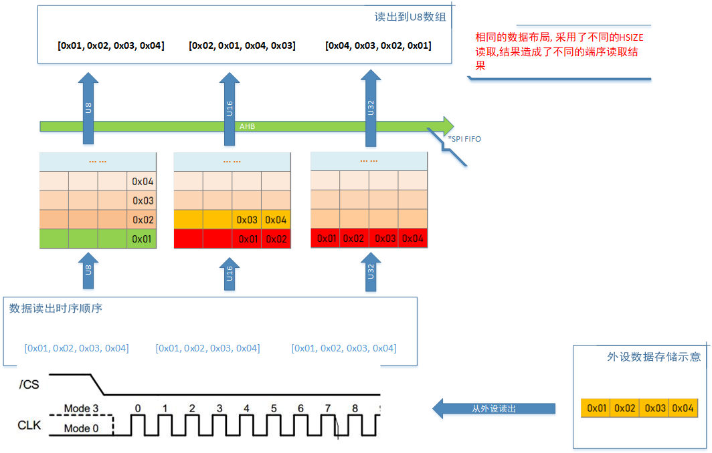
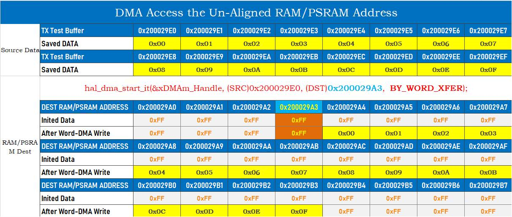
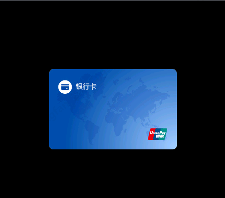
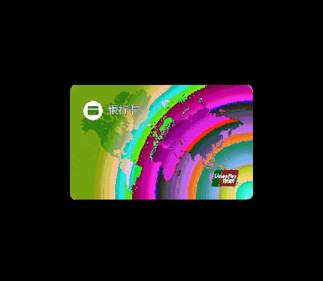
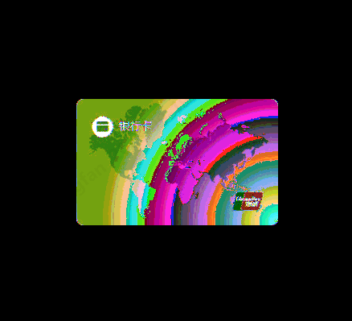
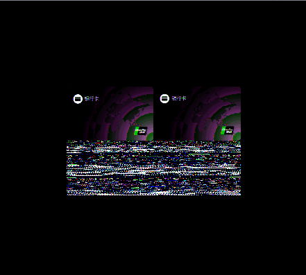
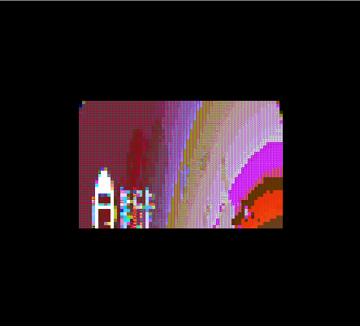
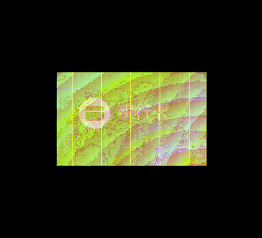
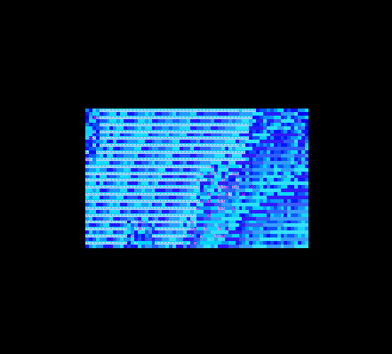

# 04. SPI-QSPI Protocol Special Topic (4) - Color Formats and Common Exceptions
- Preface
  - The SPI/QSPI protocol interface is used for data communication in display devices, storage devices, and some sensor devices.
  - This technical document provides a detailed explanation of the SPI/QSPI protocol in the GR55xx series chips, the design features of the chip components, the usage of software interfaces, and how to build high-efficiency application interfaces, to help users quickly understand and utilize the high throughput performance of SPI/QSPI.
  - This series of articles generally applies to GR551x, GR5525, GR5526; if applicable only to specific chips, it will be noted.

## 1. Screen Color Format

### 1.1 Common Color Code Formats
Currently, the pixel color formats commonly used in wearable device displays are RGB565 and RGBA8888 (or variations of RGBA8888, such as ARGB8888). These formats use 16-bit (2 bytes) and 32-bit (3 bytes + 1 byte alpha) to represent color codes, representing up to 65,536 and 16,777,216 colors, respectively. Their color code structures are defined as follows:
 
For RGBA8888, since each byte solely represents information of one color channel, only byte endianness needs to be managed during storage and usage. However, for the RGB565 format, each byte contains information for two color channels, which may involve issues with both byte endianness and parsing order. The following discussion will primarily use the RGB565 format as an example to illustrate potential issues that may arise during display processes. The principles for RGBA8888 and other variations are similar.

### 1.2 Color Code Format Storage and Usage
When converting an image to RGB565 format using a tool, incorrect endianness may be inadvertently applied during storage, reading, or when mixing with other color formats, resulting in display anomalies. The following examples demonstrate potential issues with some typical colors.
 
- Explanation:
  - The RGB888 format is used to facilitate color selection and comparison with graphic software.
  - Algorithm to convert RGB565 color back to RGB888 color:
   

## 2. Analysis of Possible Causes of Out-of-Order Execution

### 2.1 Inconsistent Read/Write Width of External Flash Leading to Reversal
This section is applicable to:
- The register-based driver interface of GR551x's SPIM and QSPI when reading/writing Flash or writing to a screen
- The register-based driver interface of GR5525/GR5526's SPIM and QSPI when reading/writing Flash or writing to a screen
When QSPI accesses peripherals, the data sequence for writing or reading external devices depends on the data width used.
 

Description:
1. When writing source data by Byte width, the destination data is stored in the same order as the source data.
2. When writing source data by Half Word width, the destination data is stored in reverse order every 2 bytes compared to the source data.
3. When writing source data by Word width, the destination data is stored in reverse order every 4 bytes compared to the source data.
4. Using the same data width for both writing and reading can restore the original byte order.
5. Wider byte order provides better access bandwidth than narrower byte order. If there is a mismatch in access during actual use, the data sequence on one end can be reversed in advance.
6. Due to the introduction of Cache, the access behavior of X-QSPI's Flash is consistent with SRAM, both being little-endian; there is no need to consider reverse order behavior.

 ### 2.2 Abnormal Byte Order Configuration in Memory Mapped Read of External Flash

This section is applicable to:
- The QSPI interface of GR5525/GR5526 when accessing Flash or PSRAM devices in memory mapping mode
According to the description of QSPI write/read data byte order behavior in section 2.1, when using memory mapping mode to read QSPI external storage devices (NOR Flash and PSRAM), the chip hardware layer is designed with multiple byte order modes: users can configure registers to read stored data in a specific byte order, as shown in the table below:
 
During application development, appropriate storage and access modes can be designed based on product needs.

### 2.3 Out-of-Order Due to Unaligned Address in DMA Access

Ensure address alignment in DMA transmission for the entire GR55xx series SoC:
- If the transmission width is a Byte, any address is aligned.
- If the transmission width is a Half Word, the transmission address must be an even address (__align(2)).
- If the transmission width is a Word, the transmission address must be 4-byte aligned (__align(4)).
 Otherwise, misalignment issues may occur due to forced address alignment conversion, as shown in the table below:
 
For example, transferring 16 bytes of data starting from address 0x2000-29E0 to address 0x200029A3 using Word transmission width will result in misalignment. Due to DMA's forced alignment requirement, the actual storage address after the transfer starts from 0x200029A4, which differs from the expected address, causing data misalignment.
To avoid such issues and prevent potential bugs caused by different width distinctions, declare the data address as 4-byte aligned.

## 3. Common Display Issues

The following images show the rendering results under normal and various abnormal conditions, serving as a reference table to trace possible causes of issues.

- Normal rendering of RGB565

   

- RGB565 pixel high-low byte swap

   

- Swap every two adjacent pixels

   

- Image data address not aligned

   

- Render RGB565 format as RGBA8888

   

- Render RGB565 format as TSC4

   

- Render RGBA8888 format as RGB565

   

- Render RGBA8888 format as TSC4

   

