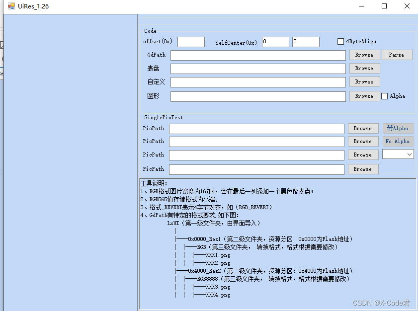
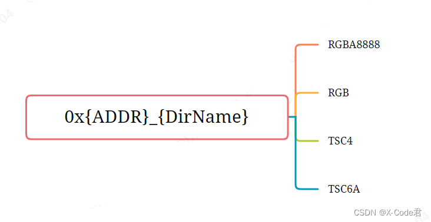

## GR5526 (2)-Generate image resources for Lvgl specification

[TOC]

This paper mainly introduces the use of LvglImageTool to generate image resources conforming to GR5526 GPU Lvgl specification, and the preparation and development of GUI image resources.

### 1. Tool introduction

Lvgl officially provides an image conversion tool .

However, due to the inconvenience of batch conversion, the inability to support multiple format conversion at the same time, and the inability to generate bin and descriptor files at the same time, it is relatively only suitable for Demo environment, not for production environment. Therefore, an additional widget, GrLvglImageTool, is provided. 


It has the following characteristics:

- It can support a large number of image conversion at the same time.
- Can support multiple image format conversion at the same time
- With GR5526 optimized Lvgl, the compressed image format support is extended on the native Lvgl, which is convenient for users to further save resources and storage space.
- Support the configuration of storage offset address according to the project needs
- Support the simultaneous generation of bin files for burning and image descriptor source code files for code use
- GR5526 users can use this tool to quickly generate image resources and descriptive source code, which can then be applied to Lvgl projects.


### 2. Generate a picture resource

The user generates the picture resource through the following steps:

#### 2.1 Prepare picture resource data
GR5526 optimized version Lvgl, in order to optimize the rendering performance, has the following requirements for the image:

Original image resources, please UI engineers, according to the needs of the project, prepared for PNG or JPG format. If the image needs alpha layer and transparent blending, prepare for the output format of PNG format image. The typical formats are as follows:

| RGBA8888 | RGB565 | TSC4       | TSC6a |
| -------------- | ------------ | -------------- | -------------- |
| W * H * 4 | W * H * 2 | W * H / 2 | W * H * 3 / 4 |

Enter the width and height of the picture to meet the following requirements. In order to break through the resource management, please prepare a set of naming conventions for the picture material in advance. When the source code description file of the image is generated later, it will depend on the image name.

#### 2.2 Organize image directory format

After the picture resources are ready, place them in different directories according to the following requirements

 


Create a directory named in the format 0x { ADDR } _ { DirName }. 0x { ADDR } represents the offset address from the initial address of the bin file to the external Flash; { DirName } represents the directory name, which can be named arbitrarily and conforms to the directory specification. For Example, 0x4000 _ WatchDemo indicates that the resource is to be downloaded to the external Flash. The address space starting from the offset 0x4000 is under the directory 0x { ADDR } _ { DirName }, according to the needs of the project for the output image format. Create directory names for RGBA8888, RGB (for placing RGB565 format), TSC4, TSC6a. The tool will generate the bin resource of the corresponding format for the picture under the directory according to the directory name. Place the previously prepared image resources in turn according to the created directory. For example, place the PNG format image containing alpha information under the RGBA8888 directory.

#### 2.3 Perform resource generation

For the tool, you only need to use the GdPath line function checked in the figure. Other features don't need care or are deprecated


Click the Browse button in the GdPath line to select the prepared image resource directory. There are some principles to be observed here. The directory path should not be too deep. It is better not to contain Chinese characters, so as to avoid compatibility problems in different environments. The selected path should be in the parent layer of the 0x { ADDR } _ { DirName } directory, and there should be no other interfering directories in the same directory. After importing the path, the software lists the subdirectories and image resources on the left

 

Click Parse, wait for some time, and the bin file and the resource description source files (.c and.h) will be generated successfully. As shown in the figure

 

### 3. Use of build resource files

#### 3.1 Burn the.bin file
This operation is very simple. Use the resource burning tool Gprogrammer provided by Goodix to burn the.bin file generated above to the corresponding offset address of the external Flash. (0 X 0000 is to burn from address 0). The Gprogrammer tool can be downloaded from the Goodix website, and its use is also described in a special document.

Just note that the actual Flash device and offset address should correspond to the source descriptor file, otherwise you may not get the desired effect.

#### 3.Adjust the source code descriptor file according to the actual situation of the project

The partial code of the screenshot source code descriptor file is as follows:

lv_img_dsc_list.h


```c
 #ifndef
  __LV_IMG_DSC_LIST_H__ 
  #define
  __LV_IMG_DSC_LIST_H__
  #define  ADDR_OFFSET_0000  0x00
  #define  ADDR_BLACK_CLOCK_FACE  (ADDR_OFFSET_0000 + 0x04)
  #define  ADDR_BLACK_CLOCK_THUMBNAIL  (ADDR_OFFSET_0000 + 0x3F488)
  #define  ADDR_DAY_CALORIE  (ADDR_OFFSET_0000 + 0x55A54)
  …
  LV_IMG_DECLARE(wd_img_black_clock_face);
  LV_IMG_DECLARE(wd_img_black_clock_thumbnail);
  LV_IMG_DECLARE(wd_img_day_calorie);
  ….
  #endif  
```

lv_img_dsc_list.c


```c
#include
  "lvgl.h"
  #include
  "gr55xx_hal.h"
  #include
  "lv_img_dsc_list.h"
  const
  lv_img_dsc_t  wd_img_black_clock_face =
  {
      .header.always_zero = 0,
      .header.w = 360,
      .header.h = 360,
      .data_size = 259200, 
      .header.cf = LV_IMG_CF_GDX_RGB565,
      .data = (uint8_t*)(QSPI0_XIP_BASE + ADDR_BLACK_CLOCK_FACE),
      };
  …
  const
  lv_img_dsc_t  wd_img_APPLIST_06_SLEEP =
  {
      .header.always_zero = 0,
      .header.w = 72,
      .header.h = 72,
      .data_size = 20736, 
      .header.cf = LV_IMG_CF_TRUE_COLOR,
      .data = (uint8_t*)(QSPI0_XIP_BASE + ADDR_APPLIST_06_SLEEP),
      };
  …
  const
  lv_img_dsc_t  wd_img_APPLIST_00_MENU =
  {
      .header.always_zero = 0,
      .header.w = 72,
      .header.h = 72,
      .data_size = 2592, 
      .header.cf = LV_IMG_CF_GDX_TSC4,
      .data = (uint8_t*)(QSPI0_XIP_BASE + ADDR_APPLIST_00_MENU),
      };
  …
  const
  lv_img_dsc_t 
  wd_img_APPLIST_03_HEARTRATE = {
      .header.always_zero = 0,
      .header.w = 72,
      .header.h = 72,
      .data_size = 31104/8, 
      .header.cf = LV_IMG_CF_GDX_TSC6a,
      .data = (uint8_t*)(QSPI0_XIP_BASE + ADDR_APPLIST_03_HEARTRATE),
      };
```

- The.h file makes a declaration of the image resource and an address index. Where the ADDR _ OFFSET _ 0000 is the address offset defined by 0x { ADDR
- .c file, RGB A8888 format (. Header. CF), either LV _ IMG _ CF _ TRUE _ COLOR or LV _ IMG _ CF _ GDX _ RGB A8888 can be used. LV _ IMG _ CF _ GDX _ such as LV _ IMG _ CF _ GDX _ RGBA8888 and LV _ IMG _ CF _ GDX _ RGB565 * are formats supported by the GR5526 extension
- The default Flash supported by the source code is Nor Flash connected to the external QSPI0 (XIP addressing is required). If it is an internal Flash or a Flash connected to QSPI1 or QSPI2, the macro QSPI0 _ XIP _ BASE. Needs to be manually modified globally according to the actual situation.
1) QSPI0 _ XIP _ BASE indicates the XIP bus start address of QSPI0 2) QSPI1 _ XIP _ BASE indicates the XIP bus start address of QSPI1 3) QSPI2 _ XIP _ BASE indicates the XIP-bus start address for QSPI2 4) If Y With internal X-Flash, you need to define a start address macro that is actually used.

#### 3.3 Embed the source code.c/.h file into the Lvgl project

You can use and index the image resources. Its usage is consistent with the official usage of Lvgl.


```c
lv_obj_t* img1 =  lv_img_create(obj);
lv_img_set_src(img1,  &wd_img_digital2_heart_small);
lv_obj_set_pos(img1,  160, 270);
```


#### 3.4 Download address of related tools

- Lv glImageTool tool:
- Gprogrammer tool download address:
- GR5526 SDK download address: [GR5526_SDK]([GR5526 SDK丨软件资源丨汇顶科技 (goodix.com)] (https://www.goodix.com/zh/software_tool/gr5526_sdk)

