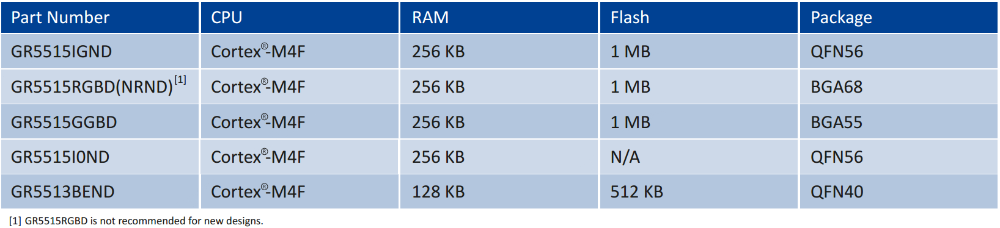
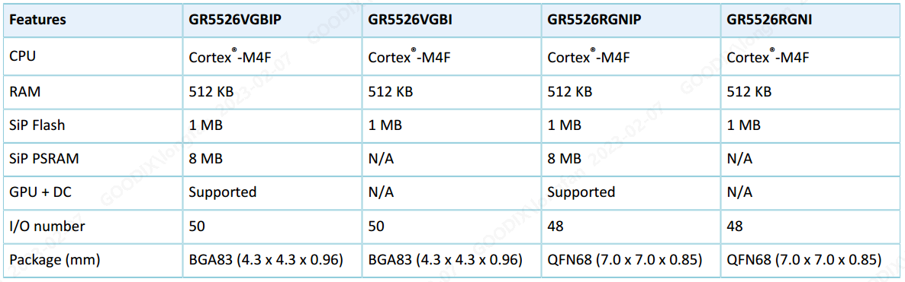
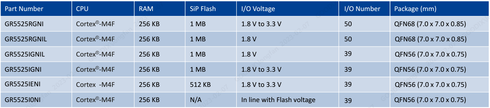

## Wearable (Watch) Solutions Technical Wizard

[TOC]

### 1. Suggestions on the use of series chips in wearable products

In the Goodix Bluetooth LE chip series, GR551x, GR5525 and GR5526 have strong computing power, data bandwidth and rich peripherals, which are suitable for wearable products such as smart watches; according to the differences of specific resources of these chips, their wearable markets are also different. Users can choose the appropriate chip model to design and develop according to the market positioning of the product.

#### 1.1 GR551x Series

##### 1.1.1 Key performance parameters

-   Arm® Cortex®-M4F 32-bit CPU @ 64 MHz
-   Bluetooth LE 5.1
    -   Data rate: 1 Mbps/2 Mbps, Long Range 500 kbps/125 kbps
    -   Sensitivity: – 97 dBm in 1 Mbps mode, – 93 dBm in 2 Mbps mode
    -   TX current：3.05 mA @0 dBm，1 Mbps
    -   RX current：3.9 mA @1 Mbps
-   Supply voltage: 1.7 V to 3.8 V
-   I/O voltage: 1.8 V to 3.3 V
-   Peripherals: QSPI, SPI, I2S, I2C, UART, ADC, PWM, Calendar Timer, ISO7816
-   Security: AES, HMAC, PKC, TRNG
-   Package: QFN56, BGA68, BGA55, QFN40

##### 1.1.2 Material number

#### 1.2 GR5526 Series

##### 1.2.1 Key performance parameters

-   Arm® Cortex®-M4F 32-bit CPU @ 96 MHz

-   Bluetooth LE 5.3

    -   Data rate: 1 Mbps/2 Mbps, Long Range 500 kbps/125 kbps
    
    -   Sensitivity: – 98 dBm in 1 Mbps mode, – 94 dBm in 2 Mbps mode
    
    -   TX current: 4.0 mA @ 0 dBm, 1 Mbps

    -   RX Current: 3.5 mA @ 1 Mbps

##### 1.2.2 Material number

#### 1.3 GR5525 Series

##### 1.3.1 Key performance parameters

-   Arm® Cortex®-M4F 32-bit CPU @ 96 MHz
-   Bluetooth LE 5.3
    -   AoA/AoD
    -   Data rate: 1 Mbps/2 Mbps, Long Range 500 kbps/125 kbps
    -   Sensitivity: – 97 dBm in 1 Mbps mode, – 93 dBm in 2 Mbps mode, 101 dBm in LR 500 kbps mode, – 103 dBm in LR 125 kbps mode
    -   TX power: – 20 dBm ~ + 7 dBm
    -   TX Current: 6.5 mA @ 0 dBm, 1 Mbps, 64 MHz
    -   RX Current: 5.4 mA @ 1 Mbps, 64 MHz
-   Peripherals: QSPI, SPI, DSPI, I2S, I2C, UART, DMA, ADC, PDM, PWM, Timer, GPIO
-   Security: AES, HMAC, PKC, TRNG

##### 1.3.2 Material number

#### 1.4 Selection reference

##### 1.4.1 Parameter comparison

| SoC          | GR551x                        | GR5525                                                  | GR5526                                                  |
| ------------ | ----------------------------- | ------------------------------------------------------- | ------------------------------------------------------- |
| CPU          | Cortex®-M4F 32-bit @ 64 MHz   | Cortex®-M4F 32-bit @ 96 MHz                             | Cortex®-M4F 32-bit @ 96 MHz                             |
| X-Flash      | Built-in support for 1 MB     | Built-in support for 1 MB                               | Built-in support for 1 MB                               |
|              | Support external expansion    | Support external expansion                              | Not Support external expansion                          |
| D-Flash      | QSPI Flash. No MMAP           | QSPI Flash. Support MMAP.                               | QSPI Flash. Support MMAP.                               |
| SRAM         | 256 KB or 128 KB              | 256 KB                                                  | 512 KB SRAM + 64 MB PSRAM                               |
| PMU          | • Supply voltage: 1.7 V~3.8 V | • Programmable thresholds for brownout  detection (BOD) | • Programmable thresholds for brown out detection (BOD) |
|              | • Brown out detection         | • Supply voltage: 1.9 V to 3.8 V                        | • Supply voltage: 2.4 V to 4.35 V                       |
|              | • I/O voltage: 1.8 V to 3.6 V | • I/O voltage: 1.8 V to 3.6 V                           | • I/O voltage: 1.8 V to 3.6 V                           |
| RF           | TX power: –20 dBm to +7 dBm   | TX power: –20 dBm to +7 dBm                             | TX power: –20 dBm to +7 dBm                             |
|              | Sensitivity: –97 dBm @ 1 Mbps | Sensitivity: –97dBm @ 1 Mbps                            | Sensitivity: –97 dBm @ 1 Mbps                           |
| Bluetooth LE | Bluetooth LE 5.1              | Bluetooth LE 5.3                                        | Bluetooth LE 5.3                                        |
| Peripherals  |                               |                                                         |                                                         |
|              | 1 x SPI Master @ 32 MHz       | 1 x SPI Master @ 48 MHz                                 | 1 x SPI Master @ 48 MHz                                 |
|              | 1 x SPI Slave                 | 1 x SPI Slave                                           | 1 x SPI Slave                                           |
|              | 2 x QSPI @ 32 MHz             | 3 x QSPI @ 48 MHz. Support MMAP.                        | 3 x QSPI @ 48 MHz. Support MMAP.                        |
|              | 1 x I2S Master                | 1 x I2S Master                                          | 1 x I2S Master                                          |
|              | 1 x DMA                       | 2 x DMA @ 6ch                                           | 2 x DMA @ 6ch                                           |
|              | 1 x I2S Slave                 | 1 x I2S Slave                                           | 1 x I2S Slave                                           |
|              | 2 x I2C                       | 4 x I2C @ 3.4 MHz                                       | 6 x I2C @ 3.4 MHz                                       |
|              | 2 x UART                      | 4 x UART                                                | 6 x UART                                                |
|              | 13-bit ADC                    | 13-bit ADC                                              | 13-bit ADC                                              |
|              | 6ch x PWM                     | 6ch x PWM                                               | 6ch x PWM                                               |
|              | 4 x Hardware Timers           | 4 x Hardware Timers                                     | 4 x Hardware Timers                                     |
|              | 1 x AON Hardware Timer        | 1 x AON Hardware Timer                                  | 1 x AON Hardware Timer                                  |
|              | 2 x WDT                       | 1 x AON WDT                                             | 1 x AON WDT                                             |
|              | 1 x RTC                       | 2 x RTC                                                 | 2 x RTC                                                 |
|              | x                             | 1 x DSPI                                                | 1 x DSPI                                                |
|              | x                             | x                                                       | 1 x OSPI (64 MB OSPI DDR PSRAM)                         |
|              | x                             | x                                                       | 1 x GPU                                                 |
|              | x                             | x                                                       | 1 x DC                                                  |
|              | x                             | x                                                       | 1 x USB 2.0 FS                                          |
|              | x                             | 1 x PDM                                                 | 1 x PDM                                                 |
|              | I/O @ 39 max.                 | I/O @ 50 max.                                           | I/O @ 50 max.                                           |

##### 1.4.2 GR5525 vs GR551x

Description of main upgrades of GR5525 relative to GR551x at the bandwidth level:

1.  The system frequency is increased from 64 MHz to 96 MHz.
2.  The QSPI maximum frequency is increased from 32 MHz to 48 MHz, and the bus architecture is increased from APB to AHB, increasing the bus access speed.
3.  QSPI adds MMAP access mode to support direct bus addressing of NOR Flash and QSPI PSRAM.
4.  The QSPI FIFO depth is increased from 8 to 16/32, and the DMA FIFO is also increased from 8 to 32, which improves the transfer efficiency of DMA.
5.  The number of QSPIs is increased to 3, the number of DMAs is increased to 2, and more QSPI interface peripherals can be expanded as needed.

Based on the above upgrade, the access throughput, access efficiency and access friendliness have been greatly improved.

##### 1.4.3 GR5526 vs GR5525

Compared with the GR5525, the GR5526 adds a more powerful Graphics module (2.5D GPU + Display Controller + 64 MB OSPI PSRAM), USB and PDM modules, and an SRAM space of 512 KB. It can design wearable products with more cool effect and higher resolution.

##### 1.4.4 General reference for type selection

| SoC    |Explain|
| ------ | ------------------------------------------------------------ |
| GR551x |Resolution range generally recommended is < = 320 X 320|
| GR5525 |As an upgraded version of 551x, it supports software design with larger resolution and easier use. At present, the resolution of mass production can reach up to 454 X 454, without tearing and stuttering.|
| GR5526 |Both frame rate and effect can be considered. Better UX interactive experience can be designed based on 2.5D GPU. The frame rate can also be very high. The software is easy to use and simple to develop. It is recommended to choose medium and high resolution watches.|

### 2. Reference to the scheme

| Index        | Reference            |Get the connection|
| --------------------- | ---------------------------- | ------------------------------------------------------------ |
|                       |                              |                                                              |
| OS Usage         | GR5xx FreeRTOS Manual | [GR5xx FreeRTOS Sample Manual](https://docs.goodix.com/zh/online/freertos_bl/V3.0)|
|                       |                              |                                                              |
| LVGL Framework | LVGL Official Doc | https://docs.lvgl.io/                                        |
|                       |                              |                                                              |
| GPU principle（Not Necessary） | GR5526 GPU User Guide | [GR5526 GPU Developer's Guide](https://docs.goodix.com/zh/online/gpu_guide_bl_b/V1.0)|
|                       |                              |                                                              |
| Optimizqation for Display | GR5526 Display Guide  | [GR5526刷屏指南](https://docs.goodix.com/zh/online/display_refresh_guide_bl_b/V1.0)|
|                       |                              |                                                              |
| DFU & OTA        | GR5xx OTA Guide | [GR5xx Firmware Upgrade Development Guide](https://docs.goodix.com/zh/online/firmware_upgrade_bl/V1.2)|
|                       |                              |                                                              |
| Lower power     | GR5526 power mode and measurment | [GR5526 Power Mode and Power Measurement Description](https://docs.goodix.com/zh/online/power_application_bl_b/V1.0)|
|                       |                              |                                                              |

