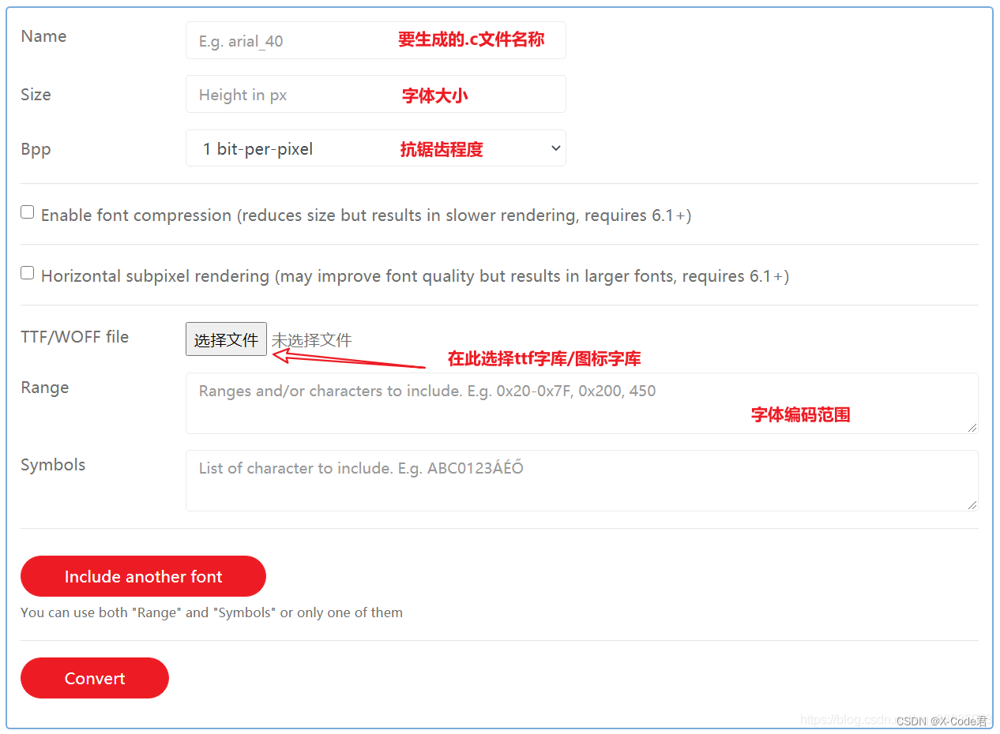

## GR5526(3)-生成Lvgl规范的字体资源

[TOC]

本文主要介绍使用 gdx_font_conv 生成符合 GR5526 GPU 适配版Lvgl 规范的字体资源, 进行字体资源的准备和开发.


### 1. 工具介绍

Lvgl 官网提供了一个字体资源转换工具（https://lvgl.io/tools/fontconverter）, 用于生成符合原生Lvgl 渲染规范的位图字体.



原生Lvgl 字体是使用CPU进行位图的渲染, 字形描述位图生成时, 为了节省存储空间, 会进行压缩处理. 在GR5526 上, 为了用加速字体的渲染处理, 字体的渲染接口基于 GR5526 GPU 进行了重新适配优化. GPU 渲染时要求位图地址对齐且字体宽度为偶数. 因此需要对Lvgl 原生的字体转换工具进行优化， 使其生成的字体位图满足 GR5525 适配Lvgl 的渲染需求.

优化后的字体生成工具重新打包为 gdx_font_conv.exe, 不用安装, 在命令行运行即可.

支持的命令列表:
```
--bpp - bits per pixel (antialiasing).像素深度：单个像素使用的bit数目
--size - output font size (pixels). 原始字体大小
—scale选项，用于基于—size选项字体位图，生成多个其他大小的字体，比如如下选项可通过16字号字体位图，同时支持16,18两个字号：
--scale 16,18
-o, --output - output path (file or directory, depends on format).输出文件
--format - output format. 输出格式，一般关心lvgl格式即可，另外有bin格式和dump格式
--format lvgl - dump font in lvgl c format.
--force-fast-kern-format - always use more fast kering storage format, at cost of some size. If size difference appears, it will be displayed.
总是使用更快的kerinng存储格式，代价是一些大小。 如果出现尺寸差异，则会显示出来。
--lcd - generate bitmaps with 3x horizontal resolution, for subpixel smoothing.
--lcd-v - generate bitmaps with 3x vertical resolution, for subpixel smoothing.
--use-color-info - try to use glyph color info from font to create grayscale icons. Since gray tones are emulated via transparency, result will be good on contrast background only.
--lv-include - only with --format lvgl, set alternate path for lvgl.h.

--font - path to font file (ttf/woff/woff2/otf). May be used multiple time for merge.字体文件
-r, --range - single glyph or range + optional mapping, belongs to previously declared --font. Can be used multiple times. Examples:
单个字形或范围 + 可选映射，属于先前声明的 --font。 可以多次使用。 例子：
	-r 0x1F450 - single value, dec or hex format.
	-r 0x1F450-0x1F470 - range.
	-r '0x1F450=>0xF005' - single glyph with mapping.
	-r '0x1F450-0x1F470=>0xF005' - range with mapping.
	-r 0x1F450 -r 0x1F451-0x1F470 - 2 ranges.
	-r 0x1F450,0x1F451-0x1F470 - the same as above, but defined with single -r.

--symbols - list of characters to copy (instead of numeric format in -r).
--symbols 0123456789., - extract chars to display numbers.
--autohint-off - do not force autohinting ("light" is on by default).
--autohint-strong - use more strong autohinting (will break kerning).
Additional debug options:
--no-compress - disable built-in RLE compression.     禁用内置 RLE 压缩。
--no-prefilter - disable bitmap lines filter (XOR), used to improve compression ratio.     禁用位图线过滤器 (XOR)，用于提高压缩率。
--no-kerning - drop kerning info to reduce size (not recommended).
--full-info - don't shorten 'font_info.json' (include pixels data).
```


### 2. 工具的使用

#### 2.1 准备工具和字体资源
下载好 gdx_font_conv.exe 和字体资源, 这里以 msyh.ttf 微软雅黑为例。将二者放置在同一个目录下.


#### 2.2 根据应用需要生成位图源码文件

下述命令用于生成 0x20-0x7F ASCII 字符的源码， bpp为4, size 为16
```
 gdx_font_conv.exe  --no-compress --no-prefilter --bpp 4 --size 16 --font msyh.ttf -r 0x20-0x7F  --format lvgl -o lv_font_msyh_16.c --force-fast-kern-format
```

生成的源文件为 lv_font_msyh_16.c.
```
/*******************************************************************************
 * Base Size: 16 px
 * Bpp: 4
 * Cmd-Opts: --no-compress --no-prefilter --bpp 4 --size 16 --font msyh.ttf -r 0x20-0x7F --format lvgl -o lv_font_msyh_16.c --force-fast-kern-format
 ******************************************************************************/

#ifdef LV_LVGL_H_INCLUDE_SIMPLE
#include "lvgl.h"
#else
#include "../../lvgl.h"
#endif

#ifndef LV_FONT_MSYH_12
#if GR552X_GPU_FONT_SUPPORT
#define LV_FONT_MSYH_12 1
#else
#define LV_FONT_MSYH_12 0
#endif
#endif

#if LV_FONT_MSYH_12

/*-----------------
 *    BITMAPS
 *----------------*/

/*Store the image of the glyphs*/
static LV_ATTRIBUTE_LARGE_CONST const uint8_t glyph_bitmap[] __attribute__((aligned(32))) = {
    /* U+0020 " " */

    /* U+0021 "!" */
    0x4f, 0x40, 0x4f, 0x40, 0x4f, 0x30, 0x3f, 0x30,
    0x3f, 0x30, 0x3f, 0x20, 0x3f, 0x20, 0x2f, 0x20,
    0x1d, 0x10, 0x0, 0x0, 0x4f, 0x40, 0x4f, 0x40,

    /* U+0022 "\"" */
    0x5f, 0x6f, 0x40, 0x3f, 0x4f, 0x30, 0x2f, 0x1f,
    0x20, 0x1c, 0xd, 0x10,

    /* U+0023 "#" */
    0x0, 0x1, 0xf1, 0xd, 0x40, 0x0, 0x5, 0xd0,
    0x1f, 0x0, 0x0, 0x8, 0x90, 0x5c, 0x0, 0xf,
    0xff, 0xff, 0xff, 0xfb, 0x0, 0xf, 0x30, 0xb6,
    0x0, 0x0, 0x1f, 0x0, 0xe3, 0x0, 0x0, 0x4d,
    0x1, 0xf1, 0x0, 0x9f, 0xff, 0xff, 0xff, 0xf2,
    0x0, 0xb7, 0x7, 0xa0, 0x0, 0x0, 0xe3, 0xb,
    0x60, 0x0, 0x2, 0xf0, 0xf, 0x20, 0x0, 0x0,

    。。。。

    /* U+007D "}" */
    0x6d, 0x50, 0x0, 0x19, 0xf1, 0x0, 0x1, 0xf3,
    0x0, 0x1, 0xf4, 0x0, 0x1, 0xf4, 0x0, 0x0,
    0xf4, 0x0, 0x0, 0xd9, 0x0, 0x0, 0x3f, 0x90,
    0x0, 0xcb, 0x10, 0x0, 0xf4, 0x0, 0x1, 0xf4,
    0x0, 0x1, 0xf4, 0x0, 0x1, 0xf3, 0x0, 0x6,
    0xf1, 0x0, 0x6f, 0x70, 0x0, 0x0, 0x0, 0x0,

    /* U+007E "~" */
    0x0, 0x0, 0x0, 0x0, 0x0, 0x3, 0xde, 0x70,
    0x2, 0xf0, 0xd, 0x85, 0xeb, 0x28, 0xd0, 0x2f,
    0x0, 0x1b, 0xff, 0x40, 0x2, 0x0, 0x0, 0x20,
    0x0, 0x0, 0x0, 0x0,

    /* U+007F "" */

};

/*---------------------
 *  GLYPH DESCRIPTION
 *--------------------*/

static const lv_font_fmt_txt_glyph_dsc_t glyph_dsc[] = {
    {.bitmap_index = 0, .adv_w = 0, .box_w = 0, .box_h = 0, .ofs_x = 0, .ofs_y = 0} /* id = 0 reserved */,
    {.bitmap_index = 0, .adv_w = 76, .box_w = 0, .box_h = 0, .ofs_x = 0, .ofs_y = 0},
    {.bitmap_index = 0, .adv_w = 80, .box_w = 3, .box_h = 12, .ofs_x = 1, .ofs_y = 0},
    。。。。
    {.bitmap_index = 4464, .adv_w = 136, .box_w = 9, .box_h = 13, .ofs_x = 0, .ofs_y = -4},
    {.bitmap_index = 4532, .adv_w = 126, .box_w = 8, .box_h = 9, .ofs_x = 0, .ofs_y = 0},
    {.bitmap_index = 4568, .adv_w = 86, .box_w = 5, .box_h = 16, .ofs_x = 0, .ofs_y = -4},
    {.bitmap_index = 4616, .adv_w = 69, .box_w = 2, .box_h = 18, .ofs_x = 1, .ofs_y = -4},
    {.bitmap_index = 4636, .adv_w = 86, .box_w = 5, .box_h = 16, .ofs_x = 0, .ofs_y = -4},
    {.bitmap_index = 4684, .adv_w = 190, .box_w = 10, .box_h = 5, .ofs_x = 1, .ofs_y = 3},
    {.bitmap_index = 4712, .adv_w = 76, .box_w = 0, .box_h = 0, .ofs_x = 0, .ofs_y = 0}
};

/*---------------------
 *  CHARACTER MAPPING
 *--------------------*/


/*Collect the unicode lists and glyph_id offsets*/
static const lv_font_fmt_txt_cmap_t cmaps[] =
{
    {
        .range_start = 32, .range_length = 96, .glyph_id_start = 1,
        .unicode_list = NULL, .glyph_id_ofs_list = NULL, .list_length = 0, .type = LV_FONT_FMT_TXT_CMAP_FORMAT0_TINY
    }
};

/*-----------------
 *    KERNING
 *----------------*/


/*Map glyph_ids to kern left classes*/
static const uint8_t kern_left_class_mapping[] =
{
    0, 0, 0, 1, 0, 0, 0, 0,
    1, 2, 0, 3, 0, 0, 0, 0,
    0, 0, 0, 0, 0, 0, 0, 0,
    0, 0, 0, 0, 0, 0, 0, 0,
    0, 0, 4, 5, 6, 7, 8, 9,
    10, 0, 0, 11, 12, 13, 0, 0,
    14, 15, 16, 17, 18, 19, 20, 21,
    22, 23, 24, 25, 2, 0, 0, 0,
    0, 0, 0, 26, 27, 0, 28, 29,
    30, 0, 0, 31, 32, 0, 0, 28,
    33, 34, 35, 36, 0, 37, 38, 39,
    40, 41, 42, 0, 43, 0, 0, 0,
    0
};

/*Map glyph_ids to kern right classes*/
static const uint8_t kern_right_class_mapping[] =
{
    0, 0, 0, 1, 0, 0, 0, 0,
    1, 0, 2, 3, 0, 4, 5, 6,
    0, 0, 0, 0, 0, 0, 0, 0,
    0, 0, 0, 7, 8, 0, 0, 0,
    9, 0, 10, 0, 11, 0, 0, 0,
    12, 0, 0, 13, 0, 0, 0, 0,
    14, 0, 15, 0, 16, 17, 18, 19,
    20, 21, 22, 23, 0, 0, 2, 0,
    0, 0, 24, 25, 26, 27, 28, 29,
    30, 25, 0, 31, 0, 0, 32, 32,
    33, 34, 35, 36, 37, 38, 34, 39,
    40, 41, 42, 43, 0, 0, 44, 0,
    0
};

/*Kern values between classes*/
static const int8_t kern_class_values[] =
{
    0, 0, 0, 0, 0, 0, 0, 0,
    0, 0, 0, 0, 0, 0, 0, 0,
    0, 0, 0, 0, 0, 0, 0, 0,
    0, 0, 0, 0, 0, 0, 0, 0,
    。。。。
    0, 0, 0, 0, 0, -1, -1, -1,
    1, -1, 0, 0, -1, 0, -1, 0,
    0, 1, 0, 0, 0, 0, 0, 0,
    0, 0, 0, 0, 0, 0, 0, 0,
    0, 0, 0, 0, 0, 0, 0, 0,
    0, 0, 0, 0, 0, 0, 0, 0,
    0, 0, 0, 0, 0, 0, 27, 0,
    0, 0, 0, 0, 0, 0, 0, 0,
    0, 0, 0, 0
};


/*Collect the kern class' data in one place*/
static const lv_font_fmt_txt_kern_classes_t kern_classes =
{
    .class_pair_values   = kern_class_values,
    .left_class_mapping  = kern_left_class_mapping,
    .right_class_mapping = kern_right_class_mapping,
    .left_class_cnt      = 43,
    .right_class_cnt     = 44,
};

/*--------------------
 *  ALL CUSTOM DATA
 *--------------------*/

#if LV_VERSION_CHECK(8, 0, 0)
/*Store all the custom data of the font*/
static lv_font_fmt_txt_glyph_cache_t cache;
static const lv_font_fmt_txt_dsc_t font_dsc = {
#else
static lv_font_fmt_txt_dsc_t font_dsc = {
#endif
    .glyph_bitmap = glyph_bitmap,
    .glyph_dsc = glyph_dsc,
    .cmaps = cmaps,
    .kern_dsc = &kern_classes,
    .kern_scale = 16,
    .cmap_num = 1,
    .bpp = 4,
    .kern_classes = 1,
    .bitmap_format = 0,
#if LV_VERSION_CHECK(8, 0, 0)
    .cache = &cache
#endif
};


/*-----------------
 *  PUBLIC FONT
 *----------------*/

/*Initialize a public general font descriptor*/
#if LV_VERSION_CHECK(8, 0, 0)
lv_font_t lv_font_msyh_12 = {
#else
lv_font_t lv_font_msyh_12 = {
#endif
    .get_glyph_dsc = lv_font_get_glyph_dsc_fmt_txt,    /*Function pointer to get glyph's data*/
    .get_glyph_bitmap = lv_font_get_bitmap_fmt_txt,    /*Function pointer to get glyph's bitmap*/
    .line_height = 18,          /*The maximum line height required by the font*/
    .base_line = 4,             /*Baseline measured from the bottom of the line*/
#if !(LVGL_VERSION_MAJOR == 6 && LVGL_VERSION_MINOR == 0)
    .subpx = LV_FONT_SUBPX_NONE,
#endif
#if LV_VERSION_CHECK(7, 4, 0) || LVGL_VERSION_MAJOR >= 8
    .underline_position = -1,
    .underline_thickness = 1,
#endif
    .dsc = &font_dsc,      /*The custom font data. Will be accessed by `get_glyph_bitmap/dsc` */
    .origin_dsc = &font_dsc,
    .origin_line_height = 18,
    .origin_base_line = 4,
};

#endif /*#if LV_FONT_MSYH_12*/
```

下述参考命令生成各种字符, 包含数字字母和部分中文
```
gdx_font_conv.exe   --no-compress --no-prefilter --bpp 4 --size 36 --font font/msyh.ttf --symbols 1234567890ABCDEFGHIJKLMNOPQRSTUVWXYZabcdefghijklmnopqrstuvwxyz文抬腕触摸亮屏自动屏幕显示应用视图过场效果语言系统关于调试模式开关系统升级关机重新启动恢复出厂设置亮度熄屏时间唤醒方式更换表盘完成重新测量中运动今日活动心率血氧压力睡眠呼吸训练天气音乐卡包闹钟秒表计时器寻找手机  --format lvgl -o lv_font_msyh_36.c
```

如果需要增加/修改文字内容, 重新用命令生成一遍即可.
#### 2.3 将生成的.c 源码嵌入 lvgl 应用工程
并配置对应字体的功能宏开关, 就可以在GR5526 工程的UI布局 中使用了。


### 3. 其他注意事项

如果开发使用的Keil IDE环境,为了让KEIL支持中文字体正确编码,使字体正确显示,需要进行如下配置：

1) 在KEIL中Options for Target -> C/C++ -> Misc Controls添加--locale=english

2) 编辑器选择UTF-8编码, Edit->Configuration->Encode in UTF-8 without signature

#### 3.1 附录
1. [gdx_font_conv 地址](https://developers.goodix.com/zh/bbs/download/comment/73ded197fb1c4580b97c2688e4c99ec4/upload_e0e99dee0ef56403351f1e813263c8cb)
2. [GR5526 介绍](https://www.goodix.com/zh/product/connectivity/ble) 
