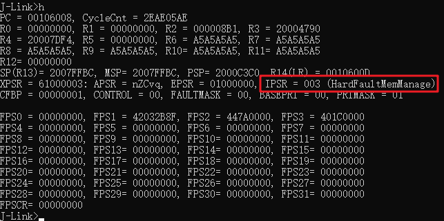
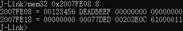

## Fault Trace模块常见问题


### 1. 如何判断我的程序是不是HardFault了？

A: 在没有使用看门狗的情况下，当系统产生HardFault之后，会在中断处理函数中执行死循环，此时包括BLE在内的所有模块都无法正常工作，表现出“死了”的效果。此时可以使用J-Link连上芯片来判断是否产生了HardFault。确保硬件连接后，打开J-Link Commander软件，输入`connect`并回车，然后在提示 **Please specify device / core** 时输入`cortex-m4`并回车，在提示 **Please specify target interface** 时输入`s`并回车，在提示 **Specify target interface speed [kHz]** 输入`4000`并回车。此时J-Link Commander会尝试连接芯片，成功后会提示 **Cortex-M4 identified**，如图所示：

 

此时输入`h`并回车，从 **IPSR** 的值可以看到目前所在的中断：

 

中断号`003`代表目前处于 **HardFaultMemManage**中，属于**HardFault**的范畴。

如果使用了看门狗，则很有可能因为看门狗复位导致第一现场丢失，此时就需要借助Fault Trace模块的异常记录功能来判断。在出现Hard Fault后，Fault Trace模块会自动将异常信息存入NVDS中。模块的导入方法以及如何读取存储的错误信息请参考[GR5xx Fault Trace Module应用说明 - 使用Fault Trace Module](https://docs.goodix.com/zh/online/detail/fault_trace_bl/V3.2/9dfd0230c1940b35d5c7a62e88332e85)。


### 2. 为什么我的程序会HardFault？

A: HardFault产生的原因非常多样化，没有一个通用答案。不过可以借助Cortex-M4核心的异常机制结合一些关键线索进行分析。在使用了Fault Trace模块的cortex-backtrace组件的情况下，HardFault时会自动反推调用栈信息。下面是使用了cortex-backtrace组件后HardFault时的信息输出：

```
Fault on interrupt or bare metal(no OS) environment
==== Main stack information ====
  addr: 2007fe28    data: 00000000
  addr: 2007fe2c    data: 00207379
  addr: 2007fe30    data: 00000301
  addr: 2007fe34    data: ffffff00
  addr: 2007fe38    data: 00240001
  addr: 2007fe3c    data: 01f40000
  addr: 2007fe40    data: ca3b0100
  addr: 2007fe44    data: 44501f80
  addr: 2007fe48    data: ffff0001
  addr: 2007fe4c    data: ffffffff
  addr: 2007fe50    data: ffffffff
  addr: 2007fe54    data: ffffffff
  addr: 2007fe58    data: ffffffff
  addr: 2007fe5c    data: ffffffff
  addr: 2007fe60    data: ffffffff
  addr: 2007fe64    data: ffffffff
  addr: 2007fe68    data: ffffffff
  addr: 2007fe6c    data: ffffffff
  addr: 2007fe70    data: ffffffff
  addr: 2007fe74    data: ffffffff
  addr: 2007fe78    data: ffffffff
  addr: 2007fe7c    data: ffffffff
  addr: 2007fe80    data: ffffffff
  addr: 2007fe84    data: ffffffff
  addr: 2007fe88    data: ffffffff
  addr: 2007fe8c    data: ffffffff
  addr: 2007fe90    data: ffffffff
  addr: 2007fe94    data: ffffffff
  addr: 2007fe98    data: ffffffff
  addr: 2007fe9c    data: ffffffff
  addr: 2007fea0    data: ffffffff
  addr: 2007fea4    data: ffffffff
  addr: 2007fea8    data: ffffffff
  addr: 2007feac    data: ffffffff
  addr: 2007feb0    data: ffffffff
  addr: 2007feb4    data: ffffffff
  addr: 2007feb8    data: ffffffff
  addr: 2007febc    data: ffffffff
  addr: 2007fec0    data: ffffffff
  addr: 2007fec4    data: ffffffff
  addr: 2007fec8    data: ffffffff
  addr: 2007fecc    data: ffffffff
  addr: 2007fed0    data: ffffffff
  addr: 2007fed4    data: ffffffff
  addr: 2007fed8    data: ffffffff
  addr: 2007fedc    data: ffffffff
  addr: 2007fee0    data: ffffffff
  addr: 2007fee4    data: ffffffff
  addr: 2007fee8    data: 20003384
  addr: 2007feec    data: 00000000
  addr: 2007fef0    data: 2000d46e
  addr: 2007fef4    data: 0020747d
  addr: 2007fef8    data: 00000002
  addr: 2007fefc    data: 00000000
  addr: 2007ff00    data: 00000000
  addr: 2007ff04    data: 00000007
  addr: 2007ff08    data: 00000001
  addr: 2007ff0c    data: 00000000
  addr: 2007ff10    data: 2000341c
  addr: 2007ff14    data: 00000008
  addr: 2007ff18    data: 002073b5
  addr: 2007ff1c    data: 00000008
  addr: 2007ff20    data: 00000e01
  addr: 2007ff24    data: 00209901
  addr: 2007ff28    data: 2000d450
  addr: 2007ff2c    data: 00209891
  addr: 2007ff30    data: 0000004a
  addr: 2007ff34    data: b0000000
  addr: 2007ff38    data: 00000002
  addr: 2007ff3c    data: 200012f4
  addr: 2007ff40    data: 00000e01
  addr: 2007ff44    data: 00000008
  addr: 2007ff48    data: ffffffff
  addr: 2007ff4c    data: 00040ee3
  addr: 2007ff50    data: 00000002
  addr: 2007ff54    data: 20001478
  addr: 2007ff58    data: 00000000
  addr: 2007ff5c    data: 0007e917
  addr: 2007ff60    data: 00000000
  addr: 2007ff64    data: 20001c9c
  addr: 2007ff68    data: 0007e948
  addr: 2007ff6c    data: 0007e948
  addr: 2007ff70    data: ffffffff
  addr: 2007ff74    data: 00040213
  addr: 2007ff78    data: 00000000
  addr: 2007ff7c    data: 002107bc
  addr: 2007ff80    data: 00000000
  addr: 2007ff84    data: 000817d1
  addr: 2007ff88    data: 00000000
  addr: 2007ff8c    data: 000817b1
  addr: 2007ff90    data: 002107bc
  addr: 2007ff94    data: ffffffe9
  addr: 2007ff98    data: 00000000
  addr: 2007ff9c    data: 00000000
  addr: 2007ffa0    data: 00000001
  addr: 2007ffa4    data: 00000003
  addr: 2007ffa8    data: ffffffff
  addr: 2007ffac    data: 0020b8c5
  addr: 2007ffb0    data: 0020b8c4
  addr: 2007ffb4    data: 61000000
  addr: 2007ffb8    data: 20003858
  addr: 2007ffbc    data: 0010747d
  addr: 2007ffc0    data: 00000001
  addr: 2007ffc4    data: 000996cb
  addr: 2007ffc8    data: 4000d000
  addr: 2007ffcc    data: 20003858
  addr: 2007ffd0    data: 20008170
  addr: 2007ffd4    data: 00106d3b
  addr: 2007ffd8    data: 00000001
  addr: 2007ffdc    data: 00000001
  addr: 2007ffe0    data: 00000000
  addr: 2007ffe4    data: 00106423
  addr: 2007ffe8    data: 200037c0
  addr: 2007ffec    data: 0009785d
  addr: 2007fff0    data: 002107bc
  addr: 2007fff4    data: 002107bc
  addr: 2007fff8    data: 00000000
  addr: 2007fffc    data: 0020b8c5
=========
==== Registers information =====
  R0 : 00123456     R1 : deadbeef
  R2 : 00000000     R3 : 00000000
  R12: 00000000     LR : 00077ded
  PC : 00203ca8     PSR: 61000011
=========
Fault reason:
Bus fault: imprecise data access violation
Call stack info : 00203ca8<--00077de9<--00207375<--000002fd<--00207479<--00000003<--002073b1<--00000dfd<--002098fd<--0020988d<--00000dfd<--00040edf<--0004020f<--0020b8c1<--0020b8c1<--
```

cortex-backtrace主要打印了4个信息：**栈数据**，**关键寄存器**，**异常类型**和**调用栈**。

其中，**栈数据**可以结合汇编进行场景重现，对于某些由数据错误引起的HardFault调试有帮助（例如除0，空指针等等）。

**关键寄存器**包括：
 - 用于传参，存储返回值和临时数据的 **R0-R3** 寄存器
 - 用于过程间临时传参的 **R12 (IP)** 寄存器
 - 用于存储返回地址的 **LR** 寄存器
 - 用于存储当前运行地址的 **PC** 寄存器
 - 用于存储运算标志位，中断号及运行状态的 **PSR** 寄存器

通过 **PC** 寄存器可以知道异常具体发生在哪一个位置。可以通过汇编文件（`.s`文件或是`.asm`文件）去查对应地址的汇编指令，也可以使用GCC工具链提供的`addr2line`工具来获取地址对应到哪个源文件中的哪一行。有时候可以看到 **PC** 的值是一个奇数，这是Cortex-M4核心的Thumb模式导致的，此时把地址值-1即是正确的地址。

**异常类型**是对Cortex-M4核心的 **CFSR (Congifurable Fault Status Register)** 寄存器的解析。该寄存器是Cortex-M4核心用于指示HardFault产生原因的寄存器。HardFault又被细分为3种类型：**Usage Fault**, **Bus Fault**, **Memory Management Fault**。具体不同类型以及指示内容的具体含义请参考 *[Cortex-M4 Devices Generic User Guide](https://developer.arm.com/documentation/dui0553/a/)* - 4.3.10 Configurable Fault Status Register。

**调用栈**是Cortex Backtrace模块通过对寄存器，运行程序以及栈数据的分析和反推得到的调用关系链。和 **PC** 寄存器的值一样，结合汇编文件或者`addr2line`工具可以对整个调用链条进行定位。


### 3. 如果不使用Cortex Backtrace组件，能分析上面的内容吗？

A: 可以。Cortex Backtrace的主要功能是反推调用栈，如果不使用Cortex Backtrace组件，只使用Fault Trace的异常记录功能，则可以在Hard Fault发生后，使用GRToolBox或GProgrammer读取芯片内存储的异常信息，例如：

```
HARDFAULT CALLSTACK INFO: R0-00123456 R1-DEADBEEF R2-00000000 R3-00000000 R12-00000000 LR-00077DED PC-00203C00 XPSR-61000011
```

由于不使用Cortex Backtrace组件，Fault Trace就只会记录关键寄存器的信息。此时同样可以通过异常前 **PC** 和 **LR** 的值结合汇编文件或`addr2line`来分析。


### 4. 如果连Fault Trace模块也不使用，能分析HardFault吗？

A: 可以。但如果不使用Fault Trace模块，则需要保留Hard Fault现场以获取必要信息。在保留现场的情况下，可以使用J-Link连接芯片进行分析，具体流程为：

1. 首先通过 **LR** 寄存器的值判断异常发生现场使用的栈指针：

 | 中断前使用FPU | 中断前未使用FPU
--- | --- | ---
**中断前在Handler Mode，使用MSP** | 0xFFFFFFE1 | 0xFFFFFFF1
**中断前在Thread Mode，使用MSP** | 0xFFFFFFE9 | 0xFFFFFFF9
**中断前在Thread Mode，使用PSP** | 0xFFFFFFED | 0xFFFFFFFD

同样以之前的Hard Fault为例，使用J-Link连接上芯片后读取现场：

 

从图中可得，异常发生之前使用的栈指针为 **MSP = 0x2007FE08**。

2. 在确实栈指针后，从栈指针处读8个word（32Byte）。Cortex-M4在中断发生时的压栈顺序为：**xPSR**, **PC**, **LR**, **R12**, **R3**, **R2**, **R1**, **R0**，则读取到的8个word的含义是反过来的。其中第6个word为异常前的 **PC**，第7个word为异常前的 **LR**。通过这两个值就可以反推出异常发生前的位置。此处使用J-Link Commander的`mem32`指令进行读取：

 

从图中可得，**LR = 0x00077DED**，**PC = 0x00203E0C**。

结合汇编文件或使用`addr2line`工具可以定位到具体的位置，进行分析。


### 5. 得到的PC指向了一个莫名其妙的地方是怎么回事？

A: 有几种可能。第一，可能是调用了非法地址，此时比起 **PC** 更需要关心 **LR** 的值，即在跳转之前的位置，例如函数指针为空或为非法值时的跳转。第二，可能MSP和PSP搞反了，这样得到反推得到的PC和LR就是错误的值。第三，对于GR5xx SoC有些代码被固化到ROM中，有些情况下（例如非法参数）可能会导致ROM中的代码产生Hard Fault，此时PC值在 **0x00000000** 到 **0x000FFFFF** 之间（不同型号的SoC的ROM地址范围不同，具体的范围请参考对应型号的Datasheet）。


### 6. 读取不了栈上的数据怎么办？

-   第一步，请确保芯片已经被Halt住，即在J-Link连上后需要先输入`h`让芯片停止运行
-   第二步，检查所读取的栈指针和所要读取的长度是否在正确的RAM范围内
-   第三步，如果上述步骤都不能解决问题，则有可能是芯片存在硬件异常，请检查供电及各个关键电源信号是否符合要求，或联系FAE进行技术支持