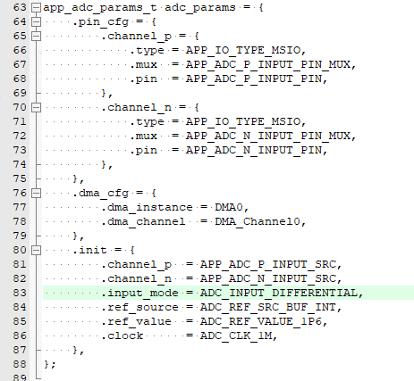
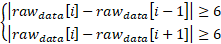
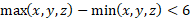
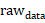
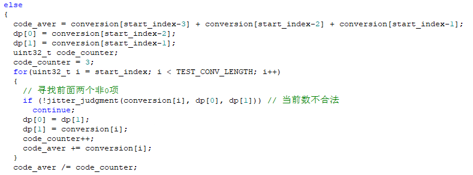
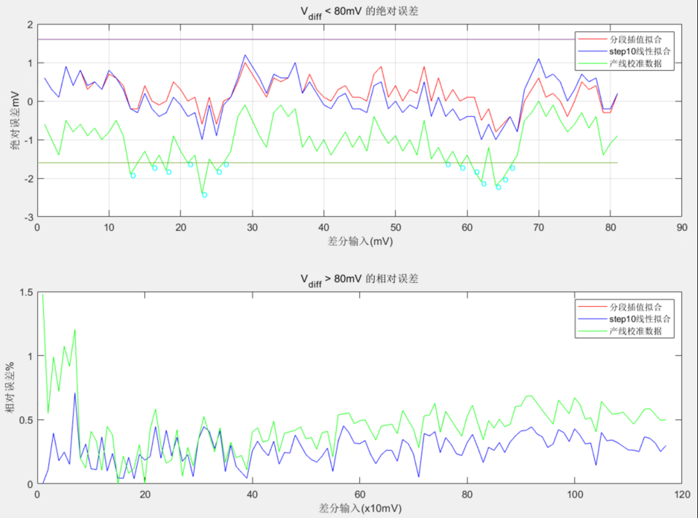
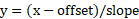

## ADC应用笔记

### 1. ADC基本功能介绍

本章主要介绍GR5xx ADC的总体框架和基本功能，用户通过本章的介绍可以快速掌握ADC的基本用法。

GR5xx内部的ADC是一种基于逐次逼近原理（SAR）的模数转换器。在它的输入端有一个多路选择器，提供多路模拟信号输入，通过多路选择器的选择实现在给定的时间内对选定的某路信号进行采样。支持的多路模拟输入中，其中两个通道用于内部VBAT和温度监测，可用于芯片内部进行PMU调整和射频电路配置调整，以获得最佳性能。ADC可以配置为单端输入模式或者差分输入模式，以执行单端测量或差分测量。ADC的参考电压支持内部参考电压和外部输入参考电压。内部参考电压可选择0P8V、1P2 V、1P6V三档；外部参考电压可以选择通过MSIO0～MSIO3进行输入。对于任何设定的参考电压（Vref），ADC最大的模拟电压输入应为（2 x Vref）。

#### 1.1 ADC功能简介

- **关于ADC输入源**

  - 对应P端，支持MSIO0～MSIO7和Internal VRef输入。

  - 对于N端，支持MSIO0～MSIO7、Temperature Sensor、VBAT Sensor和Internal VRef输入。

  - 单端模式下，利用N端通道进行信号输入，采集结果是N端的信号。

  - 差分模式下，利用P和N通道进行差分信号输入，采集结果是P-N的差分信号。

- **关于ADC参考电压**

  

  - 外部参考电压只能通过MSIO0～MSIO3输入。

  - 内部参考电压是由恒流源经过不同阻值的电阻，得到不同档位的参考电压。

  - 由于出厂只校准了0P8、1P2、1P6这三档，所以推荐只用这三档。

  - 不同芯片之间的工艺差异，以及同一芯片在不同温度下，内部电阻R0会有差异，所以导致具体内部参考电压的值也会有差异，这就是出厂要校准的原因。

- **关于ADC Clock**

  - 每15个ADC Clock产生1个Code值，其中前面2个Clock是信号采样保持时间，后面13个Clock进行13位的量化编码。所以采样率与ADC时钟的关系： 1sps = ADC clock/15。

  - 设定ADC时钟频率，就相当于设定了采样率。

  - 一旦选定了Clock频率，就能确定2个Clock的信号采样保持时间。这就要求用户外部电路的阻抗R，与ADC内部电容C（2 pF；详见Datasheet）组成的RC充电电路上，充电时间不能超过信号采样保持时间。

- **关于内部温度传感器**

  

  - 温度传感器把温度信号转换为模拟电压信号，信号一般是mV级。

  - 温度传感器的可测量范围是–40℃～80℃。

  - GR55xx内部利用测温功能对RF参数进行调整及DC供电策略的实施。

- **关于Vbat Sensor**

  

  - Vbat Sensor其实就是对芯片供电电压Vbat进行分压的分压电路。

  - 在常温下，分压比例典型值是3.854，所以Vsensor = VBAT/3.854。

  - 注意这里的分压比例是典型值，不同芯片会有个体差异；影响分压比例的因素：器件工艺、环境温度。

- **关于ADC Code值与实际电压值的转换公式**

  - code — V转换公式：***V = (code + offset) / slope***
  其中的slope和offset就是校准的参数，不同参考电压对应的参数不一样。
  
- code — 温度转换公式：***Temp = ((code – temp_offset) / adc_slope) / (0.00175) + temp_vref**
    其中的code是基于内部0P8档参考电压测量TempSensor的code；temp_vref是校准时的环境温度； temp_offset是校准时基于校准时的环境温度下ADC输出的code值；slope是0P8档对应的slope。
  - code — V转换公式：***VBat = (code + offset) / slope x 3.854***
  其中的offset和slope分别为内部0P8档对应的offset和slope；3.854为经验值，有精度要求可以重新校准这个比例系数。另外，由此可以看出，与0P8档测量误差比，测VBAT的误差也被放大了3.854倍。

#### 1.2 如何进行单端模式测量

利用ADC进行单端模式测量的步骤：

1）配置ADC参数。 

- pin_cfg需要指定输入信号的引脚类型、引脚号。

- init结构体的channel_n需要指定输入信号的通道号。

- input_mode配置为单端模式。

- 配置合适的参考电压类型、参考电压大小和ADC时钟频率。

- 如果需要用DMA搬运数据，需要通过dma_cfg指定DMA的句柄和通道。

2）调用app_adc_init完成初始化，异步模式需要指定回调函数。

3）如果需要用DMA模式，调用app_adc_dma_init完成初始化。

4）调用conversion接口启动ADC采集。

5）如果是同步接口，采集完接口入参指定的code个数就返回；如果是异步接口，采集完接口入参指定的code个数就会产生回调。

6）调用voltage convert接口把每一个code值转换为对应电压值。接口里面会利用产线校准的slope和offset参数，然后根据ADC句柄是单端模式，基于单端模式的公式进行计算。

关键代码可参考SDK中ADC示例工程的void adc_single(void)函数。

#### 1.3 如何进行差分模式测量

利用ADC进行差分模式测量的步骤：

1）首先配置ADC参数。

- pin_cfg需要指定差分信号P和N的引脚类型、引脚号。

- init结构体的channel_p和channel_n需要指定输入差分信号P和N对应的通道号。

- input_mode配置为差分模式。

- 配置合适的参考电压类型、参考电压大小和ADC时钟频率。

- 如果需要用DMA来搬运数据，需要通过dma_cfg指定DMA的句柄和通道。

2）调用app_adc_init完成初始化，异步模式需要指定回调函数。

3）如果需要用DMA模式，调用app_adc_dma_init完成初始化。

4）调用conversion接口启动ADC采集。

5）如果是同步接口，采集完接口入参指定的code个数就返回；如果是异步接口，采集完接口入参指定的code个数就会产生回调。

6）调用voltage covert接口把每一个code值转换为对应电压值。接口里面会利用产线校准的slope和offset参数，然后根据ADC句柄是差分模式，基于差分模式的公式进行计算。

7）注意差分测量的结果是P-N的结果。

关键代码中，除了配置部分，其他与单端测量模式类似。配置部分可参考以下代码：

#### 1.4 如何选择外部参考电压进行测量

利用ADC选择外部参考电压进行测量的步骤：

1）配置ADC参数。

- pin_cfg除了指定输入信号，还需指定参考电压输入extern_ref的引脚类型、引脚号。

- init结构体的channel_p和channel_n指定输入信号的通道号。

-  input_mode配置为需要的采样模式。

- 注意参考电压源ref_source要选择外部输入的通道号，参考电压大小在初始化参数里无意义，配置合适的采样时钟频率。

- 如果需要用DMA来搬运数据，需要通过dma_cfg指定DMA的句柄和通道。

2）调用app_adc_init完成初始化，异步模式需要指定回调函数。

3）如果需要用DMA模式，调用app_adc_dma_init完成初始化。

4）调用conversion接口启动ADC采集。

5）如果是同步接口，采集完接口入参指定的code个数返回；如果是异步接口，采集完接口入参指定的code个数会产生回调。

6）调用voltage covert接口把每一个code值转换为对应电压值，注意要调用app_adc_voltage_extern接口，入参要指定参考电压的大小。

关键代码中，除了配置部分，其他与单端测量模式类似。配置部分可参考以下代码：

#### 1.5 如何测量芯片供电电压

利用ADC进行芯片供电电压测量的步骤：

1）配置ADC参数。

- pin_cfg此时无意义。

- init结构体的channel_n需要指定VBAT的通道ADC_INPUT_SRC_BAT。

- input_mode配置为单端模式。

- 参考电压需要选择内部0P8档。

- 如果需要用DMA来搬运数据，需要通过dma_cfg指定DMA的句柄和通道。

2）调用app_adc_init完成初始化，异步模式需要指定回调函数。

3）如果需要用DMA模式，调用app_adc_dma_init完成初始化。

4）调用conversion接口启动ADC采集。

5）如果是同步接口，采集完接口入参指定的code个数返回；如果是异步接口，采集完接口入参指定的code个数会产生回调。

6）调用app_adc_vbat_conv接口把每一个code值转换为对应的芯片供电电压值。接口里面会利用采样电压与芯片供电电压的分压关系，转换为芯片的供电电压。

关键代码可参考SDK中ADC示例工程的void battery_measure (void)函数。

#### 1.6 如何测量芯片内部温度

利用ADC进行芯片内部温度测量的步骤：

1）配置ADC参数。

- pin_cfg此时无意义。

- init结构体的channel_n需要指定温度信号的通道ADC_INPUT_SRC_TMP。

- input_mode配置为单端模式。

- 参考电压需要选择内部0P8档。

- 如果需要用DMA来搬运数据，需要通过dma_cfg指定DMA的句柄和通道。

2）调用app_adc_init完成初始化，异步模式需要指定回调函数。

3）如果需要用DMA模式，调用app_adc_dma_init完成初始化。

4）调用conversion接口启动ADC采集。

5）如果是同步接口，采集完接口入参指定的code个数返回；如果是异步接口，采集完接口入参指定的code个数会产生回调。

6）调用app_adc_temperature_conv接口把每一个code值转换为对应的温度值。接口里面会利用采样电压与实际温度的关系，转换为温度值。

关键代码可参考SDK中ADC示例工程的void temperater_measure (void)函数。

#### 1.7 如何进行多通道测量

GR5xx的ADC只有一个实体，而且对应的FIFO也只有一个，所以无法同时对多个通道进行采集，但可以轮流对多个通道进行采集。调用SDK的多通道采集接口，不需要在采集完一个通道后进行重新初始化再去采集另一个通道，通道的切换在中断里面由SDK进行管理。

> 注意：目前SDK封装的多通道采集接口，使用的前提是这些通道都是基于相同的采集模式、相同的参考电压和相同的采样时钟频率。

利用ADC进行多通道测量的步骤：

1）先按照第一个通道的参数，对ADC进行参数配置和初始化。

2）把每个通道当做节点，进行节点参数的初始化。节点参数主要包括采集数据Buffer地址、采集数据长度和通道号。

3）把每个通道的节点串联起来，形成链表。

4）调用app_adc_multi_channel_conversion_async()接口启动多通道采集，入参是链表的首地址和节点数。

5）当所有通道指定的采集数据都采集完毕，会调用初始化设置的回调函数。

6）调用voltage接口对每个通道Buffer里面的code值转换为电压值。

关键的参考代码如下：

使用多通道采集接口的好处：

1）无需通过反复的反初始化和初始化ADC来进行通道的切换。

2）通道切换交给SDK底层管理，速度更快。

3）活用多通道采集接口、把所有节点都指向同一个通道，可以实现调用一次接口采集大量数据，避免了异步采集接口一次性采集数据长度的限制。

### 2. ADC应用笔记

本章结合实际项目的场景，对ADC的指标和应用进行讨论。

#### 2.1 如何评估测量范围是否满足要求

在实际的项目评估中，我们经常会遇到客户提出一个被测量的信号的最大/最小值，然后需要评估ADC的测量范围是否满足要求。这里需要分单端模式和差分模式去考量。

1）单端模式的测量范围

影响ADC单端模式的测量范围，首先就是参考电压。ADC内部的结构决定了单端模式最大测量电压是参考电压VREF的2倍。比如选择的参考电压是0P8，那么最大的测量范围大概可以达到1.6 V。由于不同芯片的工艺差异，标称0P8对应的实际参考电压会略有差异，所以具体的最大测量范围也略有差异。以下是各档参考电压的典型值，以及对应的最大测量范围2VREF。

| 典型值 | 参考电压 | 最大范围2VREF |
| ------ | -------- | ------------- |
| 0.85 V | 0P8      | 1.7 V         |
| 1.28 V | 1P2      | 2.56 V        |
| 1.6 V  | 1P6      | 3.2 V         |

单端模式下，还有一个因素会制约测量范围的上下限值，即ADC的上下限饱和电压。处于下限饱和电压范围内，ADC的code值还没开始随着信号的增大而变化；处于上限饱和电压范围内，ADC的code值没法继续随着信号的增大而变化。内部各档参考电压的上下限饱和电压典型值如下：

| 参考电压 | 下限饱和电压 | 上限饱和电压 |
| -------- | ------------ | ------------ |
| 0P8      | 0.033 V      | 1.567 V      |
| 1P2      | 0.052 V      | 2.348 V      |
| 1P6      | 0.072 V      | 3.128 V      |

**所以，各档参考电压上下限饱和电压，才是ADC单端模式的真正测量范围。**

评估客户项目的时候，首先要满足设定在参考电压的上下限饱和范围内。同时为了让测量得到更好的线性度，最好选择合适的参考电压，让被测量信号落在VREF附近。

2）差分模式的测量范围

首先影响差分模式测量范围的也是参考电压。ADC内部的结构决定了差分的结果需要落在+-2VREF范围内，即(-2VREF) < (P-N) <  (+2VREF)。同样的，由于不同芯片的工艺差异，参考电压对应的实际值也会有所差异，各档参考电压的典型值跟单端模式相同。

其次，差分模式还有一个共模限制，即共模电压的限制值。假设共模限制电压是Vmode，差分的每一端输入（P或N的输入），都要达到共模电压Vmode以上、（2VREF-Vmode）以下，否则code值不会随着输入信号的变化而变化。不同参考电压对应的共模电压限制也不一样，下面是各档参考电压的共模限制典型值Vmode。

| 参考电压 | 共模限制Vmode典型值 |
| -------- | ------------------- |
| 0P8      | 0.4 V               |
| 1P2      | 0.55 V              |
| 1P6      | 0.7 V               |

所以，对于差分模式，评估ADC是否能够覆盖被测量信号范围，需要同时满足：

**1)  (-2VREF) < (P-N) < (+2VREF)**

**2)  Vmode < P或N的输入 < (2VREF-Vmode)**

 

#### 2.2 如何评估分辨率是否满足要求

很多开发者喜欢用ENOB来评估ADC的分辨率，如果被测量信号是交流信号，这是合理的。ENOB，即ADC的有效位，根据ADC的信纳比SNDR得到，与信号的噪声有关。知道了ENOB，我们可以根据有效位对应的精度确定ADC的实际分辨率。

*举例：*

*ENOB = 10 bits，信号的最大测量范围是Vfull，那么实际分辨率为Vfull/(2^10)。*

但是对于直流的测量信号，用INL来评估ADC的分辨率会更合适，因为直流信号主要就是量化误差。所谓INL，即积分线性偏离度，是衡量量化误差的最主要指标。根据INL，我们可以求出信号的最大线性误差，也就是最大的测量误差。但是INL的单位往往是LSB，需要求出1 LSB对应多少电压，结合起来才得到我们需要的分辨率。根据LSB的定义，假设信号的最大测量范围是Vfull，量化的物理位是13bit，那么1 LSB = Vfull/(2^13) V。最后根据INL和LSB可以求出ADC的实际分辨率。

*举例：*

*INL = 4 LSB，信号的最大测量范围是Vfull，量化的物理位是13bit，那么ADC实际分辨率为4 x Vfull / (2^13)，单位：V。*

需要注意的是，最大测量范围Vfull在差分模式和单端模式下，是有差异的，具体如上文2.1节的讨论。而我们Datasheet标注的INL指标，是在差分模式下测量出来的，所以需要用差分模式下的最大测量范围来计算。

#### 2.3 如何提高测量的精度

为了提高ADC的实际测量精度，以下方法可供参考，分别是过采样后均值滤波法、过采样后抖动抑制法和分段插值拟合法。其中过采样后均值滤波，主要是通过消减噪声来提高精度；过采样后抖动抑制法主要是通过剔除异常波动的数据点来提高精度，这两种方法可以结合使用。分段插值拟合法，主要是分区间进行slope和offset的重新校准，以获得更好的线性度来提高精度。用户可以根据项目的具体情况采取对应的措施以提高测量精度。

1）过采样后均值滤波法

提高采样率以在同样的时间内获得更多的点数。比如之前是1M的采样时钟，如果把采样时钟提高到16M，那么同样的时间内，采集到的点数是之前的16倍。然后对采集到的这些code值，每16个点进行平均取值。由此得到的code值，由于平均滤波后消减了一些噪声，所以可以获得更好的测量精度，具体体现在ENOB有了提升。

不同参考电压下，过采样的点数不一样，对ENOB的提升空间也不一样。以下是我们内部实验测试的结果（基于GR533x测试得到）：

值得注意的是，由于过采样需要采集更多的点数，虽然采集时间是一样的，但由于配置了更高的采样时钟，所以功耗会略有升高。但这是在MCU 工作模式下的功耗，不影响睡眠模式的电流。

2）过采样后dynamic programming抖动抑制法

如果连续采集的点数比较多（128 codes或以上），由于线路信号干扰等原因，可能有个别采集出来的code值会出现比较大的跳变。对于这些跳变点，用均值滤波法无法取得较好的效果。这里介绍的dynamic programming抖动抑制就是针对这种场景的一种比较好的滤波方法。

采用动态规划（dynamic programming，以下简称dp算法）算法来抑制抖动，首先需要定义抖动因子，比如我们设为6，即满足：

我们认为当前点为抖动点。dp算法首先需要寻找起始条件。根据样本观察，通常最多不会有超过三个数同时发生抖动。可首先遍历数据样本，寻找三个不为抖动的数，作为起始点，后续根据dp算法，每次与前两位数据进行对比，判断当前数是否不为抖动点。定义合法函数，如果满足

则为True，否则为False。则dp算法可写为

其中 i 为中第一位满足的指针。考虑到采样率较低或者数据变化较大时，即数据第一次遍历指针时，找不到连续三个不为抖动的情况或仅有一组不为抖动的数据时，可简认为当前采样率不足，退化为普通均值滤波，即：

否则，根据dp算法进行滤波处理，即：

该算法时间复杂度为O(n)，空间复杂度为O(n)，考虑到GR5xx芯片资源紧张，因此对算法进行优化。除了调试阶段需要打印dp原始数据外，实际使用时仅需要其均值，因此不需要保存dp数据。即判断时，只需要保存前两位有效值或指针，同时记录所有dp数累计和与总数，优化后空间复杂度可降为O(1)。

拟合代码如下，首先进行dp头寻找，同时记录指针。

判断当前指针是否满足要求，如果未找到指针，或指针直接指向最后的节点，则认为当前采样率不足，直接退化为均值滤波。

如果满足要求，则首先记录当前三个数据的和以及总数，再进行后续遍历。

最终吐出code_aver作为dp算法输出。

3）分段插值拟合法

BLE产线的校准方法，是在测量范围的20%取一个点，80%取另一个点，然后把这两点连线，这条线的slope和offset为校准用的slope和offset。如果用户对某一段信号的测量精度要求非常高，直接用产线校准的slope和offset可能不满足要求。这时用户可以针对某一段信号范围基于分段插值拟合法进行重新校准。

举个例子，某用户对小于80 mV的测量精度要求达到1.5 mV。这时，用户可以将小于80 mV信号分为8段，每段都进行校准。然后保存每段的slope和offset以及该段的code范围到芯片内。ADC采集后，先根据采到的code值判断信号范围，然后从对应的范围取相应的slope和offset进行计算。这样就可以取得更好的精度。

以下是基于GR533x的SK板，针对小于80 mV和大于80 mV，重新拟合后的测量精度与产线校准的测量精度的对比：

 

#### 2.4 选择特殊的外部参考电压如何进行校准

BLE产线校准主要是基于内部参考电压进行的。虽然也提供了1 V的外部参考电压校准参数，但这些参数是基于产线的环境产生的1 V基准电压，与用户实际使用的参考电压可能不一样。所以，如果用户选择了自己特殊的外部参考电压，为了获得更高的测量精度，建议重新进行校准。具体的校准方法介绍如下：

1）参考源选择外部参考电压，配置单端模式来初始化ADC。

2）把干净的外部参考源输入到参考源输入脚（注意，只能选MSIO0～MSIO3），同时把参考电压值记为z。

3）把另外一路干净的输入源接到ADC的N端输入，调整输入电压大致在2Vref的20%附近，同时记录输入电压大小为y0。

4）启动ADC采集1024个点，然后对这些点取平均，平均值记录为x0。

5）改变输入电压在2Vref的80%附近，大小记为y1。

6）利用上面的方法，得到1024个点的均值，记为x1。

7）基于公式将上面的(x0,y0) 和(x1,y1)代入，可以求出slope和offset。

这里得到的slope和offset，就是用户选择的外部参考电压对应的slope和offset，保存到芯片内。

后面基于这档已校准的外部参考电压进行测量时，根据得到的code值，可以利用以下公式来转换为实际的电压：

其中的slope和offset就是上面校准出来的slope和offset，z是选择的外部参考电压具体值。
