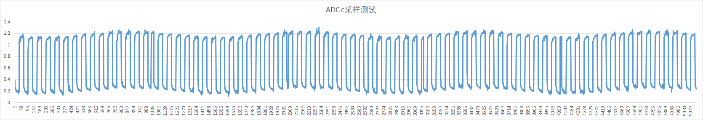

# ADC 采样率测试说明

## 1. ADC 采样时钟

- GR551x 和 GR552x 芯片ADC 模块的理论采样精度是 13bit

- 理论上, 每15个时钟信号产生一个采样值, 其中前2个Clock时钟是采样保持时间, 后面13个clock 进行13 bit的量化编码。 采样率和 ADC 时钟的关系: 

```
1 sample = ADC Clock Rate/15
```

- 另, 考虑到程序调用的额外时间占用, 实际采样时钟和 采样率的关系会 大于 15倍, 一般约在 15 ~ 16 倍之间


## 2. 测试采样率

### 2.1 测试条件设置

- ADC 采集时钟率设置为 1M, 理论采样率 为 1M/15
- 设置单端模式测试, 输入PIN选择 MSIO_2
- 采样输入信号使用 信号发生器, 产生 1k Hz的方波信号, 信号幅值 1v
- 采用多通道采样, 每次采集数据1024次, 连续对输入信号进行5次采集, 总采集次数 5120次


### 2.2 主要测试代码

1. 初始化代码

   ```c
   void app_adc_sample_init(void)
   {
       adc_param.pin_cfg.channel_n.type    = APP_IO_TYPE_MSIO;
       adc_param.pin_cfg.channel_n.mux     = APP_ADC_P_INPUT_PIN_MUX;
       adc_param.pin_cfg.channel_n.pin     = MSIO_PIN_2;
       adc_param.pin_cfg.channel_p.type    = APP_IO_TYPE_MSIO;
       adc_param.pin_cfg.channel_p.mux     = APP_ADC_P_INPUT_PIN_MUX;
       adc_param.pin_cfg.channel_p.pin     = MSIO_PIN_2;
       adc_param.dma_cfg.dma_instance      = DMA0;
       adc_param.dma_cfg.dma_channel       = DMA_Channel0;
       adc_param.init.channel_p            = ADC_INPUT_SRC_IO2;
       adc_param.init.channel_n            = ADC_INPUT_SRC_IO2;
       adc_param.init.input_mode           = ADC_INPUT_SINGLE;
       adc_param.init.ref_source           = ADC_REF_SRC_BUF_INT;
       adc_param.init.ref_value            = ADC_REF_VALUE_1P6;
       adc_param.init.clock                = ADC_CLK_1M;
       
       app_adc_deinit();
       app_adc_init(&adc_param, _app_adc_evt_handler);
       app_adc_dma_deinit();
       app_adc_dma_init(&adc_param);
   }
   
   void app_sample_channel_init(void)
   {
       int i;
       
       for(i=0;i<sizeof(adc)/sizeof(app_adc_sample_node_t);i++)
       {
           adc[i].channel =  ADC_INPUT_SRC_IO0; // ADC_INPUT_SRC_IO0+i;
           adc[i].p_buf   = (uint16_t *)malloc(CONV_LENGTH * sizeof(uint16_t));
           adc[i].len     = CONV_LENGTH;
           if(i+1<sizeof(adc)/sizeof(app_adc_sample_node_t))
               adc[i].next = &adc[i+1];
           else
               adc[i].next = NULL;
       }
       
       return ;
   }
   ```

2. 多通道读取数据, 连续采集5次

   ```c
   int8_t app_adc_read(void)
   {
       uint8_t i=0,timeout = 50;
       adc_flag = 0;
   
       // 多通道ADC读取
       for(i=0;i<sizeof(adc)/sizeof(app_adc_sample_node_t);i++)
           memset(adc[i].p_buf,0,CONV_LENGTH * sizeof(uint16_t));// 清缓冲区
       app_adc_multi_channel_conversion_async(&adc[0],sizeof(adc)/sizeof(app_adc_sample_node_t));
       
       do
       {
           delay_ms(100);
       }while(adc_flag == 0 && timeout-- >0);
       
       if(timeout ==0)
           return -1;
       
       return 0;
   }
   ```

3.  测试逻辑

   ```c
       app_adc_sample_init();
       app_sample_channel_init();
       
       while(1)
       {
           delay_ms(1000);
           memset(input_fft,0,CONV_LENGTH * 2);
           memset(out_fft,0,CONV_LENGTH);
           memset(_voltage,0,CONV_LENGTH);
           app_adc_read();
       
           for(i = 0; i < 5; i++) {
               
               app_adc_voltage_intern(adc[i].p_buf, _voltage, CONV_LENGTH);
               
               for(j=0;j<CONV_LENGTH;j++){
                   APP_LOG_INFO("%0.4f",(float)_voltage[j]);
               }
               
               APP_LOG_INFO("\r\n ++++++++++++++++++++++++++++++++++++++++ \r\n");
           }
       }
   ```

   

### 2.3 测试结果

- 将测试获取的 5120 个数据导入excel 生成折线图.




- 1M 时钟下 5120 次数据的理论采样时间范围一般为:

```
Min :  5120/(1M/15) = 0.077 Sec = 77ms
Max :  5120/(1M/16) = 0.082 Sec = 82ms
```

可以采样到 1KHz 的方波 约小于 82 个.

- 图中的方波周期个数约 78个, 符合采样预期.


- 原始采样数据:

  ```
  0.3917
  0.2854
  0.2709
  0.2556
  0.2446
  0.2415
  0.2304
  0.2251
  0.2212
  0.2128
  0.1949
  0.1895
  0.2125
  0.2197
  0.2029
  0.2094
  0.1987
  0.2033
  0.1998
  0.2006
  0.1934
  0.1991
  0.2018
  0.2109
  0.1880
  0.1613
  0.1800
  0.2037
  0.1903
  0.1888
  0.2048
  0.1926
  0.1880
  0.1941
  1.0566
  1.0749
  1.0898
  1.0875
  1.1005
  1.1162
  1.1204
  1.1528
  1.0699
  1.0982
  1.1108
  1.1097
  1.1257
  1.1253
  1.1467
  1.1326
  1.1334
  1.1433
  1.1540
  1.1391
  1.1383
  1.1292
  1.1532
  1.1399
  1.1441
  1.1261
  1.1509
  1.1391
  1.1876
  1.1100
  1.1490
  1.1471
  1.1188
  0.3049
  0.2660
  0.2568
  0.2304
  0.2289
  0.2339
  0.2147
  0.2075
  0.2041
  0.2063
  0.1956
  0.1934
  0.1926
  0.1784
  0.1888
  0.1941
  0.1884
  0.1819
  0.1823
  0.1758
  0.1983
  0.1662
  0.1716
  0.1754
  0.1937
  0.1758
  0.1456
  0.2025
  0.1941
  0.1586
  0.1387
  0.1918
  0.1704
  0.9064
  1.0233
  1.0737
  1.1055
  1.0871
  1.0634
  1.0806
  1.1039
  1.1016
  1.1032
  1.1093
  1.1158
  1.1162
  1.1093
  1.1165
  1.1234
  1.1139
  1.1322
  1.1211
  1.1227
  1.1299
  1.1330
  1.1314
  1.1441
  1.1299
  1.1353
  1.1162
  1.1303
  1.1337
  1.1284
  1.1292
  1.1311
  1.1272
  1.1318
  0.2805
  0.2438
  0.2232
  0.2125
  0.1991
  0.2086
  0.2002
  0.1918
  0.1853
  0.1930
  0.1865
  0.1792
  0.1846
  0.1834
  0.1635
  0.1746
  0.1620
  0.1647
  0.1815
  0.1731
  0.1804
  0.1521
  0.1658
  0.1574
  0.1620
  0.1781
  0.1635
  0.1574
  0.1425
  0.1628
  0.1651
  0.1544
  0.1613
  0.9992
  1.0394
  1.0581
  1.0634
  1.0764
  1.0909
  1.0699
  1.1288
  1.0734
  1.1483
  1.0875
  1.1314
  1.0990
  1.1150
  1.1047
  1.1036
  1.1089
  1.1200
  1.1123
  1.1162
  1.1234
  1.1207
  1.1368
  1.1207
  1.1215
  1.1215
  1.1311
  1.1299
  1.1120
  1.1219
  1.1448
  1.1150
  1.1311
  0.3779
  0.2690
  0.2434
  0.2331
  0.2170
  0.2121
  0.2075
  0.2048
  0.1953
  0.1991
  0.1788
  0.1911
  0.1869
  0.1846
  0.1834
  0.1815
  0.1754
  0.1758
  0.1830
  0.1746
  0.1746
  0.1628
  0.1723
  0.1624
  0.1620
  0.1635
  0.1666
  0.1677
  0.1677
  0.1700
  0.1704
  0.1693
  0.1624
  0.1681
  1.0298
  1.0508
  1.0638
  1.0707
  1.0791
  1.0844
  1.1055
  1.0959
  1.0982
  1.1039
  1.1051
  1.1066
  1.1066
  1.1112
  1.1146
  1.1165
  1.1188
  1.1169
  1.1207
  1.1272
  1.1112
  1.1223
  1.1238
  1.1406
  1.1204
  1.1276
  1.1307
  1.1483
  1.1460
  1.1357
  1.1391
  1.1406
  1.1360
  0.2923
  0.2572
  0.2335
  0.2289
  0.2174
  0.2228
  0.2155
  0.2056
  0.2144
  0.1964
  0.1934
  0.1823
  0.2331
  0.1838
  0.1865
  0.2044
  0.1849
  0.1819
  0.1891
  0.1861
  0.1792
  0.1949
  0.1754
  0.1777
  0.2052
  0.1895
  0.1727
  0.1578
  0.1727
  0.1735
  0.1666
  0.1865
  0.1643
  0.9335
  1.0428
  1.0642
  1.0745
  1.1009
  1.1001
  1.0982
  1.0974
  1.1265
  1.1116
  1.1066
  1.0974
  1.1314
  1.1200
  1.1269
  1.1158
  1.1261
  1.0841
  1.1276
  1.1353
  1.1326
  1.1337
  1.1345
  1.1334
  1.1414
  1.1341
  1.1379
  1.1620
  1.1349
  1.1334
  1.1368
  1.1372
  1.1429
  1.1444
  0.2824
  0.2728
  0.2388
  0.2358
  0.2247
  0.2266
  0.2140
  0.2117
  0.2086
  0.1953
  0.1849
  0.2083
  0.1937
  0.1922
  0.1941
  0.2209
  0.1945
  0.1857
  0.1872
  0.1773
  0.1823
  0.1689
  0.1865
  0.1762
  0.1746
  0.1773
  0.1781
  0.1720
  0.1326
  0.1716
  0.1735
  0.1655
  0.1681
  1.0180
  1.0321
  1.0783
  1.0730
  1.0657
  1.1036
  1.0929
  1.1058
  1.1005
  1.1120
  1.1123
  1.1192
  1.1211
  1.1108
  1.1284
  1.1292
  1.1349
  1.1311
  1.1391
  1.1318
  1.1341
  1.1410
  1.1387
  1.1307
  1.1418
  1.1437
  1.1395
  1.1376
  1.1437
  1.1490
  1.1429
  1.1544
  1.1498
  0.3836
  0.2732
  0.2522
  0.2232
  0.2392
  0.2277
  0.2270
  0.2113
  0.2075
  0.2113
  0.2977
  0.2136
  0.2033
  0.1972
  0.1987
  0.1956
  0.2266
  0.1926
  0.1914
  0.1911
  0.1911
  0.1888
  0.1911
  0.1857
  0.1781
  0.1899
  0.1849
  0.1842
  0.1781
  0.1876
  0.1991
  0.1861
  0.1849
  0.1804
  1.0485
  1.0745
  1.0906
  1.0940
  1.1039
  1.1139
  1.1192
  1.1227
  1.1295
  1.1280
  1.1448
  1.1387
  1.1425
  1.1441
  1.1460
  1.1475
  1.1513
  1.1582
  1.1506
  1.1601
  1.1540
  1.1601
  1.1616
  1.1502
  1.1670
  1.1578
  1.1689
  1.1605
  1.1708
  1.1712
  1.1723
  1.1708
  1.1735
  0.3286
  0.2919
  0.2759
  0.2694
  0.2583
  0.2556
  0.2415
  0.2381
  0.2358
  0.2426
  0.2365
  0.2178
  0.2167
  0.2335
  0.2174
  0.2235
  0.2128
  0.2105
  0.2186
  0.2147
  0.2274
  0.2136
  0.2094
  0.2113
  0.2132
  0.2071
  0.2052
  0.1930
  0.1968
  0.2029
  0.2086
  0.2159
  0.2029
  0.9763
  1.0818
  1.1036
  1.1123
  1.1192
  1.1326
  1.1387
  1.1540
  1.1555
  1.1647
  1.1548
  1.1513
  1.1605
  1.1613
  1.1655
  1.1616
  1.1674
  1.1670
  1.1693
  1.1762
  1.1914
  1.1590
  1.1788
  1.1662
  1.1750
  1.1796
  1.1792
  1.1846
  1.1811
  1.1911
  1.1857
  1.1911
  1.1941
  1.2029
  0.3107
  0.3034
  0.2835
  0.2767
  0.2713
  0.2644
  0.2564
  0.2553
  0.2533
  0.2476
  0.2480
  0.2514
  0.2354
  0.2323
  0.2404
  0.2361
  0.2419
  0.2327
  0.2312
  0.2358
  0.2251
  0.2232
  0.2266
  0.2316
  0.2312
  0.2212
  0.2102
  0.2121
  0.2136
  0.2205
  0.2170
  0.2182
  0.2174
  1.0703
  1.0986
  1.1158
  1.1280
  1.1376
  1.1376
  1.1540
  1.1555
  1.1555
  1.1681
  1.1655
  1.1540
  1.1639
  1.1670
  1.1731
  1.1697
  1.1754
  1.1807
  1.1861
  1.1823
  1.1880
  1.1888
  1.1838
  1.1876
  1.1941
  1.1865
  1.1903
  1.1945
  1.1823
  1.1979
  1.1735
  1.2361
  1.1827
  0.4455
  0.3206
  0.3015
  0.2927
  0.2797
  0.2782
  0.2759
  0.2629
  0.2633
  0.2579
  0.2572
  0.2530
  0.2560
  0.2511
  0.2461
  0.2480
  0.2388
  0.2484
  0.2457
  0.2415
  0.2426
  0.2400
  0.2411
  0.2392
  0.2457
  0.2384
  0.2323
  0.2446
  0.2373
  0.2178
  0.2136
  0.2319
  0.2289
  0.2163
  1.0913
  1.1421
  1.1288
  1.1299
  1.1395
  1.1506
  1.1563
  1.1624
  1.1639
  1.1735
  1.1720
  1.1689
  1.1849
  1.1842
  1.1800
  1.1792
  1.1849
  1.1823
  1.1953
  1.1865
  1.1918
  1.1888
  1.1922
  1.2002
  1.1945
  1.2021
  1.2006
  1.2025
  1.2056
  1.2048
  1.2041
  1.2071
  1.2071
  0.3577
  0.3286
  0.3091
  0.2973
  0.2912
  0.2854
  0.2789
  0.2728
  0.2736
  0.2709
  0.2675
  0.2633
  0.2740
  0.2503
  0.2541
  0.2526
  0.2564
  0.2476
  0.2533
  0.2556
  0.2537
  0.2488
  0.2453
  0.2560
  0.2423
  0.2480
  0.2495
  0.2587
  0.2354
  0.2339
  0.2423
  0.2549
  0.2453
  1.0115
  1.1207
  1.1414
  1.1574
  1.1548
  1.1681
  1.1742
  1.1490
  1.2147
  1.1754
  1.2323
  1.1651
  1.2224
  1.1800
  1.1979
  1.2002
  1.2033
  1.2125
  1.2109
  1.2128
  1.2083
  1.2086
  1.2136
  1.2060
  1.2136
  1.2281
  1.2079
  1.2190
  1.2193
  1.2205
  1.2243
  1.2113
  1.2254
  1.2507
  0.3045
  0.3126
  0.3580
  0.3130
  0.3110
  0.3034
  0.3053
  0.3000
  0.2847
  0.2938
  0.2831
  0.2767
  0.2728
  0.2843
  0.2809
  0.2724
  0.2686
  0.2717
  0.2744
  0.2728
  0.2919
  0.2667
  0.2713
  0.2625
  0.2690
  0.2579
  0.2774
  0.2606
  0.2640
  0.2698
  0.2602
  0.2705
  0.2575
  1.0734
  1.0806
  1.1391
  1.1720
  1.1765
  1.1765
  1.1930
  1.1918
  1.1976
  1.2063
  1.2025
  1.2044
  1.2090
  1.2033
  1.2308
  1.2644
  1.2308
  1.2163
  1.2239
  1.2186
  1.2155
  1.2220
  1.2212
  1.2159
  1.2300
  1.2297
  1.2293
  1.2304
  1.2251
  1.2335
  1.2316
  1.2163
  1.2277
  0.4681
  0.3615
  0.3324
  0.3363
  0.3366
  0.3290
  0.3600
  0.3271
  0.3149
  0.2912
  0.2831
  0.3068
  0.2938
  0.3019
  0.3007
  0.2786
  0.2866
  0.2763
  0.2721
  0.2843
  0.2774
  0.2579
  0.2579
  0.2702
  0.2644
  0.2728
  0.2671
  0.2595
  0.2682
  0.2721
  0.2476
  0.2621
  0.2598
  0.2644
  1.1345
  1.1215
  1.1104
  1.1593
  1.1784
  1.1804
  1.1956
  1.1903
  1.2002
  1.2029
  1.2136
  1.2083
  1.2140
  1.2136
  1.2094
  1.2151
  1.2140
  1.2178
  1.2312
  1.1857
  1.2212
  1.2698
  1.2063
  1.2094
  1.2251
  1.2297
  1.2239
  1.2193
  1.2316
  1.2346
  1.2327
  1.2392
  1.2392
  0.3905
  0.3462
  0.3366
  0.3259
  0.3168
  0.3107
  0.3156
  0.2996
  0.2916
  0.3015
  0.2912
  0.2874
  0.2866
  0.2774
  0.2854
  0.2789
  0.2759
  0.2767
  0.2724
  0.2751
  0.2648
  0.2682
  0.2652
  0.2694
  0.2724
  0.2805
  0.2572
  0.2625
  0.2595
  0.2598
  0.2702
  0.2614
  0.2545
  1.0374
  1.1345
  1.1475
  1.1643
  1.1823
  1.1792
  1.1838
  1.1934
  1.1895
  1.1891
  1.1945
  1.2090
  1.2052
  1.2067
  1.2144
  1.2128
  1.2147
  1.2113
  1.2182
  1.2212
  1.2209
  1.2331
  1.2274
  1.2239
  1.2312
  1.2247
  1.2308
  1.2388
  1.2274
  1.2186
  1.2224
  1.2335
  1.2335
  1.2342
  0.3718
  0.3462
  0.3263
  0.3198
  0.2724
  0.3003
  0.2946
  0.2992
  0.2919
  0.2938
  0.2893
  0.2717
  0.2789
  0.2797
  0.2736
  0.2751
  0.2660
  0.2724
  0.2675
  0.2663
  0.2522
  0.2702
  0.2495
  0.2717
  0.2610
  0.2553
  0.2579
  0.2595
  0.2602
  0.2709
  0.2560
  0.2560
  0.2530
  1.1024
  1.1379
  1.1532
  1.1807
  1.1662
  1.1964
  1.1700
  1.1827
  1.1926
  1.1976
  1.1998
  1.1960
  1.2625
  1.2029
  1.2136
  1.2113
  1.2170
  1.2201
  1.2170
  1.1979
  1.2067
  1.2190
  1.2144
  1.2170
  1.2235
  1.2212
  1.2021
  1.2312
  1.2232
  1.2025
  1.2316
  1.2285
  1.2308
  0.4562
  0.3515
  0.3313
  0.3263
  0.3225
  0.3179
  0.2984
  0.2908
  0.2877
  0.2820
  0.2786
  0.2797
  0.2736
  0.2736
  0.2686
  0.2709
  0.2640
  0.2656
  0.2671
  0.2488
  0.2652
  0.3145
  0.2564
  0.2537
  1.2006
  1.2071
  1.2037
  1.2140
  1.2079
  1.2113
  1.2121
  1.2113
  1.2098
  1.2285
  1.2067
  1.2201
  1.2163
  1.2258
  1.2297
  1.2155
  1.2426
  1.2247
  1.2262
  1.2289
  0.3707
  0.3508
  0.3217
  0.3130
  0.3042
  0.2988
  0.3011
  0.2931
  0.2954
  0.2831
  0.2736
  0.2713
  0.2724
  0.2713
  0.2587
  0.2591
  0.2698
  0.2572
  0.2602
  0.2564
  0.2648
  0.2553
  0.2640
  0.2583
  0.2572
  0.2503
  0.2426
  0.2507
  0.2522
  0.2449
  0.2453
  0.2541
  0.2426
  1.0802
  1.1196
  1.1452
  1.1425
  1.1525
  1.1674
  1.1632
  1.1880
  1.1765
  1.1777
  1.1823
  1.1788
  1.1846
  1.1899
  1.1811
  1.1869
  1.1853
  1.1849
  1.1918
  1.1930
  1.1960
  1.1895
  1.1960
  1.1979
  1.1991
  1.1926
  1.1964
  1.2014
  1.1926
  1.2056
  1.1964
  1.2002
  1.1964
  1.1998
  0.3271
  0.3137
  0.2866
  0.2847
  0.2797
  0.2702
  0.2732
  0.2667
  0.2637
  0.2572
  0.2549
  0.2606
  0.2461
  0.2503
  0.2434
  0.2484
  0.2369
  0.2426
  0.2373
  0.2407
  0.2430
  0.2316
  0.2232
  0.2281
  0.2247
  0.2312
  0.2262
  0.2281
  0.2247
  0.2266
  0.2331
  0.2266
  0.2251
  1.0734
  1.1039
  1.1215
  1.1337
  1.1502
  1.1318
  1.1376
  1.1517
  1.1559
  1.1689
  1.1716
  1.1762
  1.1601
  1.1597
  1.1590
  1.1597
  1.1620
  1.1723
  1.1762
  1.1869
  1.1869
  1.1857
  1.1869
  1.1930
  1.1941
  1.1861
  1.1941
  1.1891
  1.1937
  1.1876
  1.1941
  1.1934
  1.1895
  0.3607
  0.3198
  0.2927
  0.2847
  0.2747
  0.2614
  0.2640
  0.2476
  0.2503
  0.2480
  0.2373
  0.2354
  0.2468
  0.2274
  0.2365
  0.2308
  0.2327
  0.2319
  0.2308
  0.2212
  0.2277
  0.2190
  0.2147
  0.2163
  0.2151
  0.2140
  0.2209
  0.2121
  0.2155
  0.2190
  0.2113
  0.2079
  0.2094
  0.2079
  1.0764
  1.1028
  1.1108
  1.1200
  1.1314
  1.1303
  1.1276
  1.1441
  1.1467
  1.1467
  1.1517
  1.1521
  1.1532
  1.1563
  1.1616
  1.1567
  1.1742
  1.1567
  1.1639
  1.1727
  1.1578
  1.1681
  1.1739
  1.1700
  1.1700
  1.1655
  1.1750
  1.1693
  1.1697
  1.1685
  1.1804
  1.1727
  1.1788
  0.3217
  0.2889
  0.2816
  0.2640
  0.2644
  0.2499
  0.2388
  0.2423
  0.2472
  0.2316
  0.2289
  0.2228
  0.2239
  0.2205
  0.2159
  0.2144
  0.2182
  0.2136
  0.2090
  0.2140
  0.2079
  0.2083
  0.2151
  0.2289
  0.2140
  0.1960
  0.2071
  0.1987
  0.2002
  0.1995
  0.2029
  0.1960
  0.1941
  1.0264
  1.0837
  1.0948
  1.1135
  1.1162
  1.1261
  1.1269
  1.1295
  1.1295
  1.1357
  1.1421
  1.1421
  1.1441
  1.1460
  1.1498
  1.1502
  1.1494
  1.1536
  1.1441
  1.1498
  1.1559
  1.1601
  1.1593
  1.1605
  1.1551
  1.1651
  1.1655
  1.1624
  1.1620
  1.1643
  1.1674
  1.1773
  1.1720
  1.1628
  0.2881
  0.2679
  0.2587
  0.2503
  0.2461
  0.2400
  0.2300
  0.2220
  0.2193
  0.2212
  0.1998
  0.1945
  0.2105
  0.2128
  0.2086
  0.2132
  0.2002
  0.2029
  0.1964
  0.2006
  0.1972
  0.1884
  0.1853
  0.2170
  0.2514
  0.2319
  0.2021
  0.1926
  0.1998
  0.1804
  0.1922
  0.1765
  0.1926
  1.0382
  1.0776
  1.0795
  1.0844
  1.0959
  1.1020
  1.1196
  1.0955
  1.0925
  1.1093
  1.1479
  1.1261
  1.1295
  1.1376
  1.1395
  1.1376
  1.1227
  1.1368
  1.1334
  1.1364
  1.1265
  1.1448
  1.1295
  1.1368
  1.1383
  1.1421
  1.1544
  1.1620
  1.1066
  1.1448
  1.1418
  1.1364
  1.1395
  0.3191
  0.2717
  0.2518
  0.2205
  0.2235
  0.2247
  0.2274
  0.2212
  0.2071
  0.2136
  0.2044
  0.1960
  0.2048
  0.1960
  0.1865
  0.1949
  0.1846
  0.1983
  0.1758
  0.1815
  0.1834
  0.1655
  0.1849
  0.1865
  0.1410
  0.2033
  0.1582
  0.1605
  0.1869
  0.1498
  0.1490
  0.1746
  0.1658
  0.1712
  1.0359
  1.0508
  1.0669
  1.0707
  1.0856
  1.0929
  1.0967
  1.1039
  1.1051
  1.1097
  1.1196
  1.1104
  1.1066
  1.1085
  1.1089
  1.1372
  1.1200
  1.1223
  1.1280
  1.1337
  1.1330
  1.1349
  1.1265
  1.1368
  1.1364
  1.1402
  1.1303
  1.1337
  1.1444
  1.1395
  1.1444
  1.1200
  1.1479
  0.2805
  0.2530
  0.2377
  0.2293
  0.2197
  0.2121
  0.2174
  0.2094
  0.1983
  0.1811
  0.1903
  0.1869
  0.1823
  0.1788
  0.1800
  0.1758
  0.1704
  0.1754
  0.1735
  0.1777
  0.1735
  0.1742
  0.1528
  0.1540
  0.1655
  0.1739
  0.1613
  0.1616
  0.1578
  0.1559
  0.1746
  0.1635
  0.1578
  0.9817
  1.0497
  1.0573
  1.0371
  1.1211
  1.0516
  1.1357
  1.0592
  1.1139
  1.0841
  1.0936
  1.1047
  1.1074
  1.1039
  1.1100
  1.1158
  1.1127
  1.1154
  1.1215
  1.1265
  1.1162
  1.1150
  1.1295
  1.1215
  1.1246
  1.1326
  1.1280
  1.1272
  1.1295
  1.1341
  1.1192
  1.1632
  1.1368
  1.1188
  0.2812
  0.2514
  0.2274
  0.2197
  0.2105
  0.2125
  0.2094
  0.1964
  0.2014
  0.1914
  0.1903
  0.1869
  0.1819
  0.1880
  0.1754
  0.1911
  0.1746
  0.1788
  0.1712
  0.1750
  0.1697
  0.1716
  0.1800
  0.1708
  0.1662
  0.1643
  0.1639
  0.1742
  0.1639
  0.1674
  0.1605
  0.1593
  0.1620
  1.0214
  1.0481
  1.0566
  1.0669
  1.0810
  1.0898
  1.0883
  1.0986
  1.1001
  1.1028
  1.1062
  1.1177
  1.1150
  1.1131
  1.1246
  1.1223
  1.1177
  1.1230
  1.1223
  1.1295
  1.1238
  1.1314
  1.1303
  1.1311
  1.1292
  1.1272
  1.1269
  1.1272
  1.1322
  1.1318
  1.1272
  1.1146
  1.1357
  0.3072
  0.2614
  0.2518
  0.2316
  0.2201
  0.2293
  0.2140
  0.2018
  0.2006
  0.1960
  0.1979
  0.1807
  0.1884
  0.2155
  0.1804
  0.1815
  0.1960
  0.1750
  0.1758
  0.1853
  0.1784
  0.1716
  0.1731
  0.1773
  0.1968
  0.1651
  0.1727
  0.1185
  0.1750
  0.1723
  0.1490
  0.1762
  0.1677
  0.1628
  1.0210
  1.0524
  1.0753
  1.0978
  1.0925
  1.0894
  1.1070
  1.0753
  1.1043
  1.1104
  1.0638
  1.1246
  1.1227
  1.1100
  1.1223
  1.1169
  1.1250
  1.0894
  1.1303
  1.1353
  1.1376
  1.1364
  1.1349
  1.1383
  1.1311
  1.1379
  1.1441
  1.1150
  1.1563
  1.1376
  1.1357
  1.1318
  1.1402
  0.2854
  0.2618
  0.2614
  0.2297
  0.2209
  0.2029
  0.2170
  0.2147
  0.2102
  0.2098
  0.2025
  0.2018
  0.1987
  0.1937
  0.1964
  0.1811
  0.1926
  0.1708
  0.1777
  0.1964
  0.1911
  0.1849
  0.1819
  0.2167
  0.1697
  0.1750
  0.1800
  0.1754
  0.1769
  0.1976
  0.1586
  0.1792
  0.1681
  1.0046
  1.0497
  1.0692
  1.0352
  1.0971
  1.0959
  1.1234
  1.1036
  1.1058
  1.1112
  1.1181
  1.1181
  1.1204
  1.1353
  1.1227
  1.1261
  1.1146
  1.1437
  1.1322
  1.1456
  1.1326
  1.1360
  1.1494
  1.1307
  1.1391
  1.1402
  1.1486
  1.1720
  1.1506
  1.1429
  1.1464
  1.1460
  1.1280
  1.1421
  0.2801
  0.2724
  0.2419
  0.2373
  0.2327
  0.2293
  0.2270
  0.2675
  0.2075
  0.2113
  0.2025
  0.1949
  0.1930
  0.2006
  0.1872
  0.1899
  0.1983
  0.2075
  0.1853
  0.1895
  0.1991
  0.1956
  0.1872
  0.1907
  0.1865
  0.1907
  0.1796
  0.1819
  0.1872
  0.1758
  0.1777
  0.1811
  0.1922
  1.0436
  1.0852
  1.0955
  1.0982
  1.1032
  1.1078
  1.1207
  1.1284
  1.1280
  1.1311
  1.1368
  1.1387
  1.1421
  1.1429
  1.1548
  1.1502
  1.1528
  1.1571
  1.1521
  1.1590
  1.1586
  1.1551
  1.1739
  1.1632
  1.1624
  1.1666
  1.1647
  1.1677
  1.1681
  1.1712
  1.1754
  1.1750
  1.1731
  0.3405
  0.2981
  0.2744
  0.2702
  0.2587
  0.2560
  0.2461
  0.2434
  0.2530
  0.2155
  0.2224
  0.2243
  0.2235
  0.2212
  0.2190
  0.2174
  0.2140
  0.2159
  0.2151
  0.2140
  0.2048
  0.2136
  0.2125
  0.2105
  0.2266
  0.2048
  0.2002
  0.1953
  0.2155
  0.2102
  0.2113
  0.2132
  0.1754
  0.2033
  1.0772
  1.0986
  1.1085
  1.1280
  1.1238
  1.1502
  1.1345
  1.1360
  1.1230
  1.1448
  1.1620
  1.1551
  1.1567
  1.1563
  1.1681
  1.1670
  1.1624
  1.1716
  1.1742
  1.1857
  1.1807
  1.1960
  1.1941
  1.1872
  1.1811
  1.1784
  1.1746
  1.1819
  1.1853
  1.1800
  1.1888
  1.1861
  1.1807
  0.3084
  0.2973
  0.2904
  0.2751
  0.2740
  0.2648
  0.2583
  0.2602
  0.2476
  0.2465
  0.2442
  0.2404
  0.2384
  0.2300
  0.2258
  0.2361
  0.2388
  0.2308
  0.2335
  0.2300
  0.2297
  0.2323
  0.2262
  0.2285
  0.2342
  0.2239
  0.2274
  0.2339
  0.2216
  0.2190
  0.2205
  0.2159
  0.2201
  1.0367
  1.0948
  1.1116
  1.1207
  1.1326
  1.1391
  1.1506
  1.1506
  1.1609
  1.1616
  1.1586
  1.1773
  1.1765
  1.1540
  1.1605
  1.1746
  1.1739
  1.1777
  1.1815
  1.1830
  1.1857
  1.1891
  1.1926
  1.1930
  1.1857
  1.1922
  1.1899
  1.1930
  1.1953
  1.1968
  1.1926
  1.1777
  1.1956
  1.2071
  0.3042
  0.3294
  0.2916
  0.2816
  0.2801
  0.2713
  0.2671
  0.2709
  0.2614
  0.2560
  0.2533
  0.2556
  0.2499
  0.2499
  0.2392
  0.2407
  0.2354
  0.2426
  0.2442
  0.2426
  0.2365
  0.2327
  0.2400
  0.2335
  0.2381
  0.2411
  0.2308
  0.2377
  0.2289
  0.2335
  0.1888
  0.2235
  0.2358
  1.0844
  1.0971
  1.1303
  1.1605
  1.1395
  1.1532
  1.1532
  1.1662
  1.1681
  1.1689
  1.1662
  1.1681
  1.1834
  1.1857
  1.1849
  1.1918
  1.1880
  1.1891
  1.1888
  1.1857
  1.1903
  1.1956
  1.1903
  1.1976
  1.2006
  1.2014
  1.2029
  1.1987
  1.2044
  1.2021
  1.2105
  1.2117
  1.2094
  0.3798
  0.3397
  0.3152
  0.3061
  0.2969
  0.2885
  0.2854
  0.2774
  0.2744
  0.2751
  0.2759
  0.2671
  0.2637
  0.2606
  0.2564
  0.2572
  0.2549
  0.2583
  0.2480
  0.2449
  0.2446
  0.2468
  0.2526
  0.2541
  0.2495
  0.2449
  0.2377
  0.2396
  0.2591
  0.2438
  0.2503
  0.2468
  0.2289
  0.2293
  1.1150
  1.1437
  1.1475
  1.1574
  1.1567
  1.1700
  1.1777
  1.1765
  1.1934
  1.1899
  1.1605
  1.2304
  1.1811
  1.2644
  1.1788
  1.2335
  1.1968
  1.2170
  1.2098
  1.2063
  1.2086
  1.2167
  1.2151
  1.2113
  1.2151
  1.2170
  1.2167
  1.2220
  1.2228
  1.2144
  1.2277
  1.2228
  1.2251
  0.3810
  0.3454
  0.3347
  0.3622
  0.2629
  0.2660
  0.2453
  0.2579
  0.2564
  0.2621
  0.2587
  1.1441
  1.1326
  1.1418
  1.1697
  1.1861
  1.1849
  1.1884
  1.1968
  1.1930
  1.2083
  1.2132
  1.2029
  1.1979
  1.2140
  1.2170
  1.1911
  1.2251
  1.2232
  1.2155
  1.2216
  1.2235
  1.2224
  1.2361
  1.2251
  1.2212
  1.2193
  1.1976
  1.2075
  1.2579
  1.2281
  1.2346
  1.2384
  1.2419
  0.3737
  0.3527
  0.3386
  0.3286
  0.3130
  0.3175
  0.2648
  0.2889
  0.3072
  0.2965
  0.2908
  0.2977
  0.2958
  0.2809
  0.2996
  0.2862
  0.2812
  0.2751
  0.2874
  0.3007
  0.2560
  0.2618
  0.2740
  0.2694
  0.2709
  0.2717
  0.2782
  0.2732
  0.2724
  0.2671
  0.2598
  0.2705
  0.2682
  1.0772
  1.1127
  1.1464
  1.1532
  1.1746
  1.1983
  1.1907
  1.1972
  1.1991
  1.2048
  1.2033
  1.2147
  1.2125
  1.2144
  1.2075
  1.2083
  1.2323
  1.1907
  1.2128
  1.2350
  1.2423
  1.2201
  1.2254
  1.2323
  1.2235
  1.2319
  1.2235
  1.2323
  1.2354
  1.2297
  1.2373
  1.2297
  1.2293
  1.2388
  0.3588
  0.3451
  0.3229
  0.3214
  0.3110
  0.3145
  0.2874
  0.3007
  0.2912
  0.2946
  0.2912
  0.2851
  0.2824
  0.2793
  0.2835
  0.2786
  0.2816
  0.2774
  0.2782
  0.2782
  0.2763
  0.2637
  0.2698
  0.2721
  0.2595
  0.2675
  0.2618
  0.2614
  0.2610
  0.2579
  0.2648
  0.2610
  0.2660
  1.1230
  1.1410
  1.1605
  1.1677
  1.1720
  1.1800
  1.1895
  1.1972
  1.1964
  1.1953
  1.2002
  1.2021
  1.2052
  1.2075
  1.2117
  1.2224
  1.1991
  1.2193
  1.2251
  1.2147
  1.2163
  1.2212
  1.2151
  1.2438
  1.2197
  1.2350
  1.2426
  1.2258
  1.2300
  1.2316
  1.2423
  1.2266
  1.2384
  0.3901
  0.3600
  0.3363
  0.3103
  0.3126
  0.3191
  0.3099
  0.2992
  0.2877
  0.2885
  0.2793
  0.2854
  0.2835
  0.2831
  0.2705
  0.2629
  0.2656
  0.2740
  0.2629
  0.2763
  0.2702
  0.2786
  0.2572
  0.2633
  0.2438
  0.2442
  0.2679
  0.2618
  0.2969
  0.2633
  0.2541
  0.2170
  0.2587
  0.2556
  1.1230
  1.1590
  1.1567
  1.1907
  1.1819
  1.1800
  1.1548
  1.1987
  1.1934
  1.1880
  1.2006
  1.2090
  1.2090
  1.2824
  1.2014
  1.2312
  1.2102
  1.2239
  1.2174
  1.1976
  1.2190
  1.2224
  1.2430
  1.2136
  1.2384
  1.2331
  1.2235
  1.2239
  1.2304
  1.3038
  1.2232
  1.2285
  1.2293
  0.3699
  0.3519
  0.3194
  0.3202
  0.3133
  0.2969
  0.2843
  0.2889
  0.2969
  0.2705
  0.2793
  0.2835
  0.2461
  0.2736
  0.2755
  0.2732
  0.2782
  0.2644
  0.2686
  0.2656
  0.2614
  0.2625
  0.2614
  0.2724
  0.2583
  0.2598
  0.2591
  0.2751
  0.2591
  0.2553
  0.2824
  0.2518
  0.2507
  1.0791
  1.1410
  1.1486
  1.1410
  1.1693
  1.1697
  1.1777
  1.1750
  1.1846
  1.1956
  1.1857
  1.2037
  1.1460
  1.2029
  1.2018
  1.1895
  1.2178
  1.2147
  1.2235
  1.2052
  1.2151
  1.2079
  1.2270
  1.2193
  1.2316
  1.2117
  1.2247
  1.2151
  1.2186
  1.2304
  1.2239
  1.1823
  1.2270
  1.2285
  0.3401
  0.3332
  0.3206
  0.3088
  0.3034
  0.3015
  0.2679
  0.2935
  0.2812
  0.2942
  0.2728
  0.2694
  0.2774
  0.2610
  0.2625
  0.2736
  0.2663
  0.2568
  0.2740
  0.2606
  0.2537
  0.2660
  0.2526
  0.2514
  0.2621
  0.2465
  0.2491
  0.2419
  0.2564
  0.2438
  0.2430
  0.2507
  0.2526
  1.1032
  1.1311
  1.1345
  1.1467
  1.1605
  1.1586
  1.1700
  1.1704
  1.1765
  1.1781
  1.1777
  1.1857
  1.1849
  1.1815
  1.1884
  1.1842
  1.1922
  1.1926
  1.1945
  1.1918
  1.1891
  1.1995
  1.1968
  1.1914
  1.1998
  1.1895
  1.2147
  1.1991
  1.2021
  1.1991
  1.1991
  1.2041
  1.2002
  0.3638
  0.3217
  0.3030
  0.2946
  0.2923
  0.2755
  0.2705
  0.2728
  0.2640
  0.2679
  0.2591
  0.2541
  0.2495
  0.2472
  0.2453
  0.2491
  0.2468
  0.2381
  0.2533
  0.2170
  0.2495
  0.2342
  0.2354
  0.2350
  0.2293
  0.2281
  0.2300
  0.2327
  0.2312
  0.2159
  0.2300
  0.2297
  0.2254
  0.2235
  1.0951
  1.1120
  1.1253
  1.1387
  1.1406
  1.1406
  1.1494
  1.1517
  1.1509
  1.1548
  1.1483
  1.1647
  1.1754
  1.1723
  1.1750
  1.1670
  1.1727
  1.1811
  1.1754
  1.1807
  1.1792
  1.1823
  1.1796
  1.1811
  1.1792
  1.1842
  1.1807
  1.1865
  1.1842
  1.1838
  1.1857
  1.1899
  1.1876
  0.3305
  0.3034
  0.2877
  0.2797
  0.2682
  0.2633
  0.2610
  0.2491
  0.2568
  0.2423
  0.2407
  0.2400
  0.2339
  0.2316
  0.2285
  0.2316
  0.2342
  0.2277
  0.2228
  0.2232
  0.2235
  0.2151
  0.2132
  0.2128
  0.2125
  0.2201
  0.2109
  0.2090
  0.2025
  0.2079
  0.2125
  0.2063
  0.2014
  1.0459
  1.0994
  1.0967
  1.1051
  1.1360
  1.1280
  1.1421
  1.1425
  1.1475
  1.1551
  1.1571
  1.1559
  1.1532
  1.1727
  1.1616
  1.1632
  1.1506
  1.1643
  1.1704
  1.1655
  1.1697
  1.1838
  1.1666
  1.1731
  1.1796
  1.1731
  1.1727
  1.1788
  1.1754
  1.1861
  1.1677
  1.1888
  1.1769
  1.1723
  0.3053
  0.2843
  0.2744
  0.2633
  0.2549
  0.2476
  0.2476
  0.2465
  0.2190
  0.2167
  0.2308
  0.2258
  0.2270
  0.2232
  0.2216
  0.2178
  0.2201
  0.2228
  0.2163
  0.2060
  0.2052
  0.2056
  0.2033
  0.2014
  0.2014
  0.1995
  0.2025
  0.2079
  0.1956
  0.2147
  0.2113
  0.2010
  0.1976
  1.0596
  1.0860
  1.0971
  1.1108
  1.1185
  1.1211
  1.1318
  1.1322
  1.1383
  1.1433
  1.1448
  1.1479
  1.1494
  1.1582
  1.1490
  1.1467
  1.1582
  1.1578
  1.1601
  1.1578
  1.1605
  1.1647
  1.1632
  1.1647
  1.1597
  1.1681
  1.1651
  1.1681
  1.1708
  1.1720
  1.1639
  1.1681
  1.1651
  0.3279
  0.2843
  0.2690
  0.2560
  0.2423
  0.2430
  0.2197
  0.2541
  0.2388
  0.2121
  0.2167
  0.2159
  0.2144
  0.2071
  0.2155
  0.2025
  0.2067
  0.2041
  0.2033
  0.1765
  0.1548
  0.1853
  0.1834
  0.1972
  0.1895
  0.2014
  0.1960
  0.1926
  0.1895
  0.1815
  0.1976
  0.1891
  0.1834
  0.2220
  1.0623
  1.0359
  1.0772
  1.0936
  1.1039
  1.1081
  1.1154
  1.1181
  1.1238
  1.1043
  1.1246
  1.1265
  1.1143
  1.1269
  1.1265
  1.1230
  1.1498
  1.1108
  1.1383
  1.1945
  1.1399
  1.1421
  1.1536
  1.1441
  1.1418
  1.1494
  1.1360
  1.1379
  1.1479
  1.1479
  1.1475
  1.1506
  1.1379
  0.2977
  0.2579
  0.2461
  0.2342
  0.2319
  0.2224
  0.2136
  0.1857
  0.2572
  0.1815
  0.2484
  0.1891
  0.1937
  0.1842
  0.1823
  0.1891
  0.1811
  0.1712
  0.1758
  0.1769
  0.1597
  0.1781
  0.1700
  0.1769
  0.1758
  0.1712
  0.1731
  0.1628
  0.1601
  0.1746
  0.1704
  0.1643
  0.1735
  1.0073
  1.0585
  1.0703
  1.0588
  1.0772
  1.0944
  1.1036
  1.1078
  1.0959
  1.0760
  1.0867
  1.1051
  1.1452
  1.1379
  1.0948
  1.0951
  1.0810
  1.1357
  1.1697
  1.1643
  1.1307
  1.1066
  1.1051
  1.1097
  1.1123
  1.1257
  1.1314
  1.1299
  1.1364
  1.1464
  1.1421
  1.1188
  1.1253
  1.1391
  0.2702
  0.2327
  0.2297
  0.2190
  0.2079
  0.2021
  0.1953
  0.1891
  0.1872
  0.1945
  0.1995
  0.2132
  0.2239
  0.2079
  0.2021
  0.1811
  0.1597
  0.1731
  0.1658
  0.1739
  0.1689
  0.1727
  0.1914
  0.1597
  0.1635
  0.1605
  0.1655
  0.1655
  0.1689
  0.1601
  0.1712
  0.1593
  0.1513
  1.0172
  1.0481
  1.0585
  1.0711
  1.0833
  1.0810
  1.0837
  1.1081
  1.0955
  1.0986
  1.1097
  1.1089
  1.1150
  1.1089
  1.1078
  1.1253
  1.1131
  1.1211
  1.1234
  1.1089
  1.1139
  1.1112
  1.0997
  1.1314
  1.1280
  1.1318
  1.1418
  1.1311
  1.1311
  1.1353
  1.1360
  1.1334
  1.1383
  0.2858
  0.2526
  0.2381
  0.2216
  0.2304
  0.2121
  0.2071
  0.2067
  0.2067
  0.1960
  0.1934
  0.1888
  0.1884
  0.1819
  0.1911
  0.1807
  0.1742
  0.1895
  0.1819
  0.1769
  0.1670
  0.1700
  0.1777
  0.1677
  0.1643
  0.1739
  0.1590
  0.1616
  0.1777
  0.1704
  0.1700
  0.1624
  0.1655
  0.1681
  1.0264
  1.0581
  1.0661
  1.0791
  1.0841
  1.0936
  1.0951
  1.1020
  1.1001
  1.0986
  1.1078
  1.1070
  1.1135
  1.1135
  1.1215
  1.1207
  1.1207
  1.1246
  1.1200
  1.1078
  1.1311
  1.1292
  1.1379
  1.1421
  1.1257
  1.1280
  1.1700
  1.1402
  1.1357
  1.1475
  1.1425
  1.1330
  1.1486
  0.2809
  0.2530
  0.2946
  0.2251
  0.2526
  0.2125
  0.2083
  0.2094
  0.2029
  0.1953
  0.1979
  0.1945
  0.1865
  0.1949
  0.1846
  0.1865
  0.1884
  0.1716
  0.1754
  0.1830
  0.1513
  0.1777
  0.1804
  0.1815
  0.1758
  0.1712
  0.1509
  0.1685
  0.2063
  0.1674
  0.1697
  0.1765
  0.1700
  1.0080
  1.0573
  1.0669
  1.0737
  1.0932
  1.0940
  1.0978
  1.1085
  1.1047
  1.1139
  1.1154
  1.1188
  1.1165
  1.1242
  1.1246
  1.1827
  1.1261
  1.1311
  1.1192
  1.1322
  1.1318
  1.1334
  1.1372
  1.1387
  1.1272
  1.1357
  1.1544
  1.1425
  1.1651
  1.1444
  1.1127
  1.1357
  1.1525
  1.1421
  0.2831
  0.2537
  0.2511
  0.2342
  0.2205
  0.2224
  0.2228
  0.2105
  0.2083
  0.2044
  0.2109
  0.2041
  0.1972
  0.1869
  0.1853
  0.1930
  0.1899
  0.1934
  0.1830
  0.1857
  0.1559
  0.1945
  0.1765
  0.1811
  0.1796
  0.1765
  0.1823
  0.1712
  0.1773
  0.1964
  0.1784
  0.1956
  0.1773
  1.0275
  1.0581
  1.0795
  1.0802
  1.0906
  1.0990
  1.0997
  1.1097
  1.1112
  1.1165
  1.1280
  1.1314
  1.0596
  1.1360
  1.1246
  1.1429
  1.1314
  1.1376
  1.1334
  1.1314
  1.1345
  1.1376
  1.1559
  1.1486
  1.1494
  1.1379
  1.1441
  1.1731
  1.1525
  1.1456
  1.1471
  1.1464
  1.1513
  0.3133
  0.2644
  0.2533
  0.2507
  0.2304
  0.2342
  0.2190
  0.2151
  0.2144
  0.2029
  0.2090
  0.2048
  0.1804
  0.2090
  0.1995
  0.1941
  0.1983
  0.2094
  0.1819
  0.2006
  0.1937
  0.1479
  0.1884
  0.1907
  0.1880
  0.1796
  0.2056
  0.1853
  0.1891
  0.1842
  0.1853
  0.1891
  0.1796
  0.1811
  1.0562
  1.0795
  1.0951
  1.1009
  1.1070
  1.1120
  1.1196
  1.1238
  1.1269
  1.1349
  1.1345
  1.1391
  1.1429
  1.1429
  1.1475
  1.1506
  1.1444
  0.2446
  0.2411
  0.2365
  0.2354
  0.2254
  0.2251
  0.2339
  0.1998
  0.2117
  0.2423
  0.2128
  0.2220
  0.2071
  0.2159
  0.2048
  0.2121
  0.2083
  0.2197
  0.2105
  0.2128
  0.2063
  0.2159
  0.2136
  0.2071
  0.1934
  0.1914
  0.9545
  1.0787
  1.1085
  1.1112
  1.1196
  1.1326
  1.1360
  1.1383
  1.1452
  1.1490
  1.1517
  1.1590
  1.1578
  1.1483
  1.1567
  1.1685
  1.1674
  1.1658
  1.1742
  1.1754
  1.1746
  1.1777
  1.1819
  1.1769
  1.1804
  1.1773
  1.1834
  1.1655
  1.1827
  1.1907
  1.1834
  1.1884
  1.1849
  1.1934
  0.3252
  0.2969
  0.2931
  0.2831
  0.2847
  0.2652
  0.2430
  0.2602
  0.2518
  0.2507
  0.2430
  0.2339
  0.2373
  0.2415
  0.2339
  0.2373
  0.2274
  0.2316
  0.2121
  0.2155
  0.2369
  0.2289
  0.2235
  0.2235
  0.2251
  0.2251
  0.2243
  0.2235
  0.2224
  0.2224
  0.2262
  0.2316
  0.2350
  1.0741
  1.1043
  1.1188
  1.1250
  1.1345
  1.1368
  1.1502
  1.1555
  1.1597
  1.1528
  1.1620
  1.1639
  1.1693
  1.1762
  1.1674
  1.1460
  1.1563
  1.1842
  1.1827
  1.1815
  1.1819
  1.1869
  1.1811
  1.1926
  1.1926
  1.1899
  1.2052
  1.1903
  1.1884
  1.1911
  1.1941
  1.1918
  1.1995
  0.4482
  0.3374
  0.2919
  0.2839
  0.2904
  0.2629
  0.2724
  0.2740
  0.2633
  0.2602
  0.2575
  0.2568
  0.2507
  0.2495
  0.2587
  0.2511
  0.2449
  0.2411
  0.2434
  0.2404
  0.2354
  0.2381
  0.2388
  0.2316
  0.2381
  0.2358
  0.2426
  0.2293
  0.2312
  0.2304
  0.2358
  0.2163
  0.2369
  0.2281
  1.0757
  1.1276
  1.1479
  1.1288
  1.1513
  1.1521
  1.1643
  1.1628
  1.1697
  1.1628
  1.1769
  1.1777
  1.1792
  1.1838
  1.1849
  1.1853
  1.1903
  1.1907
  1.1888
  1.1998
  1.1945
  1.1914
  1.1987
  1.1960
  1.1968
  1.2010
  1.2056
  1.2006
  1.2048
  1.2037
  1.2063
  1.2075
  1.2067
  0.3626
  0.3244
  0.3107
  0.2965
  0.2935
  0.2847
  0.2870
  0.2759
  0.2774
  0.2702
  0.2702
  0.2629
  0.2625
  0.2572
  0.2549
  0.2514
  0.2545
  0.2556
  0.2583
  0.2549
  0.2595
  0.2476
  0.2472
  0.2480
  0.2430
  0.2411
  0.2430
  0.2476
  0.2511
  0.2415
  0.2461
  0.2358
  0.2335
  0.9931
  1.1276
  1.1314
  1.1433
  1.1521
  1.1624
  1.1846
  1.1762
  1.1781
  1.1869
  1.1907
  1.1697
  1.2304
  1.1891
  1.1861
  1.1960
  1.1849
  1.2384
  1.1941
  1.2075
  1.2117
  1.2147
  1.2144
  1.2174
  1.2190
  1.2174
  1.2205
  1.2251
  1.2193
  1.2220
  1.2232
  1.2220
  1.2243
  1.2319
  0.3699
  0.3389
  0.3202
  0.3252
  0.3049
  0.3309
  0.2713
  0.2767
  0.3045
  0.2893
  0.2874
  0.2778
  0.2751
  0.2988
  0.2751
  0.2839
  0.2618
  0.2732
  0.2640
  0.2686
  0.2637
  0.2755
  0.2694
  0.2671
  0.3023
  0.3130
  0.2618
  0.2690
  0.2637
  0.2587
  0.2705
  0.2564
  0.2755
  1.1051
  1.1467
  1.1517
  1.1716
  1.1727
  1.1804
  1.1949
  1.2094
  1.1998
  1.2098
  1.1922
  1.2083
  1.2052
  1.2063
  1.2117
  1.2128
  1.2212
  1.2121
  1.2205
  1.2163
  1.2285
  1.2201
  1.2067
  1.2266
  1.2251
  1.2193
  1.2319
  1.2323
  1.2308
  1.2220
  1.2327
  1.2377
  1.2533
  0.5395
  0.3707
  0.3332
  0.3298
  0.3164
  0.3271
  0.3137
  0.3068
  0.2996
  0.3038
  0.2904
  0.2854
  0.2736
  0.3133
  0.3141
  0.2816
  0.2843
  0.2809
  0.2721
  0.2854
  0.2732
  0.2694
  0.2816
  0.2690
  0.2675
  0.2549
  0.2277
  0.2583
  0.2671
  0.2660
  0.2637
  0.2732
  0.2618
  0.2667
  1.1261
  1.1498
  1.1704
  1.1677
  1.1941
  1.1979
  1.1681
  1.1670
  1.1739
  1.1941
  1.2052
  1.2067
  1.2140
  1.2174
  1.2170
  1.2285
  1.2151
  1.2308
  1.2109
  1.2319
  1.2178
  1.2304
  1.2289
  1.2377
  1.2472
  1.1773
  1.2079
  1.2572
  1.2304
  1.2350
  1.2297
  1.2377
  1.2468
  0.3791
  0.3470
  0.3420
  0.3301
  0.3160
  0.3156
  0.3084
  0.2981
  0.2950
  0.3015
  0.2927
  0.2870
  0.2843
  0.2851
  0.2835
  0.2816
  0.2786
  0.2831
  0.2763
  0.2721
  0.2736
  0.2724
  0.2702
  0.2648
  0.2660
  0.2671
  0.2709
  0.2637
  0.2503
  0.2652
  0.2553
  0.2602
  0.2595
  1.0019
  1.1376
  1.1578
  1.1670
  1.1670
  1.1804
  1.1849
  1.1934
  1.1987
  1.1964
  1.1857
  1.2002
  1.2048
  1.2132
  1.2071
  1.2144
  1.2151
  1.2178
  1.2205
  1.2178
  1.2086
  1.2155
  1.2117
  1.2277
  1.2239
  1.2285
  1.2663
  1.2186
  1.2319
  1.2254
  1.2369
  1.2090
  1.2365
  1.2381
  0.3733
  0.3424
  0.3298
  0.3321
  0.3187
  0.3168
  0.2862
  0.2847
  0.2931
  0.2778
  0.2801
  0.2935
  0.3126
  0.2698
  0.2770
  0.2927
  0.2679
  0.2721
  0.2147
  0.2709
  0.2679
  0.2858
  0.2572
  0.2579
  0.2468
  0.2583
  0.2579
  0.2423
  0.2476
  0.2556
  0.2480
  0.2461
  0.2476
  1.1441
  1.1372
  1.1525
  1.1506
  1.1647
  1.1788
  1.2247
  1.1918
  1.1960
  1.1762
  1.2021
  1.2052
  1.1922
  1.2151
  1.2090
  1.2048
  1.2140
  1.2170
  1.2132
  1.2568
  1.2147
  1.2243
  1.2354
  1.2316
  1.2216
  1.2209
  1.2201
  1.2239
  1.2545
  1.2193
  1.2243
  1.2331
  1.2167
  0.4906
  0.3424
  0.3110
  0.3202
  0.3194
  0.2938
  0.2938
  0.2996
  0.2858
  0.2889
  0.2843
  0.2881
  0.2770
  0.2705
  0.2656
  0.2767
  0.2671
  0.2572
  0.2598
  0.2667
  0.2514
  0.2702
  0.2602
  0.2598
  0.2579
  0.2667
  0.2541
  0.2614
  0.2694
  0.2545
  0.2438
  0.2553
  0.2560
  0.2503
  1.1112
  1.1421
  1.1601
  1.1609
  1.1880
  1.1712
  1.1784
  1.1891
  1.1930
  1.1979
  1.1968
  1.2014
  1.2075
  1.2105
  1.1544
  1.2075
  1.2083
  1.2094
  1.2155
  1.2193
  1.2067
  1.2186
  1.2109
  1.2174
  1.2109
  1.2350
  1.2239
  1.2239
  1.2247
  1.2205
  1.2136
  1.2224
  1.2190
  0.3638
  0.3332
  0.3386
  0.3061
  0.2984
  0.3217
  0.2973
  0.2831
  0.2805
  0.2820
  0.2702
  0.2400
  0.2801
  0.2759
  0.2740
  0.2747
  0.2602
  0.2671
  0.2698
  0.2606
  0.2595
  0.2488
  0.2614
  0.2545
  0.2587
  0.2556
  0.2614
  0.2522
  0.2438
  0.2419
  0.2339
  0.2365
  0.2430
  0.9866
  1.1039
  1.1334
  1.1467
  1.1582
  1.1750
  1.1655
  1.1727
  1.1712
  1.1784
  1.1853
  1.1762
  1.1784
  1.1811
  1.1727
  1.1880
  1.1888
  1.1911
  1.1934
  1.1907
  1.1911
  1.1941
  1.1937
  1.1930
  1.1960
  1.1972
  1.2037
  1.1964
  1.2037
  1.1995
  1.2021
  1.2021
  1.2018
  1.1983
  0.3317
  0.3179
  0.3003
  0.2816
  0.2900
  0.2732
  0.2724
  0.2713
  0.2705
  0.2591
  0.2514
  0.2614
  0.2446
  0.2499
  0.2476
  0.2491
  0.2404
  0.2388
  0.2476
  0.2434
  0.2350
  0.2331
  0.2361
  0.2327
  0.2369
  0.2293
  0.2346
  0.2235
  0.2277
  0.2365
  0.2266
  0.2136
  0.2350
  1.0783
  1.0871
  1.1292
  1.1253
  1.1337
  1.1479
  1.1509
  1.1498
  1.1517
  1.1616
  1.1551
  1.1639
  1.1727
  1.1681
  1.1662
  1.1720
  1.1754
  1.1742
  1.1700
  1.1716
  1.1735
  1.1777
  1.1819
  1.1872
  1.1876
  1.1911
  1.1792
  1.1769
  1.1804
  1.1830
  1.1800
  1.1804
  1.1811
  0.4417
  0.3072
  0.2904
  0.2793
  0.2751
  0.2637
  0.2598
  0.2503
  0.2541
  0.2404
  0.2377
  0.2361
  0.2323
  0.2277
  0.2316
  0.2262
  0.2304
  0.2235
  0.2235
  0.2235
  0.2350
  0.2182
  0.2132
  0.2125
  0.2132
  0.2209
  0.2170
  0.2186
  0.2147
  0.1953
  0.2109
  0.2140
  0.2010
  0.2102
  1.0822
  1.0990
  1.0978
  1.1265
  1.1253
  1.1353
  1.1421
  1.1421
  1.1464
  1.1448
  1.1532
  1.1536
  1.1494
  1.1574
  1.1582
  1.1494
  1.1739
  1.1448
  1.1742
  1.1609
  1.1689
  1.1506
  1.1632
  1.1712
  1.1762
  1.1677
  1.1685
  1.1720
  1.1777
  1.1708
  1.1731
  1.1777
  1.1742
  0.3294
  0.2969
  0.2774
  0.2709
  0.2614
  0.2709
  0.2449
  0.2484
  0.2354
  0.2377
  0.2396
  0.2308
  0.2251
  0.2235
  0.2239
  0.2186
  0.2266
  0.2136
  0.2102
  0.2121
  0.2098
  0.2048
  0.2086
  0.2071
  0.2018
  0.2037
  0.2121
  0.1941
  0.1979
  0.2014
  0.2037
  0.1998
  0.1972
  0.9408
  1.0737
  1.0894
  1.1036
  1.1112
  1.1238
  1.1188
  1.1318
  1.1330
  1.1483
  1.1475
  1.1475
  1.1441
  1.1551
  1.1555
  1.1513
  1.1574
  1.1567
  1.1551
  1.1597
  1.1601
  1.1601
  1.1624
  1.1628
  1.1593
  1.1624
  1.1620
  1.1628
  1.1666
  1.1605
  1.1628
  1.1635
  1.1651
  1.1651
  0.3049
  0.2843
  0.2774
  0.2495
  0.2384
  0.2361
  0.2228
  0.2281
  0.2285
  0.2209
  0.2098
  0.2285
  0.2128
  0.2136
  0.1953
  0.2052
  0.2170
  0.2006
  0.2037
  0.2006
  0.2021
  0.2083
  0.1991
  0.1987
  0.1979
  0.1792
  0.1884
  0.2041
  0.2232
  0.2083
  0.2170
  0.1849
  0.1823
  1.0310
  1.0737
  1.0825
  1.0951
  1.1009
  1.1028
  1.1211
  1.1070
  1.1062
  1.1448
  1.1181
  1.0768
  1.1177
  1.1299
  1.1303
  1.1391
  1.1299
  1.1402
  1.1433
  1.1433
  1.1666
  1.1353
  1.1383
  1.1506
  1.1387
  1.1460
  1.1486
  1.1559
  1.1429
  1.1085
  1.1414
  1.1685
  1.1399
  0.4054
  0.2713
  0.2503
  0.2388
  0.2285
  0.2193
  0.2193
  0.2151
  0.2067
  0.1823
  0.1960
  0.1888
  0.2002
  0.1903
  0.1888
  0.1979
  0.1857
  0.1827
  0.1884
  0.1593
  0.1903
  0.1509
  0.1800
  0.1704
  0.2121
  0.1498
  0.1819
  0.1846
  0.1723
  0.1750
  0.1658
  0.1666
  0.1750
  0.1609
  1.0374
  1.0501
  1.0630
  1.0737
  1.0776
  1.0909
  1.0902
  1.0929
  1.1055
  1.0971
  1.1089
  1.1165
  1.1169
  1.1127
  1.1158
  1.1081
  1.1177
  1.1177
  1.1326
  1.1368
  1.1322
  1.1376
  1.1345
  1.1360
  1.1326
  1.1349
  1.1364
  1.1376
  1.1341
  1.1387
  1.1337
  1.1391
  1.1410
  0.2912
  0.2667
  0.2396
  0.2319
  0.2197
  0.2258
  0.2060
  0.2044
  0.1884
  0.1884
  0.1842
  0.1884
  0.1750
  0.1846
  0.1807
  0.1781
  0.1777
  0.1697
  0.1693
  0.1758
  0.1800
  0.1834
  0.1750
  0.1727
  0.1502
  0.1632
  0.1613
  0.1655
  0.1590
  0.1700
  0.1498
  1.1314
  1.1238
  1.1364
  1.1272
  1.1402
  1.1211
  1.1528
  1.0951
  1.1551
  1.1265
  1.1173
  1.1376
  1.1399
  0.2858
  0.2495
  0.2354
  0.2297
  0.2136
  0.2140
  0.2140
  0.2018
  0.1995
  0.1972
  0.2327
  0.1899
  0.1895
  0.1819
  0.1765
  0.1911
  0.1681
  0.1827
  0.1754
  0.2021
  0.1750
  0.1716
  0.1693
  0.1693
  0.1723
  0.1716
  0.1639
  0.1697
  0.1674
  0.1727
  0.1620
  0.1639
  0.1616
  0.9687
  1.0374
  1.0546
  1.0711
  1.0825
  1.0887
  1.0917
  1.0978
  1.0974
  1.1070
  1.0913
  1.1078
  1.1150
  1.1143
  1.1150
  1.1307
  1.1204
  1.1150
  1.1391
  1.1257
  1.1314
  1.1215
  1.1292
  1.1292
  1.1158
  1.1349
  1.1322
  1.1372
  1.1387
  1.1372
  1.1376
  1.1376
  1.1391
  1.1387
  0.2587
  0.2446
  0.2308
  0.2205
  0.2262
  0.2235
  0.2128
  0.2041
  0.2044
  0.1972
  0.1987
  0.1949
  0.1697
  0.1815
  0.1941
  0.1869
  0.1838
  0.1819
  0.1857
  0.1807
  0.1800
  0.1708
  0.1677
  0.2010
  0.1716
  0.1792
  0.1777
  0.1746
  0.1765
  0.1674
  0.1689
  0.1674
  0.1681
  1.0160
  1.0573
  1.0577
  1.0825
  1.1005
  1.0898
  1.0959
  1.1181
  1.1043
  1.1135
  1.1139
  1.1162
  1.1192
  1.1211
  1.0734
  1.1303
  1.1265
  1.1215
  1.1322
  1.1299
  1.1345
  1.1097
  1.1357
  1.1399
  1.1945
  1.1456
  1.1410
  1.1345
  1.1402
  1.1735
  1.1364
  1.1406
  1.1437
  0.3336
  0.2663
  0.2438
  0.2419
  0.2232
  0.1720
  0.2209
  0.2033
  0.2117
  0.1723
  0.2010
  0.2151
  0.2136
  0.1953
  0.1891
  0.1941
  0.2006
  0.1899
  0.1922
  0.1666
  0.1804
  0.1804
  0.1846
  0.1823
  0.2102
  0.1819
  0.1815
  0.1849
  0.1742
  0.1716
  0.1739
  0.1460
  0.1693
  0.1689
  1.0451
  1.0676
  1.0592
  1.0887
  1.1036
  1.1028
  1.1028
  1.1089
  1.1108
  1.1230
  1.1207
  1.1196
  1.1292
  1.1238
  1.1230
  1.1311
  1.1276
  1.1250
  1.1322
  1.1322
  1.1368
  1.1387
  1.1605
  1.1456
  1.1372
  1.1433
  1.1441
  1.1437
  1.1406
  1.1490
  1.1414
  1.1353
  1.1456
  0.3026
  0.2694
  0.2507
  0.2354
  0.2434
  0.2312
  0.2170
  0.2186
  0.2006
  0.2090
  0.2029
  0.2056
  0.1930
  0.2052
  0.2029
  0.1922
  0.1991
  0.1956
  0.1838
  0.1972
  0.1941
  0.1941
  0.1857
  0.1880
  0.1853
  0.1891
  0.1876
  0.1830
  0.1796
  0.1773
  0.1823
  0.1834
  0.1777
  0.9927
  1.0608
  1.0780
  1.0929
  1.1039
  1.1055
  1.1181
  1.1211
  1.1196
  1.1253
  1.1280
  1.1337
  1.1372
  1.1460
  1.1444
  1.1498
  1.1502
  1.1593
  1.1513
  1.1582
  1.1597
  1.1616
  1.1639
  1.1670
  1.1616
  1.1765
  1.1681
  1.1677
  1.1708
  1.1727
  1.1708
  1.1800
  1.1708
  1.1720
  0.3091
  0.2835
  0.2724
  0.2629
  0.2621
  0.2484
  0.2648
  0.2319
  0.2136
  0.2572
  0.2258
  0.2254
  0.2339
  0.2212
  0.2220
  0.2147
  0.2182
  0.2190
  0.2197
  0.2174
  0.2144
  0.2071
  0.2136
  0.2102
  0.2105
  0.2136
  0.1796
  0.1853
  0.2132
  0.2063
  0.2083
  0.2044
  0.2044
  1.0600
  1.0929
  1.1051
  1.1211
  1.1200
  1.1295
  1.1349
  1.1418
  1.1395
  1.1269
  1.1387
  1.1540
  1.1624
  1.1613
  1.1632
  1.1635
  1.1739
  1.1704
  1.1735
  1.1746
  1.1720
  1.1746
  1.1777
  1.1578
  1.1700
  1.1811
  1.1842
  1.1846
  1.1853
  1.1880
  1.1884
  1.1914
  1.1888
  0.3798
  0.3156
  0.3007
  0.3198
  0.2778
  0.2679
  0.2625
  0.2514
  0.2545
  0.2476
  0.2465
  0.2419
  0.2468
  0.2400
  0.2392
  0.2277
  0.2407
  0.2312
  0.2369
  0.2327
  0.2277
  0.2339
  0.2331
  0.2251
  0.2235
  0.2235
  0.2212
  0.2186
  0.2186
  0.2098
  0.2033
  0.2170
  0.2201
  0.2147
  1.0818
  1.1062
  1.1162
  1.1230
  1.1387
  1.1437
  1.1502
  1.1582
  1.1544
  1.1674
  1.1727
  1.1853
  1.1708
  1.1693
  1.1662
  1.1727
  1.1800
  1.1804
  1.1792
  1.1838
  1.1773
  1.1880
  1.1880
  1.1884
  1.1907
  1.1849
  1.2002
  1.1788
  1.1739
  1.2293
  1.1956
  1.1960
  1.1972
  0.3485
  0.3152
  0.3003
  0.3011
  0.2847
  0.2851
  0.2778
  0.2675
  0.2591
  0.2640
  0.2476
  0.2545
  0.2560
  0.2449
  0.2480
  0.2468
  0.2648
  0.2453
  0.2633
  0.2212
  0.2625
  0.2327
  0.2369
  0.2319
  0.2358
  0.2323
  0.2312
  0.2319
  0.2300
  0.2323
  0.2304
  0.2327
  0.2281
  1.0405
  1.1036
  1.1253
  1.1372
  1.1421
  1.1494
  1.1563
  1.1597
  1.1647
  1.1697
  1.1727
  1.1735
  1.1762
  1.1838
  1.1869
  1.1838
  1.2002
  1.1953
  1.1934
  1.1960
  1.1960
  1.1960
  1.1964
  1.2052
  1.1964
  1.1976
  1.1976
  1.2006
  1.2018
  1.2041
  1.2052
  1.2128
  1.2193
  1.2075
  0.3535
  0.3233
  0.3130
  0.2954
  0.2977
  0.2912
  0.2797
  0.2736
  0.2789
  0.2759
  0.2698
  0.2698
  0.2698
  0.2652
  0.2610
  0.2549
  0.2507
  0.2407
  0.2281
  0.2266
  0.2159
  0.2201
  0.2702
  0.2816
  0.2583
  0.2335
  0.2006
  0.1983
  0.2381
  0.2847
  0.2216
  0.2258
  0.2461
  1.1364
  1.1100
  1.1337
  1.1525
  1.1601
  1.1712
  1.1720
  1.1857
  1.1788
  1.1857
  1.1903
  1.1976
  1.1899
  1.2063
  1.2117
  1.2086
  1.2182
  1.2044
  1.2094
  1.1949
  1.2144
  1.1979
  1.2209
  1.2128
  1.2197
  1.2235
  1.2247
  1.2193
  1.2354
  1.2006
  1.2671
  1.1788
  1.2102
  0.4486
  0.3397
  0.3305
  0.3282
  0.3172
  0.3080
  0.3133
  0.2935
  0.2958
  0.2969
  0.2858
  0.2977
  0.2755
  0.2877
  0.2862
  0.2637
  0.2847
  0.2755
  0.2480
  0.2793
  0.3217
  0.2572
  0.2629
  0.2721
  0.2587
  0.2663
  0.2598
  0.2587
  0.2625
  0.2602
  0.2675
  0.2587
  0.2640
  0.2598
  1.1269
  1.1475
  1.1788
  1.2075
  1.2170
  1.1830
  1.1968
  1.1903
  1.2033
  1.1991
  1.2098
  1.2083
  1.2060
  1.2205
  1.2067
  1.2105
  1.2117
  1.1930
  1.2063
  1.2270
  1.2205
  1.2167
  1.2251
  1.2331
  1.2262
  1.2358
  1.2254
  1.2300
  1.2361
  1.2388
  1.2361
  1.2190
  1.2323
  0.3833
  0.3554
  0.3351
  0.3340
  0.3149
  0.3103
  0.3110
  0.3145
  0.3076
  0.3374
  0.2935
  0.2851
  0.2889
  0.2877
  0.2820
  0.2782
  0.2778
  0.2896
  0.2755
  0.2904
  0.2770
  0.2820
  0.2847
  0.2480
  0.2721
  0.2740
  0.2598
  0.2682
  0.2637
  0.2751
  0.2614
  0.2598
  0.2663
  1.0661
  1.1452
  1.1697
  1.1762
  1.1540
  1.1865
  1.1937
  1.2018
  1.1979
  1.2052
  1.1945
  1.2136
  1.2147
  1.2190
  1.2063
  1.2254
  1.2128
  1.2308
  1.2167
  1.2121
  1.2392
  1.2625
  1.2442
  1.2251
  1.2400
  1.2285
  1.2243
  1.2354
  1.2289
  1.2361
  1.2205
  1.2297
  1.2430
  1.2335
  0.3680
  0.3412
  0.3271
  0.3187
  0.3026
  0.3099
  0.3019
  0.2908
  0.3095
  0.2935
  0.2862
  0.2854
  0.2828
  0.2732
  0.2759
  0.2789
  0.2740
  0.2767
  0.2690
  0.2724
  0.2656
  0.2694
  0.2679
  0.2682
  0.2660
  0.2728
  0.2637
  0.2656
  0.2660
  0.2675
  0.2511
  0.2618
  0.2633
  1.1108
  1.1387
  1.1548
  1.1670
  1.1750
  1.1788
  1.1888
  1.1880
  1.1869
  1.2018
  1.1998
  1.2044
  1.2033
  1.2132
  1.2079
  1.2254
  1.2102
  1.2163
  1.2170
  1.2178
  1.2216
  1.2281
  1.2285
  1.2293
  1.2293
  1.2193
  1.2308
  1.2297
  1.2361
  1.2274
  1.2346
  1.2285
  1.2361
  0.4253
  0.3489
  0.3336
  0.3252
  0.3183
  0.3042
  0.3003
  0.3068
  0.2919
  0.2938
  0.2847
  0.2919
  0.2835
  0.2809
  0.2793
  0.2702
  0.2736
  0.2686
  0.2602
  0.2663
  0.2598
  0.2656
  0.2595
  0.2640
  0.3160
  0.2575
  0.2583
  0.3179
  0.2640
  0.2507
  0.2545
  0.2549
  0.2361
  0.2491
  1.1280
  1.1337
  1.1643
  1.1704
  1.1723
  1.1796
  1.1800
  1.1911
  1.1937
  1.1956
  1.1968
  1.1861
  1.2048
  1.2067
  1.2415
  1.2048
  1.2037
  1.2113
  1.2079
  1.2503
  1.2190
  1.2193
  1.1754
  1.2316
  1.2277
  1.2342
  1.2625
  1.2186
  1.2293
  1.1998
  1.2125
  1.2270
  1.2297
  0.3611
  0.3466
  0.3240
  0.3301
  0.3057
  0.3057
  0.2988
  0.2946
  0.3015
  0.2896
  0.2713
  0.2851
  0.2713
  0.2828
  0.2709
  0.2690
  0.2660
  0.2728
  0.2675
  0.2633
  0.2682
  0.2587
  0.2610
  0.2545
  0.1884
  0.2579
  0.2591
  0.2610
  0.2430
  0.2442
  0.2583
  0.2690
  0.2553
  1.0642
  1.1280
  1.1437
  1.1658
  1.1662
  1.2495
  1.1819
  1.1872
  1.2109
  1.1914
  1.1945
  1.2071
  1.2063
  1.1995
  1.2025
  1.2079
  1.2232
  1.2155
  1.2140
  1.2170
  1.2140
  1.2193
  1.2086
  1.2155
  1.2132
  1.2079
  1.2021
  1.2174
  1.2182
  1.2216
  1.2178
  1.2568
  1.2167
  1.2220
  0.3408
  0.3431
  0.3305
  0.3191
  0.2958
  0.3099
  0.2950
  0.2824
  0.2969
  0.2816
  0.2667
  0.2713
  0.2740
  0.3045
  0.2767
  0.2660
  0.2682
  0.2595
  0.2621
  0.2499
  0.2625
  0.2598
  0.2591
  0.2537
  0.2522
  0.2583
  0.2526
  0.2476
  0.2446
  0.2400
  0.2449
  0.2484
  0.2476
  1.0932
  1.1223
  1.1452
  1.1437
  1.1578
  1.1624
  1.1720
  1.1700
  1.1758
  1.1800
  1.1922
  1.1804
  1.1884
  1.1891
  1.1884
  1.1823
  1.1872
  1.1960
  1.1937
  1.1903
  1.1930
  1.1903
  1.1949
  1.1941
  1.1968
  1.1983
  1.1972
  1.2021
  1.1907
  1.1922
  1.2113
  1.2018
  1.2018
  0.3978
  0.3279
  0.3049
  0.2931
  0.2862
  0.2732
  0.2797
  0.2702
  0.2633
  0.2671
  0.2560
  0.2549
  0.2583
  0.2495
  0.2541
  0.2446
  0.2453
  0.2430
  0.2446
  0.2438
  0.2354
  0.2346
  0.2369
  0.2304
  0.2327
  0.2277
  0.2262
  0.2281
  0.2274
  0.2193
  0.2297
  0.2144
  0.2209
  0.2174
  1.0883
  1.1100
  1.1100
  1.1230
  1.1387
  1.1441
  1.1528
  1.1605
  1.1521
  1.1555
  1.1616
  1.1655
  1.1632
  1.1643
  1.1746
  1.1739
  1.1746
  1.1804
  1.1788
  1.1777
  1.1773
  1.1815
  1.1781
  1.1819
  1.1830
  1.1899
  1.1914
  1.1903
  1.1876
  1.1857
  1.1865
  1.1968
  1.1861
  0.3321
  0.2996
  0.2935
  0.2732
  0.2694
  0.2656
  0.2541
  0.2560
  0.2491
  0.2465
  0.2415
  ```

  


