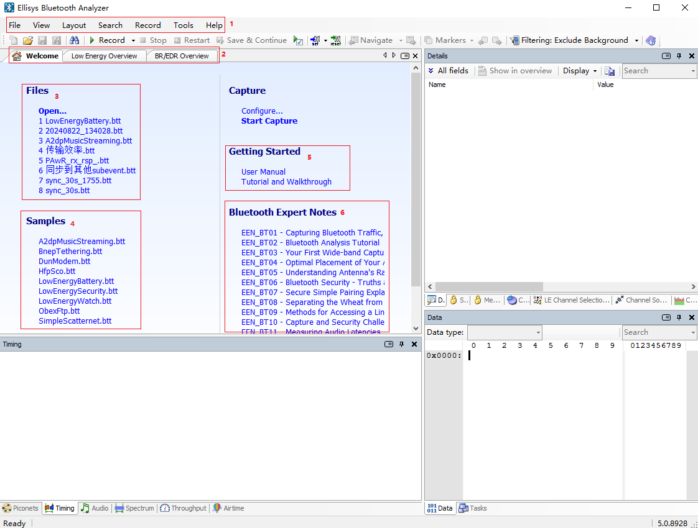
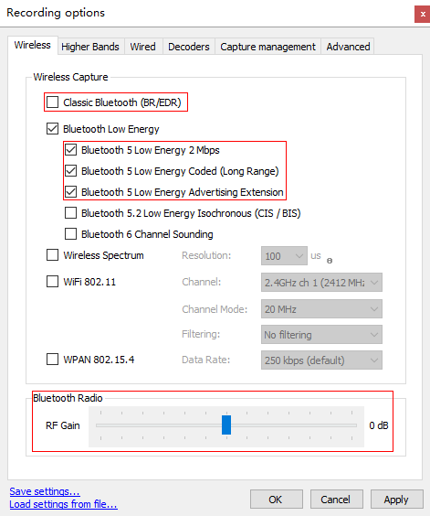

## Ellisys抓包工具使用指南

[toc]

### 1. 重要提示

抓包器属于贵重设备，一台价值15W~50W不等，更换维修费用高昂，且维修需要寄回瑞士原厂维修，时间较长。为避免纠纷，请切记使用过程中规范使用，避免电源故障，跌落等导致设备异常。

### 2. 前言

ellisys抓包工具，需要配合Ellisys Bluetooth Analyzer一起使用。

经典蓝牙抓包需要抓包器硬件支持，软件还是一致。由于我们主要业务是BLE，固本文档主要以BLE抓包为例。

该软件最新版本下载地址 https://www.ellisys.com/better_analysis/bta_latest.htm

软件会根据协议更新而同步更新，故建议尽量保持使用最新版本。

本文档仅对如何快速开始以及使用过程中典型问题做简要说明，全面详细使用说明介绍，可参考软件安装目录下官方用户指引文档：install_patch\Ellisys\Ellisys Bluetooth Analyzer\Documentation\Ellisys Bluetooth Analyzer User Manual.pdf

### 3. 关于硬件

- 我们使用的ellisys抓包器，主要有三种型号，如下图从左到右，依次为：Vanguard ，Explorer  ，Tracker。

  

- Vanguard和Explorer均必须外接专用电源适配器供电，USB连接线仅用于数据传输。这两种抓包器均可用于抓蓝牙双模空中包。

- Tracker可以使用USB连接线供电，即USB可用于数据传输和供电两种功能。笔记本电脑USB口也可能存在供电不足的问题，这时可能需要将笔记本插上电源或是更换电脑尝试。

- 蓝牙抓包数据传输量较大，请尽量使用优质USB线，避免出现供电不足或是抓包异常中断问题。

- 抓包器均需要外接天线，请确认天线功能正常，且已旋紧。

### 4. 开始使用

#### 4.1 主界面介绍

打开Ellisys Bluetooth Analyzer如下图:

1~5功能简介：

1. 软件配置：
   - File：打开历史抓包文件。也可以直接双击.btt后缀文件直接打开。
   - View：抓包各种功能小窗口打开/关闭。
   - Record：抓包各种参数配置。这个条目我们最常用。
   - Help：用户指引文档打开，最新软件版本下载，当前软件版本信息查看。
2. 窗口选择：
   - Welcome：默认打开界面。
   - Low Energy Overview：BLE抓包均处于这个界面。
   - BR/EDR Overview：BT抓包均处于这个界面。
3. 历史抓包文件：快速打开最近打开的抓包文件。
4. 原生抓包文件，软件安装后默认就会存在，用于演示抓包样式。其中LowEnergyXXXX.btt即表示为BLE抓包文件。
5. User Manual即为官方用户指引文档。
6. 一些其他官方文档。

#### 4.2 快速开始

本节介绍如何快速开始依次抓包。

1. 打开Ellisys Bluetooth Analyzer软件
2. 连接抓包器电源，USB连接抓包器和电脑，等待半分钟，设备初始化。Vanguard设备初始化等待时间可能需要1~2分钟。
3. 点击Record直接即开始抓包，界面自动跳到抓包显示界面。BLE设备抓包，会跳转到Low Energy Overview，双模设备抓包，会跳转到BR/EDR Overview。
4. 经过短暂的初始化后，设备开始抓包。这时Record按钮变灰，旁边的Stop 和 Restart按钮变得可以点击。
5. 抓包界面Low Energy Overview开始列出抓到的空口信号，并自动解析出来。
6. 抓包完毕后后，点击Stop停止本次抓包。
7. 停止抓包后，抓包数据仍然保留在缓存中，并未保存。保存操作需要点击保存按钮或是在关闭界面时的弹框提示中，点击保存。
8. 如果本次数据不理想，可以在抓包过程中，直接点Restart快速清除当前数据，重新开始抓包。请注意，restart操作，不会保存任何数据。
9. 在周围蓝牙数据较多的情况下，抓包数据可能积累的很快。长时间抓包，不仅会极大的占用系统硬盘空间，也可能会因为抓包文件过大而不好搬移。因此如需长时间抓包，请务必设置好抓包自动保存位置和大小，见后文中的Capture Management界面下的自动保存配置。

以上流程中涉及几个按钮如下图所示：

#### 4.3 抓包配置

通常，我们直接快速开始，就可以抓到需要的空口包。但也有一些情况，我们可能需要一些简单的配置，来使我们的抓包内容更准确。

这些配置通常无法在抓包过程中生效，因此请在点击Record之前，进行配置操作。

如下图打开抓包配置界面：

以下是常用的配置操作：

1. Wireless界面：

   - Classic Bluetooth (BR/EDR) : 配置为可抓经典蓝牙空口包（需要硬件支持）。
   - Bluetooth Low Energy : 配置为可抓BLE空口包。以下三个选项我们一般全部选中。
     - Bluetooth 5 Low Energy 2 Mbps : 支持抓2 M PHY包。
     - Bluetooth 5 Low Energy Coded（long Range）：支持抓Coded PHY包。
     - Bluetooth 5 Low Energy Advertising Extension : 支持抓扩展广播。
   - Bluetooth Radio：调节天线增益。空口信号并不是越高越好，需要调节增益值，使空口信号处于合适强度才能达到最好效果。
     - RF Gain：默认为0 dB。正数为增加增益，用于目标信号距离较远，信号较弱。负数为减少增益，用于目标距离过近，信号过强。

   

2. Wired界面：

   - Logic Transitions and inputs：有一些涉及到时序的问题，可能需要拉芯片信号线，配合空口包来观察时序，分析问题。
     - Add signal input (Alt+S) : 增加一个信号分析线
     - Add bus input（Alt+B）:增加一组信号分析线，多根信号线用来表示多个状态或是表示数字。
     - 对应设备拉线方法，请参考官方用户指引文档，章节“24. Flying Leads Probe – Explorer”，以及章节“25. Flying Leads Probe – Tracker and Vanguard ”。

   

3. Capture Management界面：自动保存相关设置。

   - Capture storage：抓包自动保存位置和命名规则。
   - Automatic Segmentation：长时间抓包，请务必设置自动分段保存，方便发现问题后，只保留问题数据那个分段包。

   

4. 保存配置和读取配置：

   - Save settings：可以通过配置界面最下面的按钮 ，将本次配置保存到本地。
   - Load Setting from file：点击恢复之前保存的配置，在需要配置快速恢复或是重新安装了软件后使用。

#### 4.4 空口包过滤

随着当前蓝牙技术的普及，我们生活和工作中，许多设备均带有蓝牙功能，导致我们在抓包时，可能会抓到许多我们不需要的空口包，这些包会对我们分析问题造成一些干扰，影响我们分析问题的效率。

针对这种情况，我们可以通过简单的配置，来过滤空口包。

以下方式可以在抓包开始前，抓包进行中，抓包停止后，任意时刻进行。两种方式任选其一即可：

- 根据设备地址选择：

  1. 点击抓包界面右上侧，Filtering : Exclude Background--> configure，进入设备选择界面。
  2. 在Device Database区域，找到自己的设备地址。可以在Search框内输入设备地址或是名字快速搜索。
  3. 双击目标地址，即可看到地址被加入到Traffic Filtering Criteria。
  4. 只加入一个地址，会过滤出这个地址发出的以及发给这个地址的空口包。加入多个地址则只会过滤出这些地址发出的数据包。
  5. 点击Apply后生效，之后即可看到广播空口包已经被过滤在Low Energy Overview窗口呈现出来。
  6. 示意图如下。

  

- 根据空口包选择过滤

  1. 切换到空口包界面。
  2. 选择想要过滤出来的空口包，点击右键选择。
  3. 右键弹出菜单，最上面三个选项为根据协议过滤，接下来三个选项为根据设备过滤。
  4. 下图中，选择两个设备连接过程中的ATT空口包上，点击右键下拉菜单选择。

  

### 5. FAQ

1. 如何判断空口包的信号质量？如何提高抓包质量？

   - 点击需要查看的空口包，在右侧的Details窗口，Link-Layer Information中，可以看到Sniffer Radio-->RSSI。
   - RSSI在-30dBm~-70dBm应该是比较理想信号强度，这个强度下的空口包不容易出现误包和漏包。
   - Sniffer Radio-->RF Gain即为Record-->Wireless界面下，设置的Bluetooth Radio增益。
   - 根据RSSI空口强度，调节增益，来使抓包器达到最理想的工作信号强度。

2. 抓包时，只能抓一小段，抓包设备和软件都在正常运行，但是后面就没有包了，是怎么回事？

   - 可能是抓包软件没有配置抓2M PHY空口包，请参考 开始使用-->抓包配置章节中，Wireless界面配置。
   - 可能是连接过程中，Master设备出现异常，没有继续发包，导致连接异常。观察程序后续有没有连接超时之类的错误上报。
   - 可能是过滤策略导致，尝试将过滤策略取消，看看所有完全的空口包中有没有需要的包。

3. 只能抓到经典广播，无法抓到扩展广播，是怎么回事？

   - 请先更新抓包软件Ellisys Bluetooth Analyzer至最新版本。
   - 请参考 开始使用-->抓包配置章节中，Wireless界面配置，勾选Bluetooth 5 Low Energy Advertising Extension。

4. 程序运行起来了，可以在抓包器上看到广播包，但是通过手机工具无法扫描到设备，或是发现设备后连接成功概率很低，这是什么问题？

   - 可能是设备的RF信号太弱导致，请将抓包器放置与手机相同位置抓包，观察抓到空口包的RSSI是否处于理想信号强度。信号弱请尝试靠近设备或是检查天线，信号过强请远离设备。
   - 可能是设备时钟不准，导致的RF性能问题，尝试检查设备XO是否有校准。
   - 作为专业抓包器，抓包器RF性能远优于手机RF性能，信号弱或是信号质量差，抓包器大多数情况可以正常抓取。

5. 抓包器如何在抓空口包的同时，拉程序中的信号？

   - 找到抓包器Logic 或是 Logic Analyzer接口，连接信号号。另一侧连接设备对应IO口。
   - 参考抓包配置章节，Wired界面-->Logic Transitions and inputs相关说明

6. 为什么有的加密的空口包可以解密，有的加密的空口包无法解密？

   - 根据蓝牙协议，使用LE Legacy Pairing方式中的Just Works，并且在初次配对阶段，完整抓取了整个配对过程的数据包，抓包软件才能自动解密。
   - 其他解密包均是要在知道密钥的前提下，才能解密成功。
   - 选择加密空口包，在主界面章节中，Mesh点击View-->Mesh Security，其他空口包点击View-->Security，按照提示填入密钥即可解密。
   - 正确填写Key底色会变成绿色，空口密文包变成明文包。否则为红色，空口内容无变化。

7. 抓包软件运行起来非常卡是怎么回事？

   - 抓包软件Ellisys Bluetooth Analyzer更新很快，可能会出现中间版本有bug的情况，尝试更新版本后大概率能解决。
   - 更新方法：点击主界面 Help-->Download offline installer即可下载最新版本

8. 抓包软件长时间抓包后，非常卡，而且把我们的系统盘占满了，我应该怎么办？

   - 在未保存之前，抓包软件抓的包，均是通过缓存的方式，存在系统盘中。如果周围蓝牙设备较多，抓包软件可能短时间即抓起大量数据，导致大量占用系统盘空间。这时只要停止抓包，并关闭抓包软件，即可将缓存释放，系统盘空间就会被释放出来。
   - 这里请注意：直接关闭抓包软件，并不会自动保存当前的抓包。
   - 因此长时间抓包之前，为避免单个抓包数据过大，同时也为了避免内存使用过大而导致电脑卡顿，请务必提前设置自动保存抓包文件。
   - 具体设置方法，请参考开始使用-->抓包配置-->Capture Management界面章节内容

9. 如何通过空口包查看当前广播周期或是连接周期，以此来对照我们的代码配置符合预期？

   - 打开主界面，点击View-->Timing，打开时序界面。
   - 点击选择Low Energy Overview界面的空口数据包。
   - 在Timing界面，鼠标左键按住左右拉动，即可出现量时序的标识线。
   - 对齐到需要量取的区间即可。
   - 可以右键下拉菜单中，点击Keep，将目前的量测线保留下来，继续量测其他时间区间。
   - 如下示例图，点击选择Low Energy Overview界面的广播空口数据包1，量测出广播周期大约是378ms。点击选择Low Energy Overview界面的连接空口数据包2，量测出连接周期为是20ms。
   
   

10. 我想确定我的广播数据是否设置正确，或是想确定连接数据发出来没有，应该在哪里看发出来的空口数据？

    - 在主界面，点击View-->Data，打开Data界面，查看原始数据。
    
    - 选中Low Energy Overview界面想要查看的空口数据包，即可在Data界面看到原始数据。
    
    - 注：加密数据需解密成功后，通过明文数据才能与自己的实际发送的数据比对。揭秘之前默认显示为密文原始数据。
    
    - 广播与连接数据查看方式一致，以下图以查看连接数据为例：
    
      - ​	02 07为LL层包头；
    
      - ​	03 00为ATT数据长度；
    
      - ​	04 00为ATT数据信道；
    
      - ​	0A 0E 00为ATT数据；
    
      - ​	3E B5 B1为数据CRC校验位。
    
    
