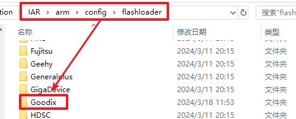
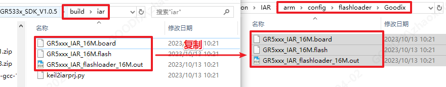
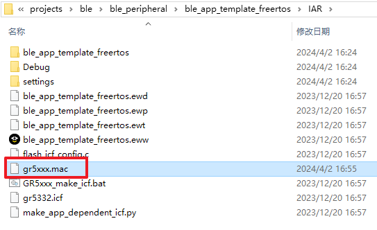
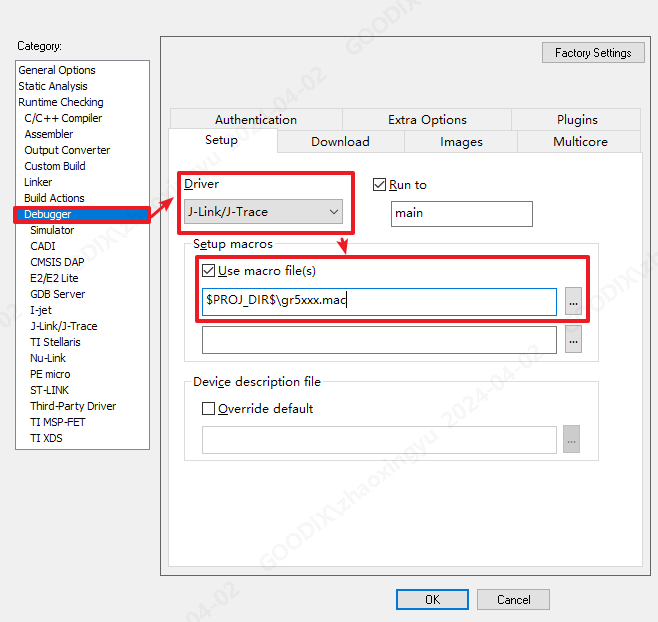
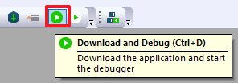
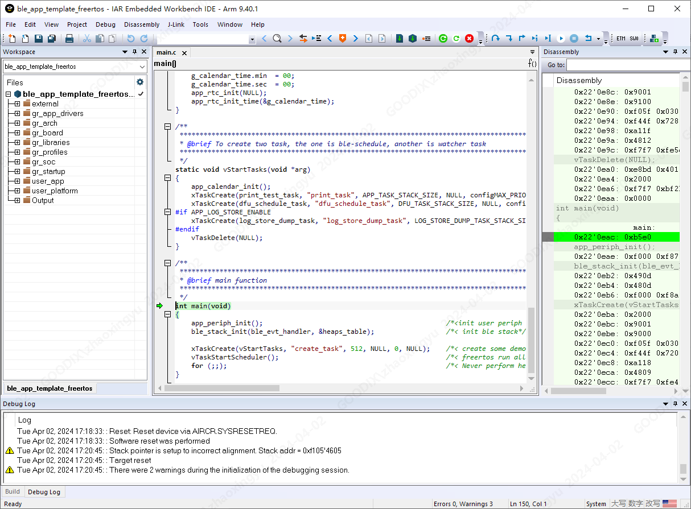

## IAR应用笔记

### 1. 基本介绍

 - IAR Embedded Workbench（下文简称IAR）是IAR Systems提供的一款专为嵌入式系统开发设计的集成开发环境，包括编译器、调试器、优化器等工具，可帮助开发人员快速高效地开发嵌入式软件。

 - GR5xx系列SDK支持通过IAR进行构建与调试。不同芯片SDK对IAR不同版本的支持程度不一样，具体支持情况见下表：

芯片系列 | SDK版本 | 推荐IAR版本
--------|----------|-----------
GR551x  | 全部版本 | IAR 9.40.1 
GR5525  | 全部版本 | IAR 9.40.1 
GR5526  | 全部版本 | IAR 9.40.1 
GR533x  | 全部版本 | IAR 9.40.1 

### 2. 在IAR中使用GR5xx SDK

下面以**GR533x SDK**与**IAR Embedded Workbench 9.40.1**为例，基于SDK中的`projects\ble\ble_peripheral\ble_app_template_freertos`示例工程介绍了如何在IAR中使用GR5xx SDK。

#### 2.1 基于Keil工程生成IAR工程

GR5525 SDK、GR5526 SDK及GR533x SDK均默认集成了IAR工程文件。对于GR551x SDK与用户自己的工程，需要通过SDK提供的脚本工具将Keil工程转换为IAR工程。具体的转换步骤请参考《[GR5xx IAR用户手册](https://docs.goodix.com/zh/online/detail/gr5xx_iar_guide/V1.0/bba656ecb2c1491ee3372c1baa7c9e33)》 “生成IAR工程” 章节。

#### 2.2 配置调试与下载

1. 配置Flash Loader。在IAR安装目录下找到`arm/config/flashloader`文件夹，然后在该文件夹下新建一个`Goodix`文件夹，如下图所示：

   

2. 进入`${SDK_Folder}/build/iar`文件夹（其中SDK_Folder为SDK根目录），将文件夹下的_GR5xxx_IAR_16M.board_、_GR5xxx_IAR_16M.flash_、_GR5xxx_IAR_flashloader_16M.out_三个文件拷贝到之前创建的`Goodix`文件夹，如下图所示：



> 若使用GR551x SDK，则需要拷贝的文件为_GR55xx_IAR_8M.board_、_GR55xx_IAR_8M.flash_、_GR55xx_IAR_flashloader_8M.out_。

3. 进入`ble_app_template_freertos`示例的IAR工程目录，并在该工程目录下创建一个_gr5xxx.mac_文件。



​	在_gr5xxx.mac_文件中写入如下内容并保存：

```c
execUserReset()
{
    #SP = __readMemory32(0x00000000, "Memory");
    #PC = __readMemory32(0x00000004, "Memory");
    __writeMemory32(0xE000ED08, 0x00000000, "Memory");
}
```

4. 使用IAR打开示例工程目录下`IAR`文件夹中的工程，如下图所示：


5. 使用IAR打开_ble_app_template_freertos.eww_工程文件。在IAR中鼠标右键单击构建目标，点击`Options...`，打开工程设置窗口。


6. 在设置窗口左侧的`Category`中单击选中`Debugger`选项，将`Driver`设置为`J-Link/J-Trace`，勾选`Use macro file(s)`，并在下面的文件选择框中输入`$PROJ_DIR$\gr5xxx.mac`，如下图所示：



切换到`Download`选项卡，勾选`Use flash loader(s)`, 勾选`Override default .board file`, 并在下面的文件选择框中输入`$TOOLKIT_DIR$\config\flashloader\Goodix\GR5xxx_IAR_16M.board`，如下图所示：


> 如果使用的是GR551x SDK，则需要将上述路径中的_GR5xxx_IAR_16M.board_替换成_GR55xx_IAR_8M.board_。

7. 点击`OK`完成设置。等待IAR更新工程后即可进行编译、下载与调试。点击IAR工具栏中的`Download and Debug`按钮，或使用快捷键`Ctrl+D`一键触发编译下载和调试：



8. 编译完成后，IAR会自动下载固件并开始调试。第一次使用IAR进行调试下载，可能会弹窗提示`The first time that you debug a project in C-SPY, you must setup or review the memory configuration`。此时点击`OK`，并在接下来的窗口中继续点击`OK`即可。


9. 等待IAR固件下载完成后可开始调试。在开始调试时，可能会弹窗提示`Warning: Stack pointer is setup to incorrect alignment. Stack addr = 0xf105'4605`，直接点击`OK`按钮即可，正确的栈指针会在设置的_gr5xxx.mac_文件中加载。等待IAR完成调试窗口初始化后，正确进入调试模式，便可以对应用程序进行调试。


