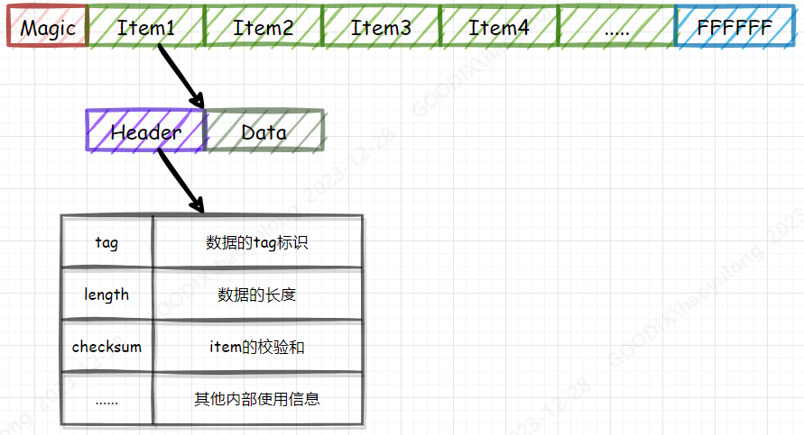

## FDS应用介绍


### 1. FDS简介

* Flash Data Store(FDS)是指轻量级逻辑数据存储系统，主要应用于将用户数据存储在Flash中(内部Flash和外部Flash)，保证掉电时数据不会丢失，并便于检索读取数据，包含对存储数据条目的存储、更新、读取和删除；
* GR5xxx平台主要涉及到NVDS，APP FDS以及APP Log Store三个模块，此处主要介绍面向轻量级数据(如配置信息，用户信息等)和日志数据的存储应用，而智能穿戴中涉及到表盘等大文件存储后续会有专题文章介绍；

### 2. NVDS应用笔记

* NVDS模块GR5xxx默认集成的存储模块，主要用于存储BLE绑定相关信息以及系统校准/配置信息，以Key-Value条目链式存储，其中：
 * BLE协议栈占用tag：0x8000 - 0x8fff
 * 系统占用tag：0xc000 - 0xcfff
* **Flash中的存储结构**，如下图占用连续的若干个Sector的Flash空间，其中第一个sector的起始位置会放置特殊magic，用于标识这块区域是否也被初始化为NVDS。NVDS的每个Item是由Item Header和Item Data组成；


* **Item Read （nvds_get）**，如上介绍，每个Item的Header会记录其Data的长度，因此由Item n可查找到Item n+1，即Item n的地址 + Header固定长度 + Item n数据长度，可以理解为“单链表”查找数据的逻辑。因此，每次Read操作从NVDS的起始位置挨个读取Item Header，并确定其tag是否为目标tag，若是则把其数据读出；
* **Item Write （nvds_put）**，当需要写入Item至NVDS时，会确认是否已存在对应tag的Item：
     * 若存在，并且存放的数据与需写入的数据一致，则不进行任何操作，返回成功；
     * 若存在，但存放的数据与需写入的数据不一致，则作为新的Item追加在NVDS区域，并将原Item Header中的Tag写为全0,（0x0000为已删除的tag，）；
     * 若不存在，则作为新的Item追加在NVDS区域；
     * 已知Flash数据写入时，只能由1变0，因此Item更新时并不能在原Item位置更新，而是在尾部追加，那么就会产生垃圾/碎片数据（Tag为0x0000的Item），随着Item不断追加直至NVDS End Address，则需要回收垃圾/碎片数据，腾出空闲空间出来。
* **NVDS GC（回收垃圾/碎片数据）**,在进行GC时，依次将NVDS每个Sector数据读至中转区，将此Sector Erase后，把中转区的有效数据写入已Erase的Sector，忽略掉垃圾/碎片数据，GC无需用户主动进行，而是在Write过程中，发现可用空间足够（垃圾/碎片数据会被计算到可用空间中），但是尾部空间不足时会自动触发。

* **Note：**GR551x平台的中转区为RAM空间，可以节省Flash空间占用，但是不具备GC过程中掉电保护；此外其他平台的中转区为Flash空间，具备GC过程中掉电保护，但是会额外占用4KB Falsh空间。
* **NVDS使用限制**
     * 不可重入，非线程安全；
     * 所有操作为阻塞式，包括GC过程，因此NVDS分配的区域越大，GC耗时越久；
     * 在GC过程中会频繁关闭中断，因为需将有效Item依次写回（GR5xxx平台Flash Write和Erase过程会关闭全局中断）;
     * 系统掉电或复位可能引起NVDS中数据丢失；
* **NVDS数据丢失原因分析**
     * NVDS能正常运行的条件是如上存储结构完整，其中任何一个Item被破坏后，会导致NVDS完整性校验失败，而无法恢复，只能重新初始化NVDS区域，导致原有数据丢失；
     * 导致Item破坏或不完整的原因是在NVDS put和GC过程中系统掉电和复位时发生，因为FLash驱动操作不是原子操作，在写/擦操作过程中的掉电会导致Flash数据不符合预期；
* **NVDS GC时对BLE链路稳定性的影响**
  * 上文提到NVDS GC时会对每个Item进行有效性判断并进行会写，此时就会频繁操作Flash，关开全局中断
  * 在关闭全局中断时，BLE Stack中断无法响应，虽然操作间隙开启了全局中断供BLE Stack中断执行，但是BLE Stack Event执行是有时序要求的，延时响应并不会执行BLE Stack事件，进而可能导致BLE Stack在空中交互Bypass，最终断开链接
* **NVDS使用注意事项**
  * 尽量存储轻量级数据，并尽量分配较小NVDS存储空间，存储空间越大，在GC时就会阻塞执行时间越久；
  * 不要存储频繁更新的数据，避免频繁产生数据碎片需要回收；
  * BLE链接参数中Timeout在允许条件下适当配置较大值，避免NVDS GC时产生超时断链；

### 3. APP FDS应用笔记
* APP FDS主要是针对NVDS在使用有所限制下的替代方案，其实现是Little FS；
* Little FS是为嵌入式系统设计的轻量级文件系统。它专为低内存和闪存设备而设计，提供高效的存储解决方案，具备低资源消耗、掉电保护、磨损均衡等特性；
* 为方便快速移植，搭建了抽象层，提供Key-Value的API，命名为`app_fds_init`，`app_fds_value_write`，`app_fds_value_read`，`app_fds_value_delete`，`app_fds_traverse`，可直接替换原NVDS的存储需求实现，可使用int或string Tag；
* 资源占用：
> Code size： ~16kB Ram：~1.8kB

* **规避NVDS限制的设计：**
     * 每个Item会有一个revision字段，越大越新，更新Item时不会更新旧Item的信息，即使在更新过程中掉电，根据revision使用次新的Item数据；
     * GC时并不是一次性回收整个存储区域碎片，而是根据存储情况，整理最小需求Sector数，并且不需要中转区，类似乒乓Sector数据搬运；

使用方法如下：

* **初始化**：至少分配两个sector，如：app_fds_init(0x010a0000, 4);
* **写入数据**：
```
if ((ret = app_fds_value_write(record_id[i], (uint8_t *)&record_val[i], 4)) < 0)
{
    printf("fail [%d] %d\r\n", __LINE__, ret);
}
```
* **读取数据**：
```
if ((ret = app_fds_value_read(record_id[i], (uint8_t *)&read_val, 4)) < 0)
{
    printf("fail [%d] %d\r\n", __LINE__, ret);
}
```

* **删除Item**：
```
if ((ret = app_fds_value_delete(record_id[i]) < 0)
{
    printf("fail [%d] %d\r\n", __LINE__, ret);
}
```

* **遍历Item**：
```
app_fds_traverse(app_fds_traverse_cb)；
void app_fds_traverse_cb(uint32_t key, uint32_t length, bool* is_continue)
{
    printf("key: %d, length:%d\r\n", key, length);
    *is_continue = true;
    if (app_fds_value_delete(key))
    {
        while(1);
    }
}
```


### 4. APP LOG Store应用笔记

* APP LOG Store主要为存储系统运行时日志存储，采用循环覆盖保存最新日志存储方式，支持各方式导出，如Uart，BLE等，自行配置即可

使用方法如下：

* **初始化**：这里一并初始化了RTC，这样日志存储时会加上时间戳信息
```
static void get_timestamp(app_log_store_time_t *p_time)
{
    app_rtc_time_t time;
    app_rtc_get_time(&time);
    p_time->year=time.year;
    p_time->month=time.mon;
    p_time->day=time.date;
    p_time->hour=time.hour;
    p_time->min=time.min;
    p_time->sec=time.sec;
    p_time->msec=time.ms;
}

static void app_rtc(void)
{
  app_rtc_time_t time;
    app_rtc_init(NULL);
    time.year = 23;
    time.mon  = 2;
    time.date = 13;
    time.hour = 8;
    time.min  = 0;
    time.sec  = 0;
    time.week = 0;
    time.ms   = 0;
    app_rtc_init_time(&time);
  }

static void log_store_init(void)
{
  app_log_store_info_t store_info;
  app_log_store_op_t   op_func;
  store_info.nv_tag   = 0x40ff;
    store_info.db_addr  = FLASH_START_ADDR + 0x60000;
	  store_info.db_size  = 0x20000;
    store_info.blk_size = 0x1000;
    op_func.flash_init  = hal_flash_init;
    op_func.flash_erase = hal_flash_erase;
    op_func.flash_write = hal_flash_write;
    op_func.flash_read  = hal_flash_read;
    op_func.time_get    = get_timestamp;
    op_func.sem_give    = NULL;
    op_func.sem_take    = NULL;
    app_rtc();
    app_log_store_init(&store_info, &op_func);
  }
  ```

* **日志存储**：

     * 需在`custom_config.h`中使能`APP_LOG_STORE_ENABLE`；
     * 仅支持使用`APP_LOG_xxx`等打印宏进行日志保存，即printf打印的日志不会被保存；

* **日志导出**
     * 调用`app_log_store_dump`后，APP LOG Store会开启读取存储日志，通过注册的dump callback抛出数据，交由应用层处理

     * 对于抛出数据用户可以自行选择通信方式导出；
      ```
      uint16_t app_log_store_dump(app_log_dump_cbs_t *p_dump_cbs);
      ```

     * 为避免阻塞执行存储和导出，采用后台执行，因此用户还需在背景任务中，无main while(1)中调用如下：
    ```
    void app_log_store_schedule(void)
    ```
