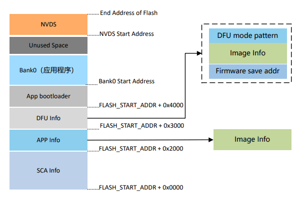

## DFU应用介绍

### 1. GR5xx DFU介绍
* 关于GR5xx DFU方案的详细介绍，请参考《[GR5xx固件升级开发指南](https://docs.goodix.com/zh/online/firmware_upgrade_bl)》。

* GR5xx DFU方案支持：

  * **后台双区升级模式**：Bank0存放运行固件；Bank1缓存升级固件。应用固件运行同时接收升级固件缓存，最后覆盖应用固件升级。
  * **非后台单区升级模式**：Bank0存放运行固件；由应用固件跳转至App Bootloader固件，接收升级固件直接存放于Bank0，覆盖应用固件升级。
  * **普通模式：**每包数据包含校验字段，可对数据进行校验，并ACK手机端继续发送下一包数据，有错误及时发现，速率较慢。
  * **快速模式：**每包数据不包含校验字段，手机端不需要ACK连续发送剩余数据，在发送完成后一次性校验，有错误最后才能发现，速率较快（上限取决于Flash数据写入效率）。
  * **BLE**和**串口**通信方式。
  * 加密、加签安全升级。
  * 低成本集成第三方手机App。
  * 低成本适配第三方升级方案。

本文重点以BLE通信方式介绍关于GR5xx产品开发过程中关于DFU功能搭建、注意事项和问题分析。

### 2. DFU方案选择
* 是否需要产品运行时后台静默接收升级固件，节省用户等待固件升级整体耗时。如需要选择后台双区升级模式，仅在覆盖升级时跳转至App Bootloader，等待缓存升级固件搬运，但需额外划分一个相同Size Bank存缓存升级固件。
* 是否需要极致节省Flash占用。若Flash资源不足以额外划分出一个相同Size Bank存缓存升级固件，则选择非后台单区升级模式，在开始接收升级固件时跳转至App Bootloader，等待升级固件接收和覆盖，等待耗时较长。
* 是否需要快速升级。如升级固件较大，或者升级表盘这样较大Size的资源，可选择快速升级模式，虽然不能及时校验中止升级，但这种概率较小。相对来讲，整体使用升级耗时短。

**约定俗语**

为了方便对齐信息，单区非后台升级称为成为**“小升大”**，双区后台升级约定称为**“拷贝升级”**。

### 3. Flash Layout划分

#### 3.1 升级模式

一旦DFU方案确认（这里主要是确认后台双区升级模式还是非后台单区升级模式），就必须进行对应的Flash Layout划分：

* **后台双区升级模式（拷贝升级）**

 

* **非后台单区升级模式（小升大）**

 

* **划分区域描述**
* **SCA Info：**SCA（System Configuration Area）系统配置区，主要用于存储系统信息和App bootloader的启动参数配置信息。
     * **APP Info：**应用固件信息区，用于存放Bank0区域应用固件运行的参数信息。
     * **DFU Info：**DFU固件信息区，存放Bank1区域新固件的相关信息。
     * **Firmware save addr：**新固件存放的起始地址。
     * **Image Info：**新固件的参数信息。
     * **DFU mode pattern：**用于标识当前运行的DFU模式。
     * **App bootloader：**App bootloader固件存放和运行区域。
     * **Bank0：**应用固件存放和运行区。
     * **Bank1：**新固件缓存区，通过有效性检查的新固件将被拷贝至Bank0。
     * **NVDS（Non-volatile Data Storage）：**非易失性数据存储区域。

#### 3.2 App Bootloader说明

无论采用什么升级方案，都需要烧录App Bootloader完成固件跳转和升级，大致的流程如下：

 * 系统上电后，App Bootloader启动，校验DFU Info区域数据，判断是否需要进行固件升级流程，以及如何进行固件升级。
 * 校验App Info区域数据，判断是否有指示跳转的应用固件，以及校验应用固件是否有效。
 * 跳转至应用固件运行其逻辑。

#### 3.3 重要细节介绍

 * 升级固件结构要求
	- 各编译器（如Keil、IAR、GCC）编译相互固件尾部不会包含当前固件Image Info。
	- DFU时，需要使用Image Info对固件进行校验，以及将Image Info更新至DFU Info区域。
	
	因此，编译生成的固件无法利用GRToolbox直接进行升级，它不会被识别为有效固件，需要使用GProgrammer将编译生成的固件转换为带有Image Info的可用于DFU的固件（转换生成的固件会在原固件文件名添加“_fw”后缀，已转换的固件不会被重复转换）。
	
 * App Bootloader跳转选择

   对于某些产线流程，可能需要烧录多个固件，如App Bootloader、Application、产测、DTM固件。如何处理App Bootloader何时跳转至指定固件，可参考App Bootloader配置文件。利用每个固件Image Info中的Comments进行比对，确认是否为指定固件，然后校验跳转。

 * App Info区域数据生成

   无论使用GProgrammer或PLT Config工具烧录固件时，都只会将固件Image Info烧录至SCA区域，App Bootloader固件会自动更新App Info区域的有效数据：
   
   - App Bootloader在启动时会读取App Info区域数据，校验指定固件的有效性。
   - 首次运行时，App Info区域数据无效，App Bootloader会根据指定的Comments在SCA区域遍历每个固件的Image Info，并进行校验，将有效Info更新至App Info区域供下次跳转使用。
   - 后续升级时，App Bootloader会在升级完成后，将DFU Info中升级固件Image Info更新至App Info区域供下次跳转使用。

#### 3.4 第三方DFU适配

这里提到的第三方DFU方案，通常指**拷贝升级**方案。Application固件中接收对端升级固件是自有方案，如BLE Service、通信协议，接收、缓存和校验固件的细节逻辑。

按照下列方法，可在GR5xx平台上实现第三方DFU视频：

 * DFU区域Flash Layout划分。
 * Flash API适配，如擦、读、写。
 * 获取GR5xx升级固件的Image Info，和DFU Info信息一起更新至DFU Info区域（使用`dfu_info_update` API）。
 * App Bootloader裁剪保留**拷贝升级**即可。

> **说明**：
>
>  * 如果第三方DFU方案需要对固件进行打包，则需对带Image Info的固件进行打包，升级传输结束时，如何获取Image Info可根据自身结果来处理，如下图为一个应用场景。
>      * 对于带有Image Info的固件，用户需加入自有安全认证方案中的签名等信息，并且追加的信息长度不是固定的。
>      * 简单采用滑动解析方法，从接收到的固件文件最后的位置往前遍历，先确定GR5xx Pattern，再基于固件check sum是否校验通过来最终判断是否为Image Info信息位置。
>      * 将获取的Image Info和DFU相关信息一起更新至DFU Info区域，（这里直接烧录的，没有使用`dfu_info_update` API）。
>        
>
>  * 请务必使用GR5xx平台提供的App Bootloader，而不要自行实现，因为其集成了平台特有的跳转逻辑，如睡眠热启动、Platform环境配置等。

### 4. FAQ

#### 4.1 Fast DFU模式怎么使能？

由于GR5xx SDK的演进，存在不兼容的问题。在GR551x SDK V2.0.1、GR5526 SDK V1.0.1、GR5525 SDK V0.8.0、GR5625 SDK V0.9.0、GR533x SDK V0.9.0上做了优化处理，设备端无需做特殊处理，在GRToolbox App **DFU**应用界面的右上角功能菜单中使能即可。在此之前的SDK版本，需使用Fast DFU的组件以及Service，请参考SDK包中Fast DFU的Demo，而GRToolbox同样需使用**Fast DFU**应用。

#### 4.2 Fast DFU速率限制在哪里，可达多少速率？

Fast DFU速率限制主要来自于设备端接收到数据后处理：Flash存储，GR5xx接收到数据后，缓存环形Buffer，然后搬运存放至Flash。提升Flash烧写速率以及设置合适的环形Buffer大小，可提高Fast DFU速率。经测试，利用片内Flash，可达到70 kbps。

> **注意**：
>
> 为保证是否使用Fast DFU情况，DFU组件占用RAM Size最小，因此，在DFU组件中配置的环形Buffer大小不是最佳速率大小，若需使用Fast DFU，并且不考虑RAM占用大小，保证速率的情况下，可将_dfu_port.c_中的`DFU_BUFFER_SIZE`配置为8 KB。

#### 4.3 DFU如何在RTOS下进行低功耗处理？

RTOS下，需要为DFU单独创建任务，并调用`dfu_schedule`。由于在产品中DFU的使用概率较低，所以该任务不应一直保持运行状态，而应该保持挂起状态，仅在需要升级时恢复。常见的处理办法是利用是否进行升级的信号量来控制DFU任务的挂起和恢复。可利用`dfu_service_init`注册dfu enter的callback，对端需要发起DFU流程时，第一时间发起dfu enter的命令。

另外，对于DFU任务栈大小的配置，需要注意：仅在GR551x平台，由于ROM实现中存在一个4 KB大小的局部变量buffer，所以DFU任务至少需要配置6 KB的栈大小，以保证DFU栈的安全。其他平台已修复此问题。

