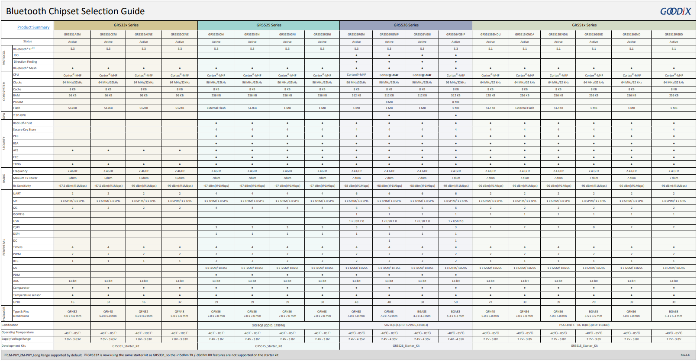

# 汇顶BLE产品开发向导

## 1. 信息列表

当用户准备了解或基于Goodix BLE SoC 进行产品设计开发时, 需要先获取和找到如下信息 (包括且不限于):

- 芯片产品信息 ： 用于芯片的了解和选型
- 芯片SDK 包 ： 获取芯片的软件开发包, 进行源码和参考工程的学习及熟悉
- 芯片及SK 开发板获取 ：获取采购芯片的渠道, 开发板可以方便产品硬件设计前的功能验证和软件先行设计
- 芯片开发工具 ：下载和获取所有需要用到的开发软件、工具
- 芯片开发文档资料 ：包括硬件设计指南、各种软件或工程的设计使用参考说明、Datasheet等
- 芯片的产品方案资料 ：对于已提供的方案参考, 获取方案相关的软件和文档资料
- 技术支持服务  ：提前获取Goodix和代理能提供的技术支持服务和技术支持渠道

## 2. 获取芯片产品信息

目前 Goodix 提供如下系列BLE SoC。

- [Goodix BLE SoC 选型表](https://www.goodix.com/zh/down/resource/Goodix_Bluetooth_Chipset_Selection_Guide?objectId=5&objectType=design_resource&version=54)

## 3. 获取芯片 SDK开发包

| BLE SoC | SDK 下载连接                                       | 说明           |
| ------- | -------------------------------------------------- | -------------- |
| GR551x  | https://www.goodix.com/zh/software_tool/gr551x_sdk | 请下载最新版本 |
| GR5525  | https://www.goodix.com/zh/software_tool/gr5525_sdk | 请下载最新版本 |
| GR5526  | https://www.goodix.com/zh/software_tool/gr5526_sdk | 请下载最新版本 |
| GR533x  | https://www.goodix.com/zh/software_tool/gr533x_sdk | 请下载最新版本 |

## 4. 芯片及开发板获取渠道

### 4.1 公司用户

请联系以下代理渠道采购各系列芯片和相应的开发板

| 代理公司       | 联系人 | Email | 电话 |
|----------------------------|--------|--------------------------|-------------|
| 上海蜜连科技有限公司       | 袁友学 | kayne.yuan@ibeelink.com  | 13242030934 |
| 杭州利尔达展芯科技有限公司 | 雷江波 | leijiangb@lierda.com     | 18067988292 |
| 深圳市瑜威电子科技有限公司 | 曾梦诗 | zengms@szyuweitech.com   | 13510292600 |

- 开发板一般涵盖：
  - SK板或小系统板, 用于软件功能的验证和预开发
  - PPK板 ：用于功耗测试评估的电路板
  - PLT 板：用于产线固件下载的电路板

### 4.2 个人及社区用户

目前个人用户采购渠道正在积极建设中, 可以加入社区群实时关注.

## 5. 获取芯片开发工具

Goodix 为蓝牙产品提供开发下载、DFU、产测等多流程所需的软件, 下面进行了汇总. 

### 5.1 标准开发软件

Goodix 蓝牙全系列芯片都默认支持 Keil/ARMCC 编译工具链, 也提供了GCC 等其他构建方式, 这类软件为标准开发软件, 可以通过对应的软件供应商官网进行下载. 

列举一些常用的标准软件如下: 

| 软件  | 描述                   | 网站                                                         |
| ----- | ---------------------- | ------------------------------------------------------------ |
| Keil  | ARMCC IDE工具          | www.keil.com                                                 |
| JLINK | SWD 调试软件           | https://www.segger.com/downloads/jlink/                      |
| Ozone | 一款Segger出品的调试器 | https://www.segger.com/products/development-tools/ozone-j-link-debugger/ |
| gcc | ARM none eabi gcc编译器 | https://developer.arm.com/downloads |

### 5.2 Goodix 开发工具合集

| 软件 | 作用 | 说明 | 下载地址 | 适用SoC |
| ---- | ---- | ---- | -------- | ------- |
| GProgrammer | 程序资源烧写及配置工具 | 一款支持BLE全系列芯片的固件烧录工具,用于开发调试,支持固件下载、Flash读写、eFuse烧写、固件加密加签等功能。在量产阶段, BLE系列芯片产品的批量烧录测试,可采用PLT Lite和GRPLT Lite配置工具进行批量烧录测试 | https://www.goodix.com/zh/software_tool/gprogrammer_ble | BLE全系SoC |
| GRToolBox | 移动端开发验证 | 一款专为汇顶科技低功耗蓝牙产品设计的移动端工具，提供Android & iOS版本, 可扫描、配置连接参数、演示标准Profile，以及调试汇顶科技低功耗蓝牙平台的Profile/Service | https://www.goodix.com/zh/software_tool/grtoolbox | BLE全系SoC |
| DTM Tool | DTM测试 | 用于Goodix BLE DTM(Direct Test Mode) 测试 | https://www.goodix.com/zh/download?objectId=107&objectType=software | BLE全系SoC |
| GRPLT Lite | 产测工具 | 为PLT Lite的配套工具，客户可使用该软件将开发完毕的应用固件、资源文件、量产配置等打包，通过串口下载至PLT Lite | https://www.goodix.com/zh/software_tool/grplt_lite | BLE全系SoC |
| GRUart | 串口工具 | PC串口调试助手, 适用于串口日志及协议栈日志打印 | https://www.goodix.com/zh/download?objectId=64&objectType=software | BLE全系SoC |
| NemaPixpresso | 资源生成工具 | 用于图片和各种图像格式的转换, 也可以用于FrameBuffer的分析 | 随 LouisUI打包 | GR5526 |
| gdx_font_conv | 资源生成工具 | 用于生成支持GPU渲染的Lvgl字体文件 | https://developers.goodix.com/zh/bbs/blog_detail/6b29cdf5923247029f4357a65de1b065 | GR5526 |
| LouisUI | 资源生成工具 | 用于将图片资源批量生成符合Lvgl规范同时支持GPU渲染的bin格式, 并生成资源描述符文件 | https://developers.goodix.com/zh/bbs/blog_detail/2996e8f9f352491eb0ccca468f28f2ce | GR5526 |
| GRPPK | 功耗测试工具 | 配合 PPK 板进行产品的功耗评估 | 采购PPK后请向代理索要 | BLE全系SoC |
| OTA SDK | 移动固件 | 提供Android & iOS DFU/OTA SDK, 方便客户App开发 | https://developers.goodix.com/zh/bbs/detail/32869e79a7c84917b32ecb4ab10acac8 | BLE全系SoC |

## 6. 获取芯片开发文档资料

- 芯片 接口参考手册位于 各芯片SDK的文档目录下

- 芯片的各种软件设计、硬件设计、示例工程参考文档均开源从官网下载

  

### 6.1 GR551x 文档 

  https://www.goodix.com/zh/product/connectivity/ble/gr551x

| [低功耗蓝牙产品开发快速入门](https://docs.goodix.com/zh/online/bluetooth_le_getting_started/V2.3) | 公开       |
| ------------------------------------------------------------ | ---------- |
| [GR551x   Datasheet](https://docs.goodix.com/zh/online/gr551x_datasheet/Rev.2.6) | 公开       |
| [GR551x勘误手册](https://docs.goodix.com/zh/online/gr551x_errata/V1.2) | 公开       |
| [GRPLT   Lite配置工具用户手册](https://docs.goodix.com/zh/online/grplt_lite_configuration_tool_user_guide/V1.6) | 公开       |
| [GR5xx APP驱动用户手册](https://docs.goodix.com/zh/online/app_driver_bl/V1.2) | 公开       |
| [GProgrammer用户手册](https://docs.goodix.com/zh/online/gprogrammer_user_guide/V3.0) | 公开       |
| [GR551x   FCC RSE认证说明](https://docs.goodix.com/zh/online/fcc_rse_certificate_bl_a/V1.1) | 公开       |
| [GR551x   IAR用户手册](https://docs.goodix.com/zh/online/gr55xx_iar_user_guide/V1.4) | 公开       |
| [GR551x   GCC用户手册](https://docs.goodix.com/zh/online/gr55xx_gcc_user_guide/V2.2) | 公开       |
| [GR551x开发者指南](https://docs.goodix.com/zh/online/gr551x_develop_guide/V2.7) | 公开       |
| [GR5515   Starter Kit用户指南](https://docs.goodix.com/zh/online/gr5515_starter_kit_user_guide/V1.9) | 公开       |
| [GR5515I0NDA外部Flash选型指导手册](https://docs.goodix.com/zh/online/gr5515_flash_selection_guide/V1.4) | 公开       |
| [GR551x   Reference Design](https://www.goodix.com/zh/docview/GR551x Reference Design_V1.5?objectId=316&objectType=document&version=494) | 仅注册用户 |
| [GR551x硬件设计指南](https://docs.goodix.com/zh/online/gr551x_hardware_design_guide/V2.5) | 公开       |
| [GR5515-SK-BASIC-RevE](https://www.goodix.com/zh/docview/GR5515-SK-BASIC-RevE_Rev.1.6?objectId=259&objectType=document&version=500) | 公开       |
| [GR5515-SK-BASIC-RevC](https://www.goodix.com/zh/docview/GR5515-SK-BASIC-RevC_Rev.1.5?objectId=100&objectType=document&version=133) | 公开       |
| [GR551x   API Reference](https://docs.goodix.com/zh/online/api/gr551x_api_reference/Rev.2.0.1) | 公开       |
| [GR5xx鼠标示例手册](https://docs.goodix.com/zh/online/hid_mouse_bl/V3.1) | 公开       |
| [GR5xx应用及自定义Sample   Service](https://docs.goodix.com/zh/online/custom_sample_service_bl/V3.0) | 公开       |
| [GR5xx Serial Port   Profile示例手册](https://docs.goodix.com/zh/online/serial_port_bl/V3.0) | 公开       |
| [GR5xx   HRS RSCS Relay示例手册](https://docs.goodix.com/zh/online/hrs_rscs_relay_bl/V3.0) | 公开       |
| [GR5xx   FreeRTOS示例手册](https://docs.goodix.com/zh/online/freertos_bl/V3.0) | 公开       |
| [GR5xx   Throughput示例手册](https://docs.goodix.com/zh/online/throughput_bl/V3.0) | 公开       |
| [GR5xx AT   Command示例手册](https://docs.goodix.com/zh/online/at_command_bl/V3.0) | 公开       |
| [GR5xx ANCS   Profile示例手册](https://docs.goodix.com/zh/online/ancs_profile_bl/V3.0) | 公开       |
| [GR5xx AMS   Profile示例手册](https://docs.goodix.com/zh/online/ams_profile_bl/V3.0) | 公开       |
| [GR5xx   Power Consumption Profile示例手册](https://docs.goodix.com/zh/online/power_consumption_bl/V3.0) | 公开       |
| [GRPLT   Lite配置工具自定义固件加密及应用介绍](https://docs.goodix.com/zh/online/grplt_lite_configuration_tool_firmware_introduction/V1.5) | 公开       |
| [GR5xx APP Log应用说明](https://docs.goodix.com/zh/online/app_log_bl/V3.1) | 公开       |
| [GR5xx固件升级开发指南](https://docs.goodix.com/zh/online/firmware_upgrade_bl/V1.2) | 公开       |
| [GR5xx Fault Trace   Module应用说明](https://docs.goodix.com/zh/online/fault_trace_bl/V3.1) | 公开       |
| [GR5xx固件加密及应用介绍](https://docs.goodix.com/zh/online/firmware_encryption_bl/V3.0) | 公开       |
| [GR5xx DTM测试指南](https://docs.goodix.com/zh/online/dtm_test_bl/V3.0) | 公开       |
| [GR551x功耗模式及功耗测量说明](https://docs.goodix.com/zh/online/gr551x_sleep_mode_power_measure_note/V2.1) | 公开       |
| [GR551x可靠性测试报告](https://docs.goodix.com/zh/online/reliablity_report_bl_a/V1.1) | 公开       |
| [GR551x   MCD](https://www.goodix.com/zh/docview/GR551x MCD_V1.0?objectId=314&objectType=document&version=490) | 公开       |

  

### 6.2 GR5525文档
https://www.goodix.com/zh/product/connectivity/ble/gr5525

| [GR5525   Product Brief](https://www.goodix.com/zh/docview/GR5525 Product Brief_V1.0?objectId=348&objectType=document&version=538) | 公开       |
| ------------------------------------------------------------ | ---------- |
| [GR5525 Datasheet](https://docs.goodix.com/zh/online/datasheet_bl_c/V1.0) | 公开       |
| [GRPLT   Lite配置工具用户手册](https://docs.goodix.com/zh/online/grplt_lite_configuration_tool_user_guide/V1.6) | 公开       |
| [GR5xx APP驱动用户手册](https://docs.goodix.com/zh/online/app_driver_bl/V1.2) | 公开       |
| [GProgrammer用户手册](https://docs.goodix.com/zh/online/gprogrammer_user_guide/V3.0) | 公开       |
| [GR5525刷屏指南](https://docs.goodix.com/zh/online/display_guide_bl_c/V1.0) | 公开       |
| [GR5525开发者指南](https://docs.goodix.com/zh/online/developer_guide_bl_c/V1.0) | 公开       |
| [GR5525   Starter Kit用户指南](https://docs.goodix.com/zh/online/starter_kit_manual_bl_c/V1.0) | 公开       |
| [GR5525   Reference Design](https://www.goodix.com/zh/docview/GR5525 Reference Design_V1.1?objectId=357&objectType=document&version=555) | 仅注册用户 |
| [GR5525   Hardware Design Guidelines](https://docs.goodix.com/zh/online/hardware_design_guide_c/V1.0) | 公开       |
| [GR5525-SK-BASIC-RevB](https://www.goodix.com/zh/docview/GR5525-SK-BASIC-RevB_V1.0?objectId=351&objectType=document&version=541) | 公开       |
| [GR5525   API Reference](https://docs.goodix.com/zh/online/api/api_reference_bl_c/V1.0.0) | 公开       |
| [GR5xx鼠标示例手册](https://docs.goodix.com/zh/online/hid_mouse_bl/V3.1) | 公开       |
| [GR5xx应用及自定义Sample   Service](https://docs.goodix.com/zh/online/custom_sample_service_bl/V3.0) | 公开       |
| [GR5xx Serial Port   Profile示例手册](https://docs.goodix.com/zh/online/serial_port_bl/V3.0) | 公开       |
| [GR5xx   HRS RSCS Relay示例手册](https://docs.goodix.com/zh/online/hrs_rscs_relay_bl/V3.0) | 公开       |
| [GR5xx   FreeRTOS示例手册](https://docs.goodix.com/zh/online/freertos_bl/V3.0) | 公开       |
| [GR5xx   Throughput示例手册](https://docs.goodix.com/zh/online/throughput_bl/V3.0) | 公开       |
| [GR5xx AT   Command示例手册](https://docs.goodix.com/zh/online/at_command_bl/V3.0) | 公开       |
| [GR5xx ANCS   Profile示例手册](https://docs.goodix.com/zh/online/ancs_profile_bl/V3.0) | 公开       |
| [GR5xx AMS   Profile示例手册](https://docs.goodix.com/zh/online/ams_profile_bl/V3.0) | 公开       |
| [GR5xx   Power Consumption Profile示例手册](https://docs.goodix.com/zh/online/power_consumption_bl/V3.0) | 公开       |
| [GRPLT   Lite配置工具自定义固件加密及应用介绍](https://docs.goodix.com/zh/online/grplt_lite_configuration_tool_firmware_introduction/V1.5) | 公开       |
| [GR5xx APP Log应用说明](https://docs.goodix.com/zh/online/app_log_bl/V3.1) | 公开       |
| [GR5xx固件升级开发指南](https://docs.goodix.com/zh/online/firmware_upgrade_bl/V1.2) | 公开       |
| [GR5xx Fault Trace   Module应用说明](https://docs.goodix.com/zh/online/fault_trace_bl/V3.1) | 公开       |
| [GR5525功耗模式及功耗测量说明](https://docs.goodix.com/zh/online/power_measure_bl_c/V1.0) | 公开       |
| [GR5xx固件加密及应用介绍](https://docs.goodix.com/zh/online/firmware_encryption_bl/V3.0) | 公开       |
| [GR5xx DTM测试指南](https://docs.goodix.com/zh/online/dtm_test_bl/V3.0) | 公开       |
| [GR5525   MCD](https://www.goodix.com/zh/docview/GR5525 MCD_V1.0?objectId=349&objectType=document&version=539) | 公开       |

### 6.3 GR5526文档
https://www.goodix.com/zh/product/connectivity/ble/gr5526

| [GR5xx APP驱动用户手册](https://docs.goodix.com/zh/online/app_driver_bl/V1.2) | 公开 |
| ------------------------------------------------------------ | ---- |
| [GProgrammer用户手册](https://docs.goodix.com/zh/online/gprogrammer_user_guide/V3.0) | 公开 |
| [GR5526 GCC用户手册](https://docs.goodix.com/zh/online/gcc_manual_bl_b/V1.0) | 公开 |
| [GR5526刷屏指南](https://docs.goodix.com/zh/online/display_refresh_guide_bl_b/V1.0) | 公开 |
| [GR5526 GPU开发者指南](https://docs.goodix.com/zh/online/gpu_guide_bl_b/V1.0) | 公开 |
| [GR5526开发者指南](https://docs.goodix.com/zh/online/developer_guide_bl_b/V1.0) | 公开 |
| [GR5526   API Reference](https://docs.goodix.com/zh/online/api/api_reference_bl_b/Rev.1.0) | 公开 |
| [GR5xx鼠标示例手册](https://docs.goodix.com/zh/online/hid_mouse_bl/V3.1) | 公开 |
| [GR5xx应用及自定义Sample   Service](https://docs.goodix.com/zh/online/custom_sample_service_bl/V3.0) | 公开 |
| [GR5xx Serial Port   Profile示例手册](https://docs.goodix.com/zh/online/serial_port_bl/V3.0) | 公开 |
| [GR5xx   HRS RSCS Relay示例手册](https://docs.goodix.com/zh/online/hrs_rscs_relay_bl/V3.0) | 公开 |
| [GR5xx   FreeRTOS示例手册](https://docs.goodix.com/zh/online/freertos_bl/V3.0) | 公开 |
| [GR5xx   Throughput示例手册](https://docs.goodix.com/zh/online/throughput_bl/V3.0) | 公开 |
| [GR5xx AT   Command示例手册](https://docs.goodix.com/zh/online/at_command_bl/V3.0) | 公开 |
| [GR5xx ANCS   Profile示例手册](https://docs.goodix.com/zh/online/ancs_profile_bl/V3.0) | 公开 |
| [GR5xx AMS   Profile示例手册](https://docs.goodix.com/zh/online/ams_profile_bl/V3.0) | 公开 |
| [GR5xx   Power Consumption Profile示例手册](https://docs.goodix.com/zh/online/power_consumption_bl/V3.0) | 公开 |
| [GR5xx APP Log应用说明](https://docs.goodix.com/zh/online/app_log_bl/V3.1) | 公开 |
| [GR5xx固件升级开发指南](https://docs.goodix.com/zh/online/firmware_upgrade_bl/V1.2) | 公开 |
| [GR5xx Fault Trace   Module应用说明](https://docs.goodix.com/zh/online/fault_trace_bl/V3.1) | 公开 |
| [GR5xx固件加密及应用介绍](https://docs.goodix.com/zh/online/firmware_encryption_bl/V3.0) | 公开 |
| [GR5xx DTM测试指南](https://docs.goodix.com/zh/online/dtm_test_bl/V3.0) | 公开 |
| [GR5526功耗模式及功耗测量说明](https://docs.goodix.com/zh/online/power_application_bl_b/V1.0) | 公开 |

## 7. 获取技术方案支持

### 7.1 产品技术方案

目前Goodix 提供了下属技术方案或参考设计

| 技术方案                | 方案描述                                               | 获取方式       |
| ----------------------- | ------------------------------------------------------ | -------------- |
| GR5526 穿戴手表参考设计 | 提供手表的示例参考,涵盖常用的软件模块和GUI框架         | GR5526 SDK     |
| FMNA (Apple Find My)    | 完整的FMNA方案, 提供SDK 及对应的各种工具和认证流程支持 | 请联系代理支持 |
|                         |                                                        |                |

### 7.2 生态技术集成

Goodix BLE 目前集成或部分支持了以下Iot 技术生态服务, 可以根据产品需要选择.

| IoT 技术生态    | 服务说明                        | 芯片                   | 获取方式                                  |
| --------------- | ------------------------------- | ---------------------- | ----------------------------------------- |
| Amazon FreeRTOS | Amazon FreeRTOS IoT认证         | GR551x                 | https://github.com/goodix/amazon-freertos |
| RT-Thread       | 移植集成 RT-Thread OS和驱动框架 | GR551x、GR533x、GR5526 | 代理                                      |
| Zephyr          |                                 |                        |                                           |
| OpenHarmony     |                                 |                        |                                           |
| HomeKit         |                                 |                        |                                           |

 

## 8. 技术服务

Goodix BLE 产品提供代理技术服务和原厂社区技术服务支持. 可以及时有效的帮助客户在前期需求研究、产品开发设计、技术问题支持解决、产测的各个阶段提供技术、便捷和专业的技术服务. 帮助客户节省开发时间、缩短开发周期、节省开发成本, 快速的落地产品抢占市场.

- 技术服务列表

  | 技术服务                            | 备注                                           |
  | ----------------------------------- | ---------------------------------------------- |
  | 官网渠道 - 技术博客                 | https://developers.goodix.com/zh/bbs/blog_list |
  | 官网渠道 - 技术论坛                 | https://developers.goodix.com/zh/bbs/list      |
  | 官网渠道 - QQ技术社群               | QQ社群号: 168552615                            |
  | 官网渠道 - 疑难问题的快速工程师相应 |                                                |
  | 代理渠道                            | 可选的现场/远程技术支持                        |

