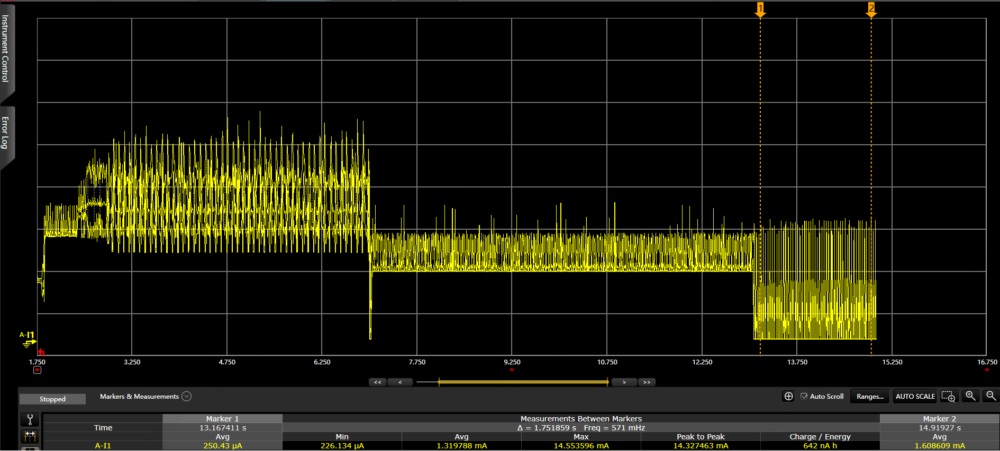

## GR5526(6)-Watch Demo功耗调试参考
[TOC]


- 注:  本文档适用于参考工程 ${GR5526_SDK}\projects\peripheral\graphics\graphics_lvgl_831_gpu_demo


### 1. 参考工程说明 

- Watch Demo 工程是一个基于 GR5526 SK 开发的智能手表演示工程. 工程采用的 Lvgl 8.31 GUI框架, 基于GR5526的GPU进行移植优化, 具有帧率高、交互效果好、开发效率快等特点, 用户可以基于此工程进行手表或显示类产品的二次开发: 增修UI布局及交互、增加外设处理、增加业务交互逻辑、增修BLE Profile等. 能很好的加速用户的产品周期. 

- 由于不同产品会设计不同的产品工作模式, 且模式间的状态转换条件各异, 因此产品的功耗(工作)模式设计具有多样性. 此Watch Demo示例工程提供了一种基础的工作模式管理策略, 一方面给用户设计工作模式时提供初级参考, 另一方面也帮助用户理解和快速调试产品的低功耗模式.


### 2. 低功耗模式背景知识

- 如果需要进行GR5526 芯片级的功耗评估, 建议使用 ${SDK}\rojects\ble\ble_peripheral\ble_app_pcs 工程进行. 并参考文档 《GR5526功耗模式及功耗测量说明》进行, 文档的在线网页连接为:   [GR5526功耗模式及功耗测量说明](https://docs.goodix.com/zh/online/detail/power_application_bl_b/V1.0/61ae20c6ecf2d6ea57ef7e7b77f80c08),  本文的功耗背景知识也依赖这篇文档, 请先行阅读.
-  如果要学习了解OS 环境下的功耗业务逻辑, 请查看工程       ${SDK}\projects\ble\ble_peripheral\ble_app_template_freertos, 它基于GR5526移植了FreeRTOS 系统、适配了休眠策略、开启了基础的BLE广播, 适合作为从OS开始从零架构的IOT类产品的模板工程. 工程对应的在线参考文档 [GR5xx FreeRTOS示例手册](https://docs.goodix.com/zh/online/detail/freertos_bl/V3.1/1018832044f1b7ff252f659fd41a50a2)
- GR5xxx 系列芯片, FreeRTOS 环境下的低功耗休眠策略和 Bare (裸机)环境下, 存在差异, 前者基于 FreeRTOS 空闲任务的Tickless模式进行设计, 后者的休眠裸机在主栈主循环中管理。注意根据产品是否采用OS来选择合适的工程模板.


### 3. 基于Watch Demo 的低功耗调试

#### 3.1 原则

由于低功耗调试基于 GR5526 SK 开发板进行, 跟产品环境具备很大的差异, 比如: 使用的I/O 排布不同、挂载的外设不同、工作模式设计不同、Demo工程的业务逻辑不完整等原因, 本节主要描述调试的一般方法, 关于外设休眠处理方法、漏电的查找分析等一些业务场景强相关的调试, 并不再仔细描述. 

 

#### 3.2 测试环境搭建

- 本测试采用电流回路测量法来判断系统的功耗状态, 另外也可以使用电压供电方法. 

- 下面的硬件配置适用于 GR5526 SK Rev.B 和Rev.C 电路版本. 点击参考 [GR5526 SK Rev.C 电路图](https://www.goodix.com/zh/docview/GR5526-SK-BASIC-RevC_V1.0?objectId=278&objectType=document&version=449)

  - KeySight 设置为电流测量模式

  - 取掉 J1 的跳线帽. KeySight 输出Output+ 连接 J1.Pin1; KeySight 输出Output- 连接  J1.Pin2. 将KeySight串入电流回路

  - 拨码开关 S1 拨码模式: Pin2 和Pin3相连, Pin4和Pin5相连

  - 拨码开关 S10 拨码模式为:  拨至VBAT 一侧

  - 拨码开关 S11 拨码模式为: 拨至 VCC一侧

  - JLink-USB 口接PC USB, 用于电路供电和连接Jlink 调试.

  - 

    

#### 3.3 Watch Demo工程跟休眠相关的主要任务

- 从 main 函数启动BLE 协议栈, 开启了名为  "SmartWatch" (早前版本广播名为: "5526_SK.X") 的广播, 并创建了几个参考BLE Profile

- Touch 检测任务, 主要用于周期性检测Touch的输入, 作为 GUI渲染任务的驱动事件输入；另外扩展了应用层面的工作状态管理 (用户可以根据产品重新设计工作状态管理逻辑)
- Lvgl GUI渲染任务, 用于处理整个UI的渲染和显示
- UI 外部事件处理任务, 负责将产生的按键事件等分发给 GUI任务处理
- FreeRTOS 的 Idle 任务, 处理系统空闲、休眠唤醒的逻辑入口

 

#### 3.4 Watch Demo的工作模式设计

在本参考工程中, 设计了三种应用层的工作模式:  

- Active 亮屏工作模式:  所有应用业务均在工作状态, GUI任务实时渲染, 屏幕常亮

- 熄屏工作模式: 在这种模式下, 其他应用业务正常运行, 只有屏幕显示被关闭, GUI渲染及刷屏行为被暂停, 持续若干秒时间。 如果在此时间段内, 系统检测到有触摸屏幕的行为, 会直接点亮屏幕, 回到Active 模式工作; 如果超过时间段未检测到触摸行为, 进入系统的熄屏幕休眠模式

- 熄屏休眠(Sleep)模式:  在这种模式下, GUI 相关的任务不工作、屏幕熄灭、所有外设按照产品设计进入掉电或周期性执行状态、芯片停止工作进入休眠。 熄屏休眠模式不会阻止周期性任务的执行. 周期性任务执行时, 芯片会重新唤醒工作, 完成后继续进入Sleep模式.  本参考工程的Sleep 模式下, 由于将Touch 停止工作(未实现休眠中断触发唤醒、用户需根据产品需要另行实现), 额外增加了按键唤醒. 用户可以通过SK 的 K1 & K2 按键唤醒屏幕、上电或唤醒所有外设， 让系统重新进入Active 亮屏工作模式.

  

一般情况下, 上述三种工作模式的电流依次从大到小, 根据产品不同，熄屏休眠模式的底电流 应该在 几十~几百uA 级别 (注: 芯片本身的休眠电流只有若干uA,这里的举例值包含了其他各类耗电外设)。

  

#### 3.5 休眠模式的调试


##### 3.5.1 原则

系统休眠策略的大致原则是: 

- 系统非 Idle 任务运行完毕、BLE 当前工作完成、所有外设均工作完成处于Idle 状态、下一个可执行任务距离当前时间不少于5ms.  当进入 FreeRTOS的 Idle 任务时,  就会允许芯片进入Sleep 模式. 


##### 3.5.2 通用条件

系统进入低功耗休眠的前置条件一般是:

- 检查是否有一直工作的任务, 确保任务设计符合产品逻辑
- 检查是否有小于 5ms 的周期性事件
- 确保 BLE 应用符合规范
- 确保所有外设均已没有在工作处于Idle状态  

一般情况下, 前面三个条件很容易检查和满足, 比较小的概率成为芯片不能休眠的原因. 更多概率的是最后一种情况: **有外设还处在工作态**. 


##### 3.5.3 判断外设是否处于工作状态的方法

找出外设是否处于工作态的方法也很简单, SDK提供了2 个 u32 变量的bit位来记录每个外设当前是否在工作。 

-   变量本身定义在SDK内部, 在头文件 ${SDK}\drivers\inc\hal\gr55xx_hal_pwr_mgmt.h 做了extern 引用. 
-   下面是变量名和对应的bit 位枚举, 枚举值对应的bit位标示了对应外设当前的状态：如果位1, 正在被使用; 如果为0, 则已进入idle 模式. 
-   当2个变量的所有位 均为0时, 表明外设允许休眠的条件也达成.


```
extern volatile uint32_t g_devices_state; 
```

对应管理的外设数量为32个, 最低bit位表征[DMA0]的是否工作，到高bit位表征[USB]是否工作. 

```c
		typedef enum
		{
		    PERIPH_DEVICE_NUM_DMA0 = 0,
		    PERIPH_DEVICE_NUM_DMA1,     //NO.=1
		    PERIPH_DEVICE_NUM_ISO7816,  //NO.=2
		    PERIPH_DEVICE_NUM_PKC,      //NO.=3
		    PERIPH_DEVICE_NUM_QSPI0,    //NO.=4
		    PERIPH_DEVICE_NUM_QSPI1,    //NO.=5
		    PERIPH_DEVICE_NUM_QSPI2,    //NO.=6
		    PERIPH_DEVICE_NUM_SPIM,     //NO.=7
		    PERIPH_DEVICE_NUM_SPIS,     //NO.=8
		    PERIPH_DEVICE_NUM_DSPI,     //NO.=9
		    PERIPH_DEVICE_NUM_I2C0,     //NO.=10
		    PERIPH_DEVICE_NUM_I2C1,     //NO.=11
		    PERIPH_DEVICE_NUM_I2C2,     //NO.=12
		    PERIPH_DEVICE_NUM_I2C3,     //NO.=13
		    PERIPH_DEVICE_NUM_I2C4,     //NO.=14
		    PERIPH_DEVICE_NUM_I2C5,     //NO.=15
		    PERIPH_DEVICE_NUM_UART0,    //NO.=16
		    PERIPH_DEVICE_NUM_UART1,    //NO.=17
		    PERIPH_DEVICE_NUM_UART2,    //NO.=18
		    PERIPH_DEVICE_NUM_UART3,    //NO.=19
		    PERIPH_DEVICE_NUM_UART4,    //NO.=20
		    PERIPH_DEVICE_NUM_UART5,    //NO.=21
		    PERIPH_DEVICE_NUM_I2S_M,    //NO.=22
		    PERIPH_DEVICE_NUM_I2S_S,    //NO.=23
		    PERIPH_DEVICE_NUM_PDM,      //NO.=24
		    PERIPH_DEVICE_NUM_HMAC,     //NO.=25
		    PERIPH_DEVICE_NUM_RNG,      //NO.=26
		    PERIPH_DEVICE_NUM_AES,      //NO.=27
		    PERIPH_DEVICE_NUM_PWM0,     //NO.=28
		    PERIPH_DEVICE_NUM_PWM1,     //NO.=29
		    PERIPH_DEVICE_NUM_SNSADC,   //NO.=30
		    PERIPH_DEVICE_NUM_USB,      //NO.=31
		    MAX_PERIPH_DEVICE_NUM
		} periph_device_number_t;
```


 ```c
extern volatile uint32_t g_extra_devices_state;
 ```

对应管理的外设如下:

```
		typedef enum
		{
		    EXTRA_DEVICE_NUM_CLK_CALIB = 0,
		    EXTRA_DEVICE_NUM_GPU,          //NO.=1
		    EXTRA_DEVICE_NUM_DC,           //NO.=2
		    EXTRA_DEVICE_NUM_OSPI,         //NO.=3
		    MAX_EXTRA_DEVICE_NUM
		} extra_device_number_t;
```


##### 3.5.4 举例

-   如果进入Idle准备休眠前做状态检查时, 发现 g_extra_devices_state 变量的值为 2, 对应置位的bit位是 EXTRA_DEVICE_NUM_GPU， 表明当前的GPU 还没有完成工作. 因此还不能休眠

当找到了影响休眠的外设后, 进一步分析其还在工作的原因, 如果此时不应该还在工作, 则找出其不正常工作的原因进行解决即可.

当休眠失败的情况下，查看外设工作状态变量值可以使用以下几种方法:

- 使用Keil的Debug 模式, 断点断在 port_pm.c 的函数 pwr_mgmt_enter_sleep_with_cond 种, 查看2个变量的值. 这个方法效率较低 
- 通过Map表, 获得2个变量的SRAM地址, 使用 Jlink 连接SK 板查看.
- 使用 Ozone 调试工具, 给变量增加定时刷新监测. 通过判断哪些bit 为1 进一步分析异常工作的外设. 

当芯片能周期性正常休眠时, 连接的JLink 会由于休眠自动断开, 这个也可以作为辅助判断芯片是否进入休眠的一个条件。


#### 3.6 各工作模式的电流波形

波形测量使用的KeySight 串入电流回路的方法,如果使用电压供电法, 波形有差异. 波形主要反映各模式电流的数量级差异, 用于判断工作模式是否切换正常, 不反应实际的电流精度 (没有仔细的做关闭外设、查漏电等    涉及具体业务层的操作)


##### 3.6.1 工作模式切换的电流波形

- 波形1: 上电后从 **Active模式** 到 **熄屏模式** 到 **休眠模式** 的电流波形变化

  


##### 3.6.2 带BLE广播休眠的电流波形

- 波形2: 休眠模式下的电流波形展开

  >  周期性波形为 BLE广播

  


当系统功耗完成模式层面的调试后, 就可以进入细致化调试阶段, 包括逐个优化各个外设的休眠策略、检查系统漏电、完善系统整体的功耗调优.


