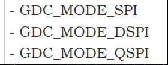
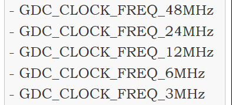
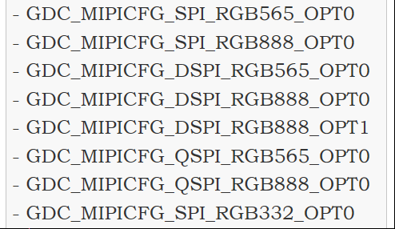
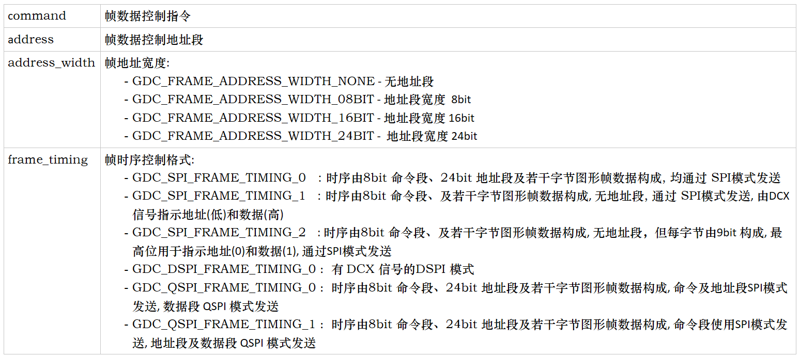
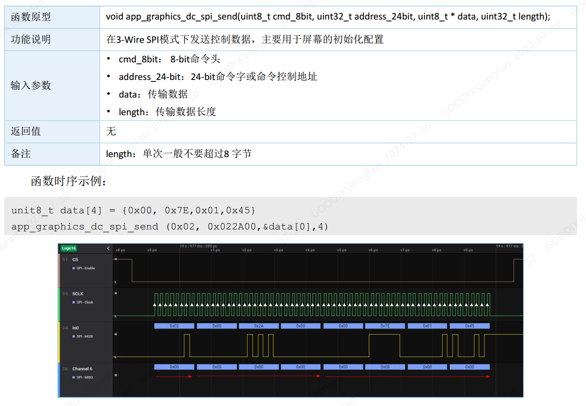
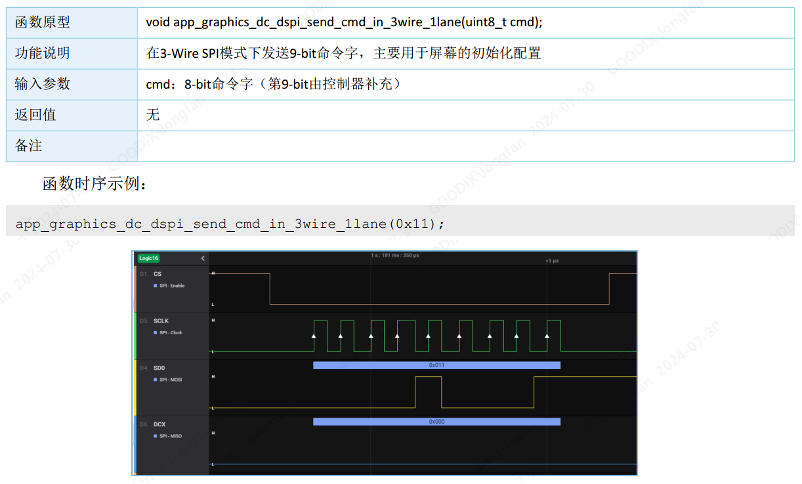
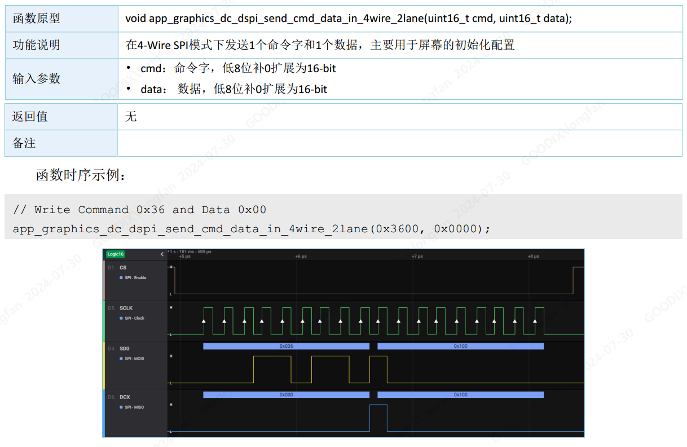
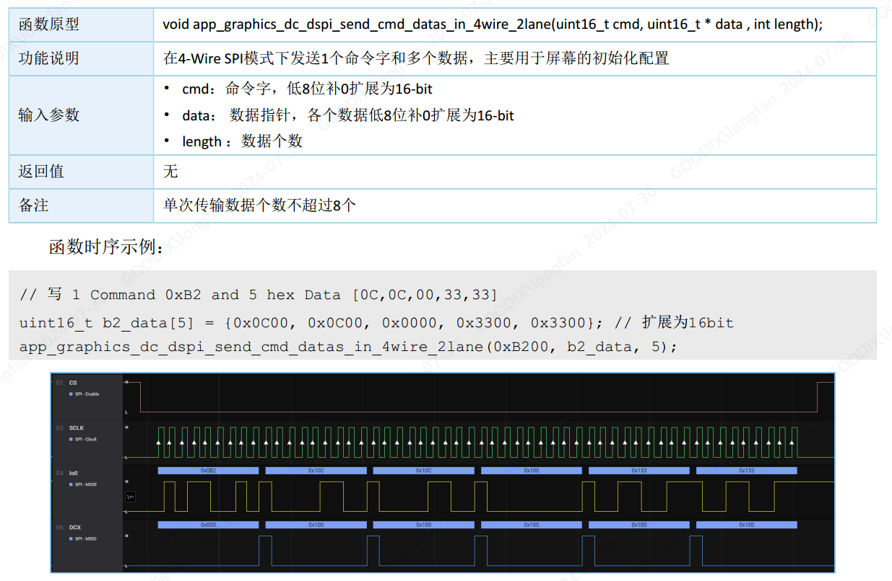

## GR5526(9)-显示控制器驱动配置参考

[TOC]

### 1. 显示控制器

显示控制器(Display Controller)是GR5526芯片系列独有的外设模块. 配合将GPU的图形渲染的结果, 刷新到屏幕进行显示. 本文主要用于说明如何配置常见的驱动 时序.


#### 1.1 初始化函数参数

-   DC 模块初始化函数为 graphics_dc_init, 需要构建结构体入参 app_graphics_dc_params_t 如下:


| **参数**       | **说明**           | **值**   |
| -------------- | ------------------ | ------------------------------ |
| mspi_mode      | 数据线模式         | I |
| clock_freq     | DC 时钟频率        |  |
| clock_mode     | DC 时钟模式        | 一般配置GDC_CLOCK_MODE_0  即可 |
| tcsu_cycle     | CS片选建立延迟     | 配置为  GDC_TCSU_CYCLE_1 即可, 不用修改 |
| layer_mode     | Layer  模式        | 配置为GDC_ONE_LAYER_MODE即可,  不用修改                      |
| mipicfg_format | DC图形数据输出格式 |  |
| resolution_x   | 屏幕宽度分辨率     |                    |
| resolution_y   | 屏幕高度分辨率     |                    |
| pins_cfg       | 屏幕引脚控制       | 引脚默认均采用硬件控制,  相关功能引脚只能pinmux 到固件的引脚. 驱动参数输入 主要控制是否使能对应引脚 |


-   mipicfg_format 各时序格式对应的输出时序图如下:

    
    
    -   注: 上图的时序列, 由  app_graphics_dc_send_single_frame 接口的入参app_graphics_dc_cmd_t之成员变量 frame_timing 决定


-   函数调用参考:

    ```c
        app_graphics_dc_params_t dc_params = {
            .mspi_mode  = GDC_MODE_QSPI,
            .clock_freq = GDC_CLOCK_FREQ_48MHz,
            .clock_mode = GDC_CLOCK_MODE_0,
            .tcsu_cycle = GDC_TCSU_CYCLE_1,
            .layer_mode = GDC_ONE_LAYER_MODE,
            .mipicfg_format = GDC_MIPICFG_QSPI_RGB565_OPT0,
            .resolution_x   = screen_w,
            .resolution_y   = screen_h,
            .pins_cfg = {
                .csn = {
                    .pull = APP_IO_PULLUP,
                    .enable = ENABLE,
                },
                .clk = {
                    .pull = APP_IO_PULLUP,
                    .enable = ENABLE,
                },
                .io0 = {
                    .pull = APP_IO_PULLUP,
                    .enable = ENABLE,
                },
                .io1 = {
                    .pull = APP_IO_PULLUP,
                    .enable = ENABLE,
                },
                .io2 = {
                    .pull = APP_IO_PULLUP,
                    .enable = ENABLE,
                },
                .io3 = {
                    .pull = APP_IO_PULLUP,
                    .enable = ENABLE,
                },
                .dcx = {
                    .pull = APP_IO_PULLUP,
                    .enable = DISABLE,
                },
            },
        };
    
        graphics_dc_init(&dc_params, NULL);
    ```

    

#### 1.2 帧数据发送接口参数 

DC提供的帧数据发送函数 app_graphics_dc_send_single_frame, 入参说明如下:

| 参数                          | 说明                                                         |
| ----------------------------- | ------------------------------------------------------------ |
| uint32_t which_layer          | DC Layer， 设置为GRAPHICS_DC_LAYER_0，不要修改               |
| app_graphics_dc_framelayer_t  |  |
| app_graphics_dc_cmd_t         |  |
| app_graphics_dc_access_type_e | 接口的同步模式:<br />- GDC_ACCESS_TYPE_SYNC : 同步调用模式, 刷屏完成后函数才返回<br />- GDC_ACCESS_TYPE_ASYNC : 异步调用模式, 刷屏结果通过回调函数返回 |

-   接口调用参考 (1) :

    -   控制命令 0x38、控制地址段 24bit 0x002c00, 时序发送模式为: 命令由SPI发送、地址和数据段由QSPI发送
    -   帧缓冲区格式为 GDC_DATA_FORMAT_RGB565, 接口调用方式为异步调用

    ```c
    app_graphics_dc_cmd_t dc_cmd = {
            .command = 0x38,
            .address = 0x002C00,
            .address_width = GDC_FRAME_ADDRESS_WIDTH_24BIT,
            .frame_timing  = GDC_QSPI_FRAME_TIMING_1,
        };
    
        app_graphics_dc_framelayer_t dc_layer = {
            .frame_baseaddr = buf,
            .resolution_x = w,
            .resolution_y = h,
            .row_stride = -1,
            .start_x = 0,
            .start_y = 0,
            .size_x = w,
            .size_y = h,
            .alpha = 0,
            .blendmode = HAL_GDC_BL_SRC,
            .data_format = (graphics_dc_data_format_e) GDC_DATA_FORMAT_RGB565,
        };
    
        app_graphics_dc_send_single_frame(GRAPHICS_DC_LAYER_0, &dc_layer, &dc_cmd, GDC_ACCESS_TYPE_ASYNC);
    ```

-   接口调用参考 (2) :

    -   控制命令 0x20、无地址段、时序发送格式为 - GDC_SPI_FRAME_TIMING_2 
    -   缓冲区帧格式为 GDC_DATA_FORMAT_RGB332，接口调用模式为同步调用 

    ```c
    app_graphics_dc_cmd_t dc_cmd = {
            .command = 0x20,
            .address = 0x000000,
            .address_width = GDC_FRAME_ADDRESS_WIDTH_NONE,
            .frame_timing  = GDC_SPI_FRAME_TIMING_2,
        };
    
        app_graphics_dc_framelayer_t dc_layer = {
            .frame_baseaddr = buf,
            .resolution_x = w,
            .resolution_y = h,
            .row_stride = -1,
            .start_x = 0,
            .start_y = 0,
            .size_x = w,
            .size_y = h,
            .alpha = 0,
            .blendmode = HAL_GDC_BL_SRC,
            .data_format = (graphics_dc_data_format_e) GDC_DATA_FORMAT_RGB565,
        };
    
        app_graphics_dc_send_single_frame(GRAPHICS_DC_LAYER_0, &dc_layer, &dc_cmd, GDC_ACCESS_TYPE_SYNC);
    ```

    

### 2. 其他DC 接口时序图

#### 2.1 app_graphics_dc_spi_send  



#### 2.2 app_graphics_dc_dspi_send_cmd_in_3wire_1lane  



#### 2.3 app_graphics_dc_dspi_send_cmd_data_in_3wire_1lane  


#### 2.4 app_graphics_dc_dspi_send_cmd_data_in_4wire_2lane  



#### 2.5 app_graphics_dc_dspi_send_cmd_datas_in_4wire_2lane  




